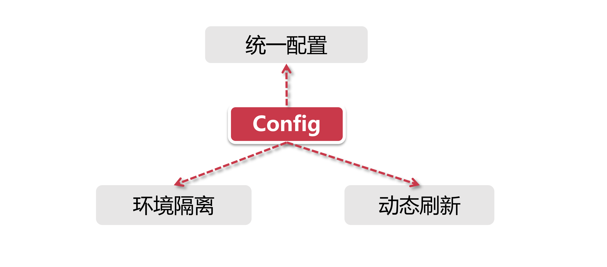
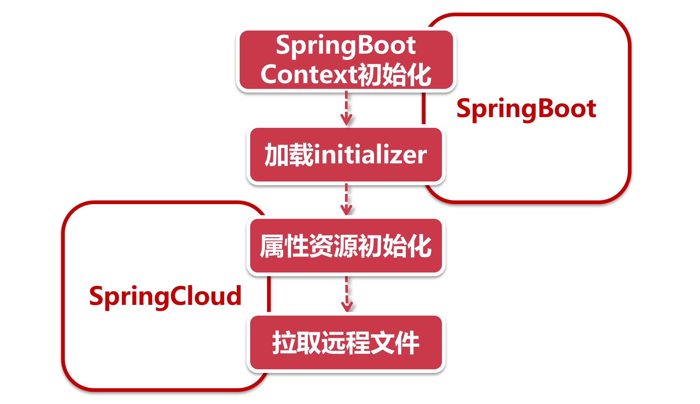

# Config核心功能和原理

前面我们认识了配置中心的作用，接下来我们来了解一下Spring Cloud中的配置管理组件Config。

## 1、配置管理的前世今生

随着技术的发展，配置项管理变得越来越简单，尽管如今它只限于管理业务属性或者配置初始化参数等等，但是当年它可肩负着Spring IOC的光菜使命，风光无限。

在前几年的时候还是SSH（Struts + Spring + Hibernate） 的天下，那时远没有现在这些丰富的开源组件，一个标准的Java程房员就是靠SSH打天下，但那时候的配置管理是一件让人头疼的事情。

早先SSH的配置管理可以说是相当复杂，每个项目的XML配置文件大大小小几十个。创建一个Form表单从前到后要创建好几个Java Class，还要再加上一大堆配置文件，那时的Spring还没有@Autowired功能，所有类之间的依赖关系全部XML来描达，远不像今天 auto-scan搞定一切。所以配置管理承担了Spring的依赖注入功能。

### 1.1、第一次技术革命

这一次由Spring引领，在Spring入自动装配机制以后，情况发生了天翻地覆的变化，基于注解的自动装配取代了繁重的XML配置，使用@Autowired，@Qualifier，@Primary等一系列自动装配注解，把所有关于“依赖注入”的繁重工作从配置项中解放了出来。

现在的项目已经很少看到XML配置的身影了，配置文件只要关注业务属性的管理，比如说注册中心的连接参数，或者某个功能开关的控制等等。

### 1.2、第二次技术革命

随着应用复杂度的提升，大家开始意识到使用工程化的方式对待杂乱的配置项

- **环境隔离：**当项目中建立起了多级环境（从测试、集成、上线都有独立的研发环境），需要我们的应用根据不同环境加载不同的配置文件，把各个不同环境的配置项隔离开来，把配置文件也纳入工程化部署的一部分。
- **运行期变更：**大多数配置文件的内容是静态属性，也就是说自打项目启动加载一次以后就再也不会发生变化，可随着业务复杂度提升，我们也需要一种能够在应用运行期修改属性的功能，以支持复杂业务场景。

在这个阶段各种技术百花齐放，每个公司都有自己的玩法，就拿第二点来说，有些公司直接把需要动态变更的属性放到数据库中或者缓存中，每次运行的时候去读取一把，但是这并不是一种既方便又高效的解决方案，那么我们有没有一个简单、高效并且还易于管理的方式可以应用在配置项上呢?

我们接下就看看Spring CIoud是如何设计配置管理的。

## 2、Config Server核心功能

Config作为Spring Cloud官方指定产品，在配置管理方面主要提供了三个功能：

**统一配置：**提供了一个中心化的配置方案，将各个项目中的配置内容集中在Config Server一端；

**环境隔离：**Config Server提供了多种环境隔离机制，Client可以根据自身所处的项目环境（比如生产环境、测试环境）加载对应的配置文件；
**动态刷新：**支持运行期改变配置属性。

除了上面三个功能以外，还有加密解密、定向推送等功能。

## 3、Config Server实现原理分析

作为配置中心的服务端，拉取参数三步走：

- **自动装配：**秉承了Spring Cloud的一贯传统，一段故事从一个注解开始，我们只要在启动类上放个@EnableConfigServer注解就可以了，Config 内部再通过@lmport注解引入其他配置类，完成自动装配（具体承担自动装配的类是ConfigServerAutoConfiguration）。
- **环境仓库装配：**启动了自动装配以后，自然要知道从哪里拉取配置文件，具体负责环境仓库装配的是EnvironmentRepositoryConfiguration这个类。Conig Server支持很多种文件存储仓库，比如JDBC，SVN，GiHub和本地文件，当然也可以配置多种类型组合的方式，也就是说Config 会从不同的地方拉取配置文件。默认情况下Config采用基于GitHub的集成方式，这也是官方建议的方式.
- **对外REST接口：**从外部环境拉取到了配置文件之后，需要返回给客户端，Config通过EnvironmentController这个类对外提供了一套供客户端调用的REST格式接口，所有服务都是通过GET方法对外提供，客户端可以通过不同的URL路径获取相对应的配置内容。

除此之外，Config 还提供了属性转换的功能。假如我们提供的配置文件是yml形式的，如果希望获取其他格式的重置项，那么在调用第二步中的REST接口时可以在URL后面以扩展名结尾，比如“json”或者”.properties”，Config Server会自动将配置内容转为对应格式。

## 4、Config Client的实现原理

如果大家在applicaltion.yml中定义了一个属性test，并使用占位符`${remoteTest}`作为test属性的值，当我们在Config Server中配置remoteTest属性后，你会发现在项目成启动的时候，Config Server中的remoteTest被注入到了配置文件中的test属性，从这个现象我们可以得出一个结论，应用程房一定是在Spring上下文初始化的早期阶段就从Config Server获取了配置文件，这个过程优先于本地配置项的加载过程。

PS：关于文件加载顺序在这里多提一句，bootstrap.yml文在所有文件以前加载，所以Config 的配置我们会放在bootstrap.yml中，然后applicaltion.properties的加载优先级比application.yml文件高。

我们来看看应用的初始化方式：

SpringCloud应用同时也是一个SpringBoot应用，因此整个应用的初始化从SpringBoot启动时的上下文Context构建开始:

**1、SpringBoot构建Context：**和所有的SpringBoot项目一样，通过SpringApplication类的run方法开始启动项目初始化和加载流程，其中就包括prepareContext这一步，整个项目的上下文结构就通过这个方法来构建的。

**2、加载initializer：**这是一连串的初始化构造过程，当我们在项目中引入了SpringCloud依赖时，PropertySourceBootstrapConfiguration将作为个初始化构造器，参与SpringBoot上下文的初始化，用来加载SpringCloud的属性资源。

**3、初始化属件资源：**PropertySourcebootstrapConfiguration是通过一系列的locator来定位资源文件的，当我们在项目中引入springcloud-config-client的依赖以后，就会开启Config组件的自动装配(由ConfigServiceBootstrapConfiguration实现），在这个自动装配过程中会向locator列表里添加一个专门用来获取远程文件的类-ConfigServicePropertySourceLocator。

**4、拉取远程文件：**ConfigServicePropertySourceLocator定义了执行顺序的优先级是0（通过@Order(0)注解定义)，在Spring中这个数字越小表示优先级越高，因此，这个组件将优先于其他locator先被执行。通过getRemoteEnvironment方法，向Conig Server发起请求，获取远程属性。