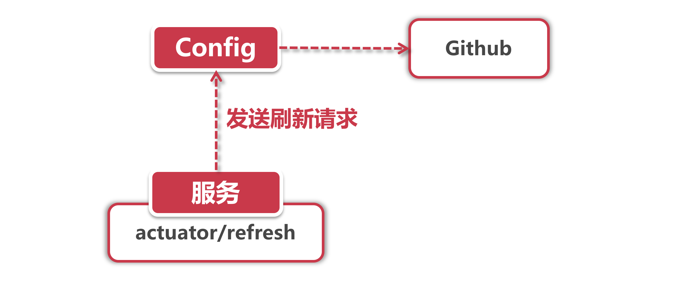

# 配置文件动态刷新

前面我们搭建了一个基于Github的配置中心，服务在启动的时候从Config组件获取资源，那假如我希望在程序运行期动态修改参数怎么办呢？这一节我们就来探讨一下参数动态刷新机制。

话说我们帮派的小弟们都比较放飞自我，自打获取到配置文件之后就再也不管了，任凭文件内容怎么修改也不会同步到本地，除非重启应用服务器。

这还了得，帮主的话只能听一次?一点面子也不给。帮主喊你回家刷新属性。

## 1、动态刷新

帮派决定来一次整风运动，调动小弟们的积极性，要做到帮主随叫随到（是帮主叫你，不是他自己随叫随到），我们来看看怎么推广。



很简单，这个过程分3个步骤进行：

**1.发送刷新请求：** 我们选定一个服务节点，通过POST请求访问节点下的 /actuator/refresh 路径，这时节点会发送一个刷新请求到Config服务器。

**2.拉取文件：**Config服务器会访问Github获取最新的内容，并把配置信息文件下载到本地。

**3.获取更新内容：** 接着服务节点从Config那里拿到变更内容，并将变动的属性配置到各个类中。

在第三步骤里还有小前提，假如一个类中有需要进行运行期替换操作的属性，那就要把 @RefreshScope注解加到这个类上，这样运行期参数修改才会在这个类上面生效。

在上面那个case里，"/actuator/refresh“ 就像帮主发给小弟的对讲机，只要一声令下就得前来报到。但是要使用这个对讲机还得先了解一下它的配置。

## 2、什么是Actuator

Actuator是一个轻巧的监控组件，通过REST接口的方式可以供外部调用，访问服务节点下的"/actuator"路径可以查看当前开放的服务。

Actuator也是一相当贴心的组件，当引入Spring Cloud的其他组件依赖到POM中以后（比如Config或BUS）这部分会通过Actuator Endpoint 将自己的核心服务提供出去（比如Config和BUS的refresh功能）。

假如同学们访问 "/actuator“ 后只能看到health和 info 这两个服务，那是因为 Actuator 的服务包合很多“机密"信息，为了安全考虑，默认只暴露几个关痛降的接口。我们可以通过改动默认配置项让它暴露指定的接口，为了方便演示，我们采用以下配置让Actuator暴露所有服务，这样你就可以通过 ”/actuator" 路经查看当前可用的服务了。

```
management.endpoints.web.exposure.include=* 
```

接下来，希望大家能拿Actuator这个精巧的小组件入手，尝试从下面这个官方文档了解它的功能：

```
https://docs.spring.io/spring-boot/docs/2.0.2.RELEASE/actuator-api//html/
```

