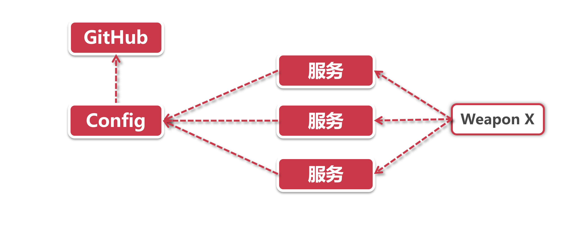

# 总线式架构展望

## 1、当前的问题

由于我们是从某台指定的服务节点发起refresh清求，也就是说，即便Config在接到请求后已经从Github获取了最新配置项，但也仅仅只能返回给发起refresh请求的那台机器。

这在服务节点较少的情况下没有什么问题，但假如说我们是100台服务器的集群，要想刷新所有节点，就要挨个触发每个服务器的refresh请求，这可不得累死。像淘系业务动不动一个微服务模块就近一万台服务器，那简直是要崩溃掉了。

这个时候就需要引入个组件，可以代理这种繁重的刷新工作，只触发一次请求，就能同时号令千万节点共同更新配置。

## 2、解决方案—添加总线层

在软件工程领域有这么一句名言：“计算机科学领域的任何问题都可以通过增加一个间接的中间层来解决”，既然我们现在需要解决集群环境下的刷新问题，那我们是否也能通过添加一个中间层来解决呢?

从这个角度出发，让我们对这个中间层提两点需求：

**1.响应事件：**它可以对变更事件做出响应，并且将这个事件路由到一个或多个服务节点

**2.消费事件：**各个服务节点都可以从这个组件中消费事件

上面的需求无非就是设立一个中间层作为消息代理，向服务节点下发通知。我们想一下目前最常用的消息分发策略，这个需求是不是和“订阅—发布”模型非常类似?

由各个节点订阅变更事件，当变更事件发生以后，从中间层获取消息并消费这个变更请求。

那我们来设想一下，这个中间层应该出现在什么位置：

在上面这个模型中，所有服务依然是在启动阶段从Conhg中拉取数据，这一点和之前没有区别。我们引入了一个额外的Weapon X(只是代号而已)作为中间层，当有变更发起的时候，就借助Weapon X将消息推送到所有服务节点上。

这就是总线式架构的响应模式，当然这里面还有更加细节的部分，比如如何触发变更请求，谁来触发等等。