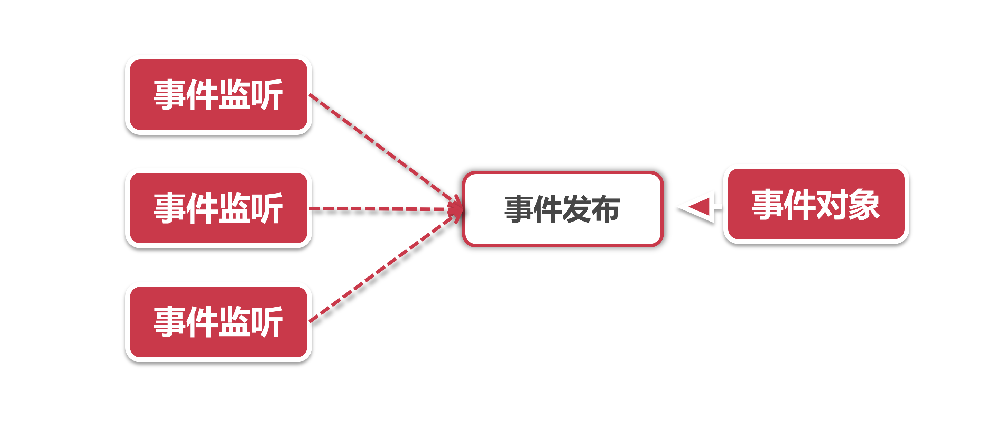
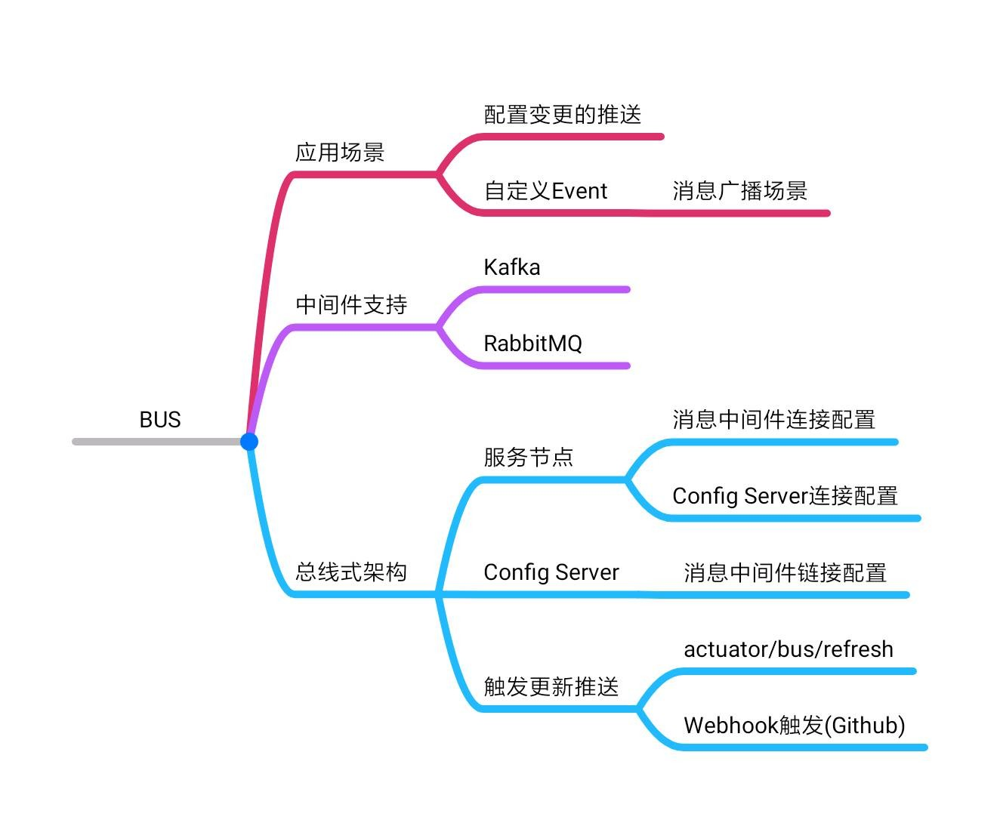

# 消息总线如何助攻其他业务场景

前面我们学习了Bus的主要应用场景：推送配置变更，这难道是Bus的全部本领吗? 就这点本事还能进Spring Cloud?

我们知道Spring Cloud的组件身怀十八般武艺，每个组件都有几样拿手的功能，再看Bus好像似乎除了推送变更啥也不会。大家有所不知，BUS是Spring Cloud的特长生，推送就是它的特长。Bus就着这一手排山倒海的推送特长，进了Spring Cloud，专门处理各种广播消息推送，不只局限在配署变更推送。

## 1、发布-订阅模型



Bus的事件推送由三个角色构成：

- **事件对象：**Bus中定义的一个事件类，通常是一个Pojo对象，包含了消费者需要的信息；

- **事件发布：**Bus作为生产者，将事件对象通过广播的形式发布出去；

- **事件监听：** 由消费者主动监听Bus的事件发布动作，当获取到事件对象后会调用处理方法进行消费

## 2、自定义事件

### 2.1、自定义事件对象

Bus的所有事件对象都继承自ApplicationEvent或者RemoteApplicationEvent，我们可以仿照bus-refresh功能定义的事件类RefreshRemoteAppilcationEvent中的写法，定义一个MyEvent类：

```java
public class MyEvent extends RemoteApplicationEvent {

   public MyEvent() {
   }

   public MyEvent(Object body, String originService, String destinationService) {
       super(body, originService, destinationService);
   }
}
```

其中第一个参数可以自定义一个POJO类，大家可以根据自己的需求随意添加属性，但是要保证这个类实现了序列化/反序列化接口 (implements Serializabdle)。

### 2.2、配置自定义对象

在创建了MyEvent之后，我们需要将它加载到Bus的上下文中，这里可以通过@Configuration和@RemoteApplicationEventScan注解将MyEvent加载进来。

```java
@Configuration
@RemoteApplicationEventScan(basePackageClasses = MyEvent.class)
public class BusExtConfiguration {

}
```

### 2.3、监听事件

我们要在服务节点添加事件监听，用来监听服务发布动作，这一步可以通过@EventListener方法级别的注解来实现（可以参考RefreshEventListener类），接收的参数就是第一步中创建的EventBody，Bus会帮我们将消息反序列化为Java类。也可以通过继承ApplicationListener接口来实现，示例如下：

```java
@Component
public class MyEventListener implements ApplicationListener<MyEvent> {
    
    @Override
    public void onApplicationEvent(MyEvent event) {
        logger.info("Received MyCustomRemoteEvent - message: ");
    }
}
```

### 2.4、发布事件

万事俱备之后，我们只需要一个发布事件的地方了(在消息生产者处实现)，我们可以创建一个简单的Controller，然后对外提供一个POST方法，比如：

```java
@PostMapping("/bus/publish/myevent")
public boolean publishMyEvent(@RequestBody EventBody body) {
   MyEvent event = new MyEvent(body, applicationContext.getId(), "");
   try {
       // 可以注入ApplicationEventPublisher来发送event
       eventPublisher.publishEvent(event);
       // 也可以直接使用 
       // applicationContext.publishEvent(event)
       return true;   
   } catch (Exception e) {
            log.error("failed in publishing event", e);  
   }  
   return false;
}
```

我们有两种方式发送event，一种是通过依赖注入AppicatonEventPublisher的实例来发送，现有的bus-refresh功能也是使用这种方式。另一种是直接通过ApplicationContext来发送。由于前面我们通过@RemoteApplicationEventScan注解已将MyEvent注册为BUS的一个事件，这样ApplicationContext会MyEvent当做一个Bus总线事件，而不是在Context范围内发布一个Regular Event。

## 3、应用场景

通过上面的方式我们可以将自定义事件广播到所有监听该事件的节点，让所有消费者触发事件响应，消息广播的使用场景非常多，我们随便举两个实际应用中的例子：

**清空缓存：**通知所有服务监听者清空某项业务的本地缓存信息，我们也可以在自定义的消息体中加业务属性，事件监听逻辑可以根据这些属性来定点清除某个特定业务对象的缓存；

**数据同步：**子系统依赖实时的数据库记录变动触发相应的业务逻辑，我们这里就可以将数据库的binlog抓取出来，通过广播功能同步到所有监听器，起到数据同步的作用。

## 4、本章小结




