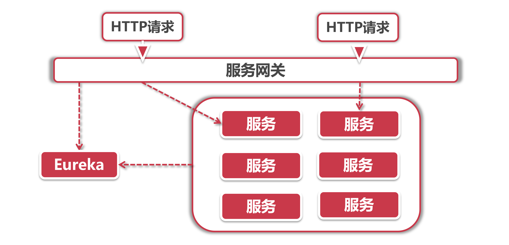

# 服务网关在微服务中的应用

我们将目光转向Spring Cloud应用的外围，过论微服务架构下的各个模块如何对外提供服务。

## 1、对外服务的难题

微服务架构下的应用系统体系很庞大，光是需要独立部零的基础组件就有注册中心、配置中心和服务总线、Turbine异常聚合和监控大盘、调用链追踪器和链路聚合，还有Kafka和MQ之类的中间件，再加上拆分后的零散微服务模块，一个小系统都能轻松弄出20个左右的部署包。

我们前面都是采用`localhost`加端口的方式直接访问，如果这些服务一并都要提供给外部用户访问那该怎么办？

产品经理表示可以让前端程序员加班加点在各个页面给各种不同请求配置URL和端口号，人不是问题，项目完成就行。可是这一大堆URL在页面上换来换去的，用户还以为是进了钓鱼网站，有的同学会说，我们配一个URL，通过F5或者Nginx可以做路由，话是没错，可是这样就要让运维团队手工维护路由规则表，当我们新增删除节点或者因为更换机房导致IP变化的时候就很麻烦；因此我们需要引入一套机制来降低路由表的维护成本。

还有一个问题就是安全性，我们在提供外部服务的时候住往会加入一些访问控制，比如说下单接口不允许未登录用户的访问，有的服务还会通过一些JWT签名等防止客户端篡改数据。如果让每个服务提供者都实现同样的访问验证逻辑未免有些太繁琐，这样纯属是增加研发人员的怒气值，况且如果有一天我们需要更换权限认证方案，比如更换为OAuth2.0，难不成还要每个服务提供者都做变更?

我们如何对外提供服务，既能管好路由规测，还能做好访问控制呢?

在这个背景下，API网关应运而生，它就像一个传达室的角色，接待所有来访请求。

## 2、微服务的传达室

系统设计理论：在计算机领域，任何问题都可以通过引入一个中间层来解决。

接下来，我们就给微服务引入一层专事专办的中间层——传状室，我们去别家公司办事，第一道要过的关就是传达室大爷这一关，大爷主要做两件事：

1. 访问控制看你是不是有权限进行访问，拒绝未授权的来访者；
2. 引导指路问清楚你要办的事儿，给指条明路，找到对应处理这些事儿的人。

引入网关层后，我们的微服务架构就变成了这个样子：

网关层作为唯一的对外服务，外部请求不直接访问服务层，由网关层承接所有HTTP请求，在实际的应用里，我们也会将Gateway和Nginx一同使用。接下来分别就访问控制和路由规则这两个方面做介绍。

## 3、访问控制

访问控制主要包含两个方面的任务，具体实现并不是由网关层提供，但是网关作为一个载体承载了这两个任务：

- **拦截请求：** 有的接口需要登录用户才能访问，对这类接口的访问，网关层可以检查访问请求中是否携带“令牌"等身份信息，比如HTTP Header中的“Authorization”或者“token”属性。如果没有携带令牌，则说明还没有登录，这时可以直接返回403 Forbidden；
- **鉴权：** 对于携带有令牌的服务，我们需要验证令牌的真假，否则用户可以通过伪造的令牌进行通信，对令牌校验失败的服务请求，或者令牌已过期的请求执行拒绝服务。

## 4、路由规则

路由规则包含两个方面，分别是URL映射和服务寻址；

**URL映射：**在大多数情况下，客户端访问的HTTP URL往往不是我们在Controller里配置的真实路径，比如客户端可以发起请求"/password/update"来修改密码，但后台并没有这个服务，这时候就需要网关层做一个路由规则，将来访URL映射成真正的服务路径，比如将刚才的密码修改请求的路径映到"/user/settings/security/password"请求；

**服务寻址：** URL映射好了之后，网关层就需要找到可以提供服务的服务器地址，对于服务集群的话，还需要实现负载均衡策略。(剧透一下:在Spring Cloud中，Gateway是借助Eureka的服务发现机制来实现服务寻址的，负载均衡则依靠Ribbon)