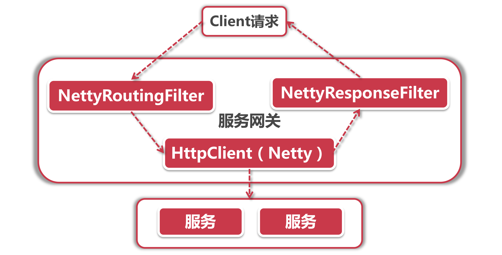
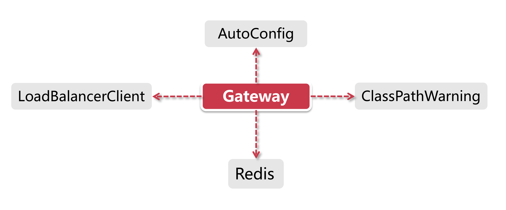

# Gateway体系架构解析

前面我们了解到Spring Cloud中的第二代网关Gateway，作为网二代来说它在各项指标上都领先Zuul，实在没有理由不在新项目中用Gateway；这一小节，我们就去看看Gateway的体系架构，看看它到底好在哪里。

## 1、网二代的家底

所有二代都有同样的特点，家底子厚实。我们Gateway也不例外，打开Gateway的自动装配工厂GatewayAutoConfiguration来看一下，排头第一个类赫然写着五个金光闪的大字Netty。

Netty是什么? 在网络传输领域Netty就是身份的象征，它是非归塞、高性能、高可靠的异步输入输出框架，用一个字概括就是 “快”，这里我们不对Netty做深入探讨，但是需要了解下Netty在Gateway中主要应用在以下几个地方：

- **发起服务调用：**由NettyRoutingFilter过滤器实现，底层采用基于Netty的HttpClient发起外部服务的调用；
- **Response传输：** 由NettyResponseFilter过滤器实现，网络请求结束后要将Response回传给调用者；
- **Socket连接：**具体由ReactorNettyWebSocketClient类承接，通过Netty的HttpClient发起连接请求。

在Gateway中发起Request和回传Response之类的步骤都是通过一系列过滤器完成的，用一张图来概括一下Netty在Gateway组件中的位置：

Client发起请求到服务网关之后，由NettyRoutingFilter底层的HttpClient(也是Netty组件)向服务发起调用，调用结束后的Response由NettyResponseFilter再回传给客户端，有了Netty的加持，网络请求效率大幅提升 (Zuul 1.x还是使用Servlet，在2.x 版本才移步到Netty) 由此可见，Netty贯穿了从Request发起到Response结束的过程，承担了所有和网络调用相关的任务。

## 2、Gateway自动装配

接下来，让我们梳理一下Gateway框架的加载过程，从Gateway自动装配的角度，看看它都需要加载什么资源：

- **AutoConfig：** 作为核心自动装配主类，GatewayAutoConfiguration负责初始化所有的Route路由规则、Predicate断言工厂和Filter（包括Global Filter和Route Filter)，这三样是Gateway吃饭的家伙，用来完成路由功能；AutoConfig也会同时加载Netty配置；
- **LoadBalancerClient：**这部分在AutoConfig完成之后由GatewayLoadBalancerClientAutoConfiguration负责加载，用来加载Ribbon和一系列负载均衡配置；
- **ClassPathWarning：** 同样也是在AutoConfig完成之后触发(具体加载类为GatewayClassPathWarningAutoConfiguration) ，由于Gateway底层依赖Spring WebFlux的实现，所以它会检查项目是否加载了正确配置；
- **Redis：** 在Gateway中Redis主要负责限流的功能；
- 除了上面几个核心装配工厂以外，还有两个打酱油的路人，它们并不直接参与Gateway的核心功能，但是会提供一些重要的支持功能，我们也来一道认识下：
- **GatewayMetricsAutoConfiguration：**负责做一些统计工作，比如对所谓的“short task”运行时长和调用次数做统计；
- **GatewayDiscoveryClientAutoConfiguration：**服务发现客户端自动装配类。

## 3、爬坑指南

很多同学发现自己的GateWay项目启动出错，但是查来查去，发现也没有什么配置问题，这时候就要看一下是不是引入了错误的依赖，Gateway比较坑的一个地方是它基于WebFlux实现，因此它需要的依赖是spring-boot-stater-webflux，假如我们不小心引入了spring-boot-starterweb将导致启动问题。

由于我们大部分的spring Cloud项目都依spring-boot-stater-web，所以很容易就将其依赖导入到了Gateway项目中，碰到这种问题只要打出依赖树，排查下错误依赖的来源，然后将它在pom中排除出去就好了。

## 4、路由流程

这里就涉及到了Gateway 最核心的路由功能，路由主要由断言和过滤器配合来实现，我们把这部分内容拆分为3个小节，分别介绍路由的整体功能，断言的使用、过滤器原理和生命周期。