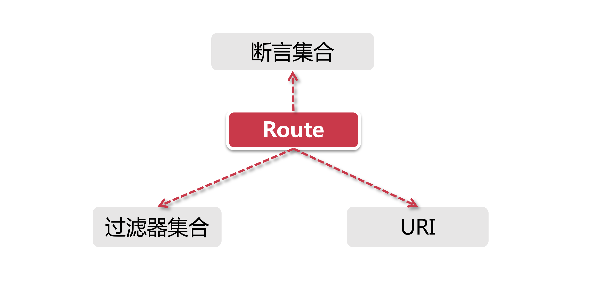
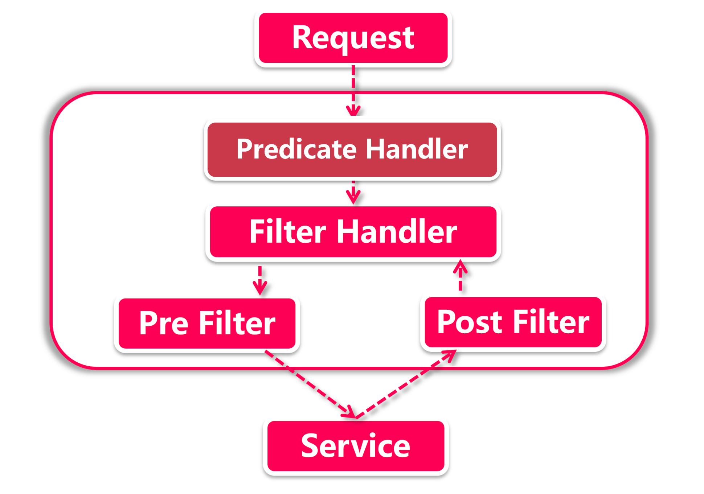

# 路由功能详解

这一节我们看一看Gateway中的路由是怎么工作的；GateWay网关的路由功能可不是简简单单的 “转发" 请求，在请求到达网关要流转到指定服务之间发生了很多事儿，它不光可以拒绝请求，甚至可以"篡改” 请求的参数，我们接下来就去看看路由这里面的门道。

## 1、路由三重门

Gateway中可以定义很多个Route，一个Route就是一套包含完整转发规则的路由，主要由三部分组成：

- **断言集合：** 断言是路由处理的第一个环节，它是路由的匹配规则，它决定了一个网络请求是否可以匹配给当前路由来处理。之所以它是一个集合的原因是我们可以给一个路由添加多个断言，当每个断言都匹配成功以后才算过了路由的第一关。
- **过滤器集合：** 如果请求通过了前面的断言匹配，那就表示它被当前路由正式接手了，接下来这个请求就要经过一系列的过滤器集合。过滤器的功能就是八仙过海各显神通了，可以对当前请求做一系列的操作，比如说权限验证，或者将其他非业务性校验的规则提到网关过滤器这一层。在过滤器这一层依然可以通过修改Response里的Status Code达到中断效果，比如对鉴权失败的访问请求设置Status Code为403之后中断操作；
- **URI：** 如果请求顺利通过过滤器的处理，接下来就到了最后一步，那就是转发请求。URL是统一资源标识符，它可以是一个具体的网址，也可以是IP+端口的组合，或者是Eureka中注册的服务名称。

## 2、关于负载均衡

对最后一步寻址来说，如果采用基于Eureka的服务发现机制，那么在Gateway的转发过程中可以采用服务注册名的方式来调用，后台会借助Ribbon实现负载均衡(可以为某个服务指定具体的负载均衡策略)，其配置方式如: lb://FEIGN-SERVICE-PROVIDER/，前面的lb就是指代Ribbon作为LoadBalancer。

## 3、路由的工作流程

从一个请求到达网关开始，看看Gateway内部流转的过程。

**Predicate Handler：**具体承接类是RoutePredicateHandlerMapping，首先它获取所有的路由(配置的routes全集)，然后依次循环每个Route，把应用请求与Route中配置的所有断言进行匹配，如果当前Route所有断言都验证通过，Predict Handler就选定当前的路由，这个模式是典型的职责链。

**Filter Handler：** 在前一步选中路由后，由FilteringWebHandler将请求交给过滤器，在具体处理过程中，不仅当前Route中定义的过滤器会生效我们在项目中添加的全局过滤器(Global Filter) 也会一同参与。可以看到图中有Pre Filter和Post Filter，这是指过滤器的作用阶段，我们在稍后的章节中再深入了解。

**寻址：** 这一步将把请求转发到URL指定的地址，在发送请求之前，所有Pre类型过滤器都将被执行，而Post 过滤器会在调用请求返回之后起作用，有关过滤器的详细内容将会在稍后的章节里讲到。