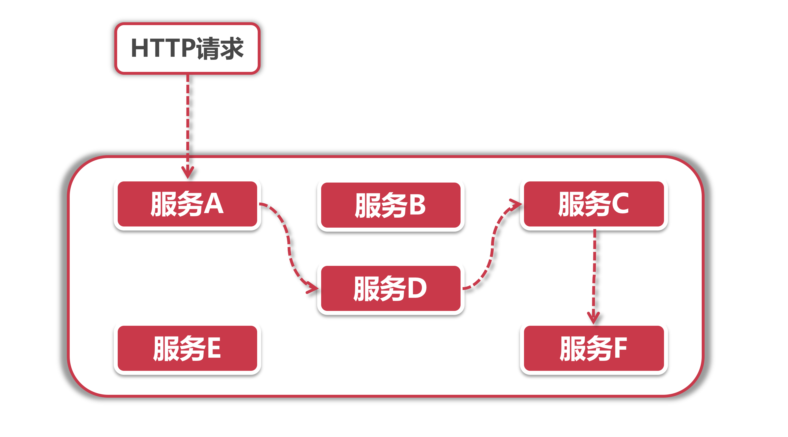
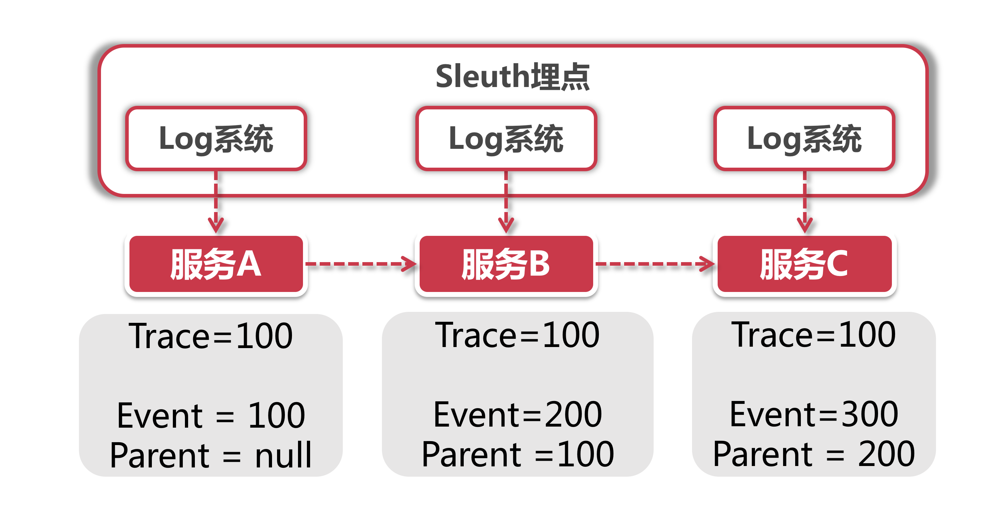
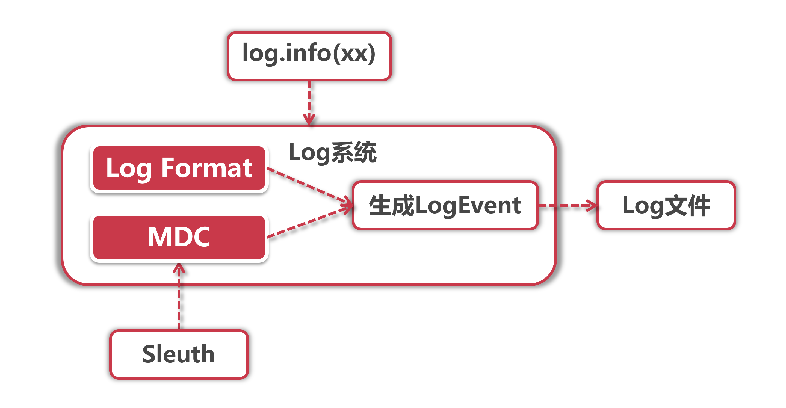

# Sleuth核心功能和体系架构解析

Sleuth的意思是大侦探，顾名思义，侦探就是查找信息搜集线索，顺着线索链找到所有上下游的关联，这恰好正是Seluth在Spring CIoud中的工作。

## 1、大侦探的功能

Sleuth最核心的功能就是提供链路追踪，在一个用户请求发起到结束的整个过程中，这个Request经过的所有服务都会被Sleuth梳理出来：



比如上面的例子，用户请求访问了服务A，接着服务A又在内部先后调用了服务D，C和F，在这里Sleuth的工作就是通过一种 “打标”的机制，将这个链路上的所有被访问到的服务打上一个相同的标记，这样我们只要拿到这个标记，就很容易可以追溯到链路上下游所有的调用，这大侦探之名真是名副其实。

借助Sleuth的链路追踪能力，我们还可以完成一些其他的任务，比如说：

**1.线上故障定位：**结合Tracking ID寻找上下游链路中所有的日志信息(这一步还需要借助一些其他开源组件);

**2.依赖分析梳理：**梳理上下游依赖关系，理清整个系统中所有微服务之间的依赖关系；

**3.链路优化：**比如说目前我们有三种途径可以导流到下单接口，通过对链路调用情况的统计分析，我们可以识别出转化率最高的业务场景，从而为以后的产品设计提供指导意见；

**4.性能分析：**梳理各个环节的时间消耗，找到性能瓶颈，为性能优化，软硬件资源调配指明方向。

## 2、大侦探的做事原则

每个链路追踪技术都有自己做事的方法，作为这个领域的杰出代表，我们来看下Sleuth的设计理念：

**无业务侵入：** 如果说接入某个监控组件还需要改动业务代码，那么我们认为这是一个"高侵入性“的组件。Seluth在设计上秉承"低侵入”的理念，不需要对业务代码做任何改动，即可静默接入链路追踪功能；

**高性能：** 一般认为在代码里加入完善的log (10行代码对应2条log) 会对降低5%左右接口性能(针对非导步log框架)，而通过链路追院技术在log里做埋点多多少少也会影响性能，Seluth在埋点过程中力求对性能影响降低到最小，同时还提供了“采样率配置”来进一步降低开销(比如说开发人员可以设置只对20%的请求进行采样)。

## 3、Sleuth架构体系

Sleuth采用集成底层Log系统的方式实现业务埋点，我们先来看一下它的结构：



## 4、哪些数据需要埋点

每一个微服务都有自己的Log组件（slf4j，lockhack等各不相同)，当我们集成了Sleuth之后，它便会将链路信息传递给底层Log组件，同时Log组件会在每行Log的头部输出这些数据，这个埋点动作主要会记录两个关键信息：

1. **链路ID：** 当前调用链的唯一ID，在这次调用请求开始到结束的过程中，所有经过的节点都拥有一个相同的链路ID；
2. **单元ID：** 在一次链路调用中会访问不同服务器节点上的服务，每一次服务调用都相当于一个独立单元，也就是说会有一个独立的单元ID。同时每个独立单元都要知道调用请求来自哪里(就是对当前服务发起直接调用的那一方的单元ID，我们记为Parent ID)

比如这里服务A是起始节点，所以它的Event ID (单元ID) 和Trace D 鞋路D) ，而服务B的前置节点就是A节点，所以B的Parent Event就指向A的Event ID。而C在B的下游，所以C的Parent就指向B。A、B和C三个服务都有同一个链路ID，但是各自有不同的单元ID。

## 5、数据埋点之前要解决的问题

看起来创建埋点数据是件很容易的事儿，但是想让这套方案在微服务集群环境下生效，我们还需要先解决两个核心问题：

**Log系统集成：**如何让埋点信息加入到业务Log中?

**埋点信息的传递：** 我们知道SpringCloud中的调用都是通过HTTP请求来传递的，那么上游调用方是如何将链路ID等信息传入到下游的呢?

## 6、Log系统集成

我们需要把链路追踪信息加入到业务Log中，这些业务Log是我们研发人员写在具体服务里的，而不是Sleuth单独打印的Log，因此Sleuth需要找到一个合适的切入点，让底层Log组件可以获取链路信息，并且我们的业务代码还不需要做任何改动。

如果有对Log框架做过深度定制的同学可能一下就能想到实现方式，就是使用MDC + Format Pattern的方式输出信息，我们先来看一下Log组件打即信息到文件的过程：



当我们使用"log.info"打印日志的时候，Log组件会将“写入”动作封装成一个LogEvent事件，而这个事件的具体表现形式由Log Format和MDC共同控制，Format决定了Log的输出格式，而MDC决定了输出什么内容。

### 6.1、LogFormat Pattern

Log组件定义了日志输出格式，这和我们平时使用“String.format"的方式差不多，集成了Sleuth后的Log输出格式是下面这个样子：

```
"%5p [sleuth-traceA,%X{X-B3-TraceId:-},%X{X-B3-SpanId:-},%X{X-Span-Export:-}]"
```

同学们发现上面有几个X开头的占位待，这就是我们需要入Log的链路追综信息了。

### 6.2、MDC

MDC是通过Inheritable ThreadLocal来实现的，它可以携带当前线程的上下文信息。它的底层是一个Map结构，存情了一系列Key- value的值，Sleuth就是借助Spring的AOP机制，在方法调用的时候配置了切面，将链路追踪数据加入到了MDC中，这样在打印Log的时候，就能从MDC中获取这些值，填入到LogFomat中的占位符里。

由于MDC基于Inheritable ThreadLocal而不是ThreadLocal实现，因此假如在当前线程中又开启了新的子线程，那么子线程依然会保留父线程的上下文信息。

如果大家想去看看源代码，可以参考logback组件中LogEvent类的prepareForDeferredProcessing方法，了解MDC和Log Fomat是如何工作的。