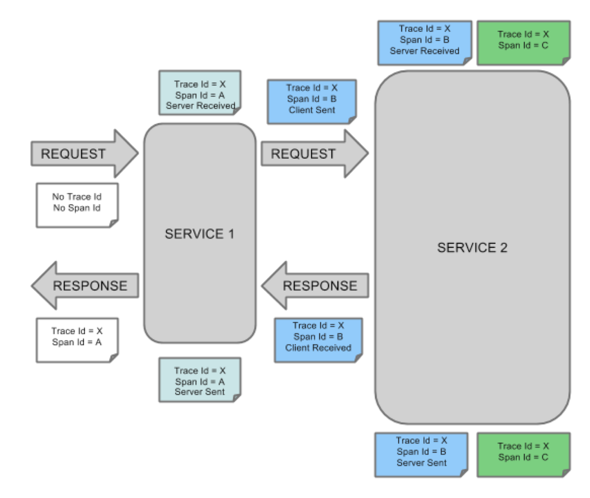
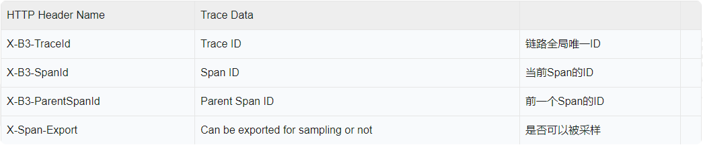

# 调用链路数据模型

这一章来深入了解链路追踪后面的数据结构，以及Sleuth是如何在不同服务节点之间传递数据的。

话说大侦探要做到追踪调用链的线索还真不是件容易的事儿，没两件顺手的装备还办不到，前面提到路追踪主要靠两个维度的信息，一个是链路ID，另一个是单元ID，接下来我们就看Sleuth是如何靠这两个ID做链路追踪的。

## 1、Sleuth数据结构

Sleuth准备了两个专业装备搞定这事儿，从一个调用请求开始直到结束，不管中途又调用了多少外部服务，从头到尾一枪打穿。

**Trace：** 它就是从头到尾贯穿整个调用链的ID，我们叫它Trace ID，不管调用链路中途访问了多少服务节点，在每个节点的log中都会打印同一个Trace ID；

**Span：** 它标识了Sleuth下面一个基本的工作单元，每个单元都有一个独一无二的ID，比如服务A发起对服务B的调用，这个事件就可以看做一个独立单元，生成一个独立的ID。

Span不单单只是一个ID，它还包含一些其他信息，比如时间戳，它标识了一个事件从开始到结束经过的时间，我们可以用这个信息来统计接口的执行时间。

每个Span还有一系列特殊的“标记”，也就是接下来要介绍的"Annotation”，它标识了这个Span在执行过程中发起的一些特殊事件。

## 2、Annotation标记

一个Span可以包含多个Annotation，每个Annotation表示一个特殊事件，比如：

- cs Client Sent，客户端发送了一个调用请求；
- sr Server Received，服务端收到了来自客户端的调用；
- ss Server Sent，服务端将Response发送给客户端；
- cr Client Received，客户端收到了服务端发来的Response。

每个Annotation同样有一个时间字段，这样我们就能分析一个Span内部每个事件的起始和结束时间，这里选取了Spring Cloud官网的一张图来展示Trace、Span和Annotation的关系：

上面的图中调用了两个接口Service1和Service 2，整个调用过程的所有Span都有相同的Trace ID，但每一个Span都有独立的Span ID。

其中Service1对Service2的调用分为两个Span，蓝色Span的时间跨度从调用发起直到调用结束，分别记录了4个特殊事件（对应客户端和服务端对Request和Response的传输）。

绿色Span主要针对Service2内部业务的处理，因此我们在Service2中打印的日志将会带上绿色Span的ID。

## 3、服务节点间的ID传递

我们知道了Trace ID和Span ID，眼下的问题就是如何在不同服务节点之间传递这些ID。

因为在Eureka的服务治理下所有调用请求都是基于HTTP的，那我们的链路追踪ID也一定是HTTP请求中的一部分，可是把ID加在HTTP哪里好呢? 

Body里可以吗? NONONO，一来GET请求压根就没有Body，二来加入Body还有可能影响后台服务的反序列化。

加在URL后面？似乎也不行，因为某些服务组件对URL的长度可能做了限制（比如Nginx可以设置最大URL长度)。

那剩下的只有Header了! Sleuth正是通过Filter向Header中添加追踪信息，我们来看下面表格中Header Name和Trace Data的对应关系：

在调用下一个服务的时候，Sleuth会在当前的Request Header中写入上面的信息，这样下游系统就很容易识别出当前Trace  ID以及它的前置Span ID是什么。