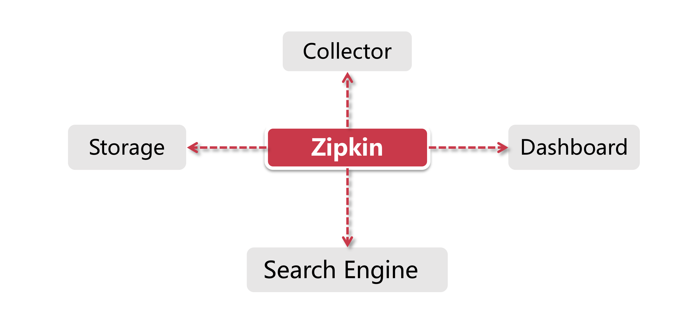

# Zipkin简介

这一节我们来认识一个和Sleuth形影不离的好搭档-Zipkin。

## 1、Why Zipkin

SIeuth为什么需要一个搭档?大家准道没发现Sleuth空有一身本领，可是没个页面可以展示出来吗? 而SIeuth似乎只是自娱自乐在Log里埋点，却没有一个汇聚信息的能力，不方便对整个集群的调用链路进行分析。Sleuth目前的情形就像Hystrix一样，也需要一个类似Turbine的组件做信息聚合+展示的功能。在这个背景下，Zipkin就是一个不错的选择。

Zipkin是一套分布式实时数据追踪系统，它主要关注的是时间维度的监控数据，比如某个调用链路下各个阶段所花费的时间，同时还可以从可视化的角度帮我们梳理上下游系统之间的依赖关系。

## 2、Zipkin的由来

很多厉害的大厂也很舍得在学术领域进行投入，比如我们熟悉的Hadoop的基础理论就是来源于Google的三大论文(Google File System、Map-Reduce、BigTable)。再如现在各大通讯公司全力投入的5G技术，其理论基础来源于土耳其一位教授的数学论文。学术界的成果一直在为未来业界前沿技术提供理论方向。

zipkin也是来源于Google发布的一篇有关分布监控系统论文(论文各称《Dapper, a Large-Scale Distributed Systems Tracing lnfrastucture》) ，Twiter基于该论文研发了一套开源实现-Zipkin。

### 3、Zipkin的核心功能

Zipkin的主要作用是收集Timing维度的数据，以供查找调用延迟等线上问题，所谓Timing其实就是开始时间+结束时间的标记，有了这两个时间信息，我们就能计算得出调用链路每个步骤的耗时。Zipkin的核心功能有以下两点：

**1.数据收集：**聚合客户端数据；

**2.数据查找：** 通过不同维度对调用链路进行查找；

Zipkin分为服务端和客户端，服务端是一个专门负责收集数据、查找数据的中心Portal，而每个客户端负责把结构化的Timing数据发送到服务端，供服务端做索引和分析。

这里重点关注下“Timing数据”到底用来做什么，前面说过Zipkin要解决调用延迟情况的线上排查，它通过收集一个调用链上下游所有工作单元的独立用时，Zipkin就能知道每个环节在服务总用时中所占的比重，再通过图形化界面的形式，让开发人员知道性能瓶颈出在哪里。

Zipkin提供了多种维度的查询功能用来检索Span的耗时，最直观的是通过 Trace ID 查找整Trace链路上所有Span的前后调用关系和每阶段的用时，还可以根据Service Name或者访问路径等维度进行查找。

## 4、Zipkin的组件

Zipkin 主要由四个组件组成：

**Collector：**很多人以为Collector是一个客户端组件，其实它是Zipkin Server的守护进程，用来验证客户端发送来的链路数据，并在存储结构中建立索引。守护进程就是指一类用于执行特定任务的后台进程，它独立于Zipkin Server的控制终端，一直等待接收客户端数据。

**Storage：**Zipkin支持ElasticSearch和MySQL等存储介质用来保存链路信息；

**Search Engine：**提供基于JSON API的接口来查找信息；

**Dashboard：**一个大盘监控页面，后台调用Search Engine来获取展示信息，大家如果本地启动Zipkin会每次刷新主页后系统日志会打印Error信息，这个是Zipkin的一个小问题，直接跳过即可。