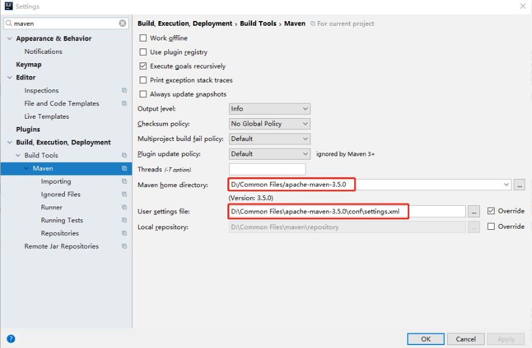
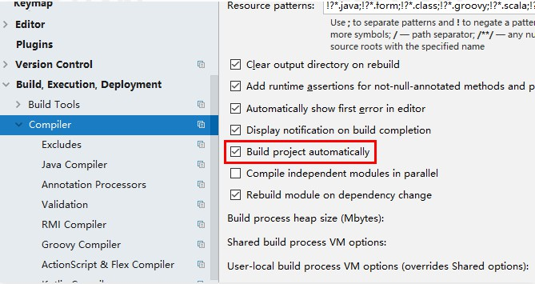

# SpringBoot项目创建与单元测试

Spring Boot 可以构建一切。Spring Boot 设计之初就是为了用最少的配置，以最快的速度来启动和运行 Spring 项目。Spring Boot 使用特定的配置来构建生产就绪型的项目。

## 1、Hello World

1.1）可以在 Spring Initializr 上面添加，也可以手动在 pom.xml 中添加如下代码:

```xml
<dependency>
      <groupId>org.springframework.boot</groupId>
      <artifactId>spring-boot-starter-web</artifactId>
</dependency>
```

 pom.xml 中有个默认的模块：

```xml
<dependency>
  <groupId>org.springframework.boot</groupId>
  <artifactId>spring-boot-starter-test</artifactId>
  <scope>test</scope>
</dependency>
```

<scope>test</scope>，表示依赖的组件仅仅参与测试相关的工作，包括测试代码的编译和执行，不会被打包包含进去；

spring-boot-starter-test 是Spring Boot 提供项目测试的工具包，内置了多种测试工具，方便我们在项目中做单元测试、集成测试。

1.2）编写 Controller 内容

在目录 src/main/java/com/imooc/web 下创建 HelloController:

```java
@RestController
public class HelloController {
    @RequestMapping("/hello")
    public String hello() {
        return "hello world";
    }
}
```

- @RestController 的意思是Controller 里面的方法都以 JSON 格式输出，不需要有其他额外的配置;如果配置为 @Controller，代表输出内容到页面。
- @RequestMapping("/hello")提供路由信息，"/hello" 路径的 HTTP Request 都会被映射到 hello() 方法上进行处理。

1.3）启动主程序

右键单击项目中的 HelloApplication|run 命令，就可以启动项目了，若出现以下内容表示启动成功:

```
2019-12-1 14:34:33.601  INFO 32996 --- [  restartedMain] o.s.b.w.embedded.tomcat.TomcatWebServer  : Tomcat started on port(s): 8080 (http) with context path ''
2019-12-1 14:34:33.602  INFO 32996 --- [  restartedMain] com.imooc.hello.HelloApplication           : Started HelloApplication in 0.66 seconds 
```

如果启动过程中出现java ClassNotFoundException 异常，请检查 Maven 配置是否正确，具体如下：

- 检查 Maven 的 settings.xml 文件是否引入正确；
- 检查 IDE 工具中的 Maven 插件是否配置为本机的 Maven 地址，如下图：



Spring Boot 还提供了另外两种启动项目的方式：

1. 在项目路径下，使用命令行 mvn sprina-bootrun 来启动，其效果和上面“启动主程序”的效果是一致的；
2. 或者将项目打包，打包后以 Jar 包的形式来启动。

```
# 进行项目根目录
cd ../hello
# 执行打包命令
mvn clean package
# 以 Jar 包的形式启动
java -jar target/hello-0.0.1-SNAPSHOT.jar
```

启动成功后，打开浏览器输入网址:http://localhost:8080/hello， 就可以看到以下内容了:

```
hello world
```

1.4）如果我们想传入参数怎么办?

请求传参一般分为 URL 地址传参和表单传参两种方式，两者各有优缺点，但基本都以键值对的方式将参数传递到后端。作为后端程序不用关注前端采用的那种方式，只需要根据参数的键来获取值，Spring 提供了很多种参数接收方式，今天我们了解最简单的方式：通过 URL传参

只要后端处理请求的方法中存在参数键相同名称的属性，在请求的过程中 Spring 会自动将参数值赋值到属性中，最后在方法中直接使用即可。下面我们以 hello()为例进行演示。

```java
@RestController
public class HelloController {
    @RequestMapping("/hello")
    public String hello(String name) {
        return "hello world, " +name;
    }
}
```

重新启动项目，打开浏览器输入网址 http://localhost:8080/hello?name=imooc，返回如下内容。

```
hello world, imooc 
```

到这里，我们的第一个 Spring Boot 项目就开发完成了，经过测试发现，修改 Controller 内相关的代码，需要重新启动项目才能生效，这样做很麻烦是不是?别着急，Spring Boot 又给我们提供了另外一个组件来解决。

## 2、热部署

热启动就需要用到我们在一开始就引入的另外一个组件：spring-boot-devtools。它是 Spring Boot 提供的一组开发工具包，其中就包含我们需要的热部署功能，在使用这个功能之前还需要再做一些配置。

2.1）添加依赖

在 pom.xml 文件中添加 spring-boot-devtools 组件

```xml
<dependency>
  <groupId>org.springframework.boot</groupId>
  <artifactId>spring-boot-Devtools</artifactId>
  <optional>true</optional>
</dependency>
```

在plugin中配置另一个属性fork，并且配置为true

```xml
<build>
    <plugins>
        <plugin>
            <groupId>org.springframework.boot</groupId>
            <artifactId>spring-boot-maven-plugin</artifactId>
            <configuration>
                <fork>true</fork>
            </configuration>
        </plugin>
</plugins>
</build>
```

2.2）配置IDEA

选择File|Settings|Compiler 命令，然后勾选 Build project automatically 复选框，低版本的 IDEA 请勾选 make project automatically 复选框



使用快捷键 Ctrl+Shift+A，在输入框中输入 Registry，勾选 compile.automake.allow.when.app.running 复选框:


全部配置完成后，IDEA 就支持热部署了，大家可以试着去改动一下代码就会发现 Spring Boot 会自动重新加载，再也不需要手动单击重新部署了。

为什么IDEA 需要多配置后面这一步呢?因为IDEA 默认不是自动编译的，需要我们手动去配置后才会自动编译，而热部署依赖于项目的自动编译功能。

> 该模块在完整的打包环境下运行的时候会被禁用，如果你使用 java-jar 启动应用或者用一个特定的 classloader 启动，它会认为这是一个“生产环境”。

## 3、单元测试

下面我们看下 Spring Boot 对单元测试又做了哪些支持?

如果我们只想运行一个 hello world，只需要一个 @Test 注解就可以了。在 src/test 目录下新建一个 HelloTest 类，代码如下：

```java
public class HelloTest {
    @Test
    public void hello(){
        System.out.println("hello world");
    }
}
```

右键单击“运行”按钮，发现控制台会输出:hello world。如果需要测试 Web 层的请求呢?

Spring Boot 也给出了支持。

以往我们在测试 Web 请求的时候，需要手动输入相关参数在页面测试查看效果，或者自己写 post 请求。在 Spring Boot 体系中，Sprinq 给出了一个简单的解决方案，使用 MockMVC 进行 Web 测试，MockMVC 内置了很多工具类和方法，可以模拟 post，get 请求，并目判断返回的结果是否正确等，也可以利用 print()打印执行结果。

```java
@SpringBootTest
public class HelloTest {
    private MockMvc mockMvc;
    @Before
    public void setUp() throws Exception {
        mockMvc = MockMvcBuilders.standaloneSetup(new HelloController()).build();
    }
    @Test
    public void getHello() throws Exception {
        mockMvc.perform(MockMvcRequestBuilders.post("/hello?name=Imooc")
          .accept(MediaType.APPLICATION_JSON_UTF8)).andDo(print());
    }
}
```

- @Before 注解的方法表示在测试启动的时候优先执行，一般用作资源初始化；
- accept(MediaType.APPLICATION JSON UTF8))这句是设置 JSON 返回编码，避免出现中文乱码的问题；
- 注意导包需要加入以下代码:

```
import static org.springframework.test.web.servlet.result.MockMvcResultHandlers.*;
```

因为 print() 等方法都是 MockMvcResultHandlers 类的静态方法。

在类的上面添加@SpringBootTest，系统会自动加载 Sprinq Boot 容器。在日常测试中，可以注入 bean来做一些局部的业务测试。MockMvcRequestBuilders可以支持 post、get 请求，使用 print() 方法会将请求和相应的过程都打印出来，具体如下：

```
MockHttpServletRequest:
      HTTP Method = POST
      Request URI = /hello
       Parameters = {name=[Imooc]}
          Headers = {Accept=[application/json;charset=UTF-8]}
             Body = <no character encoding set>
    Session Attrs = {}

Handler:
             Type = com.imooc.hello.web.HelloController
           Method = public java.lang.String com.imooc.hello.web.HelloController.hello(java.lang.String)

...

MockHttpServletResponse:
           Status = 200
    Error message = null
          Headers = {Content-Type=[application/json;charset=UTF-8], Content-Length=[19]}
     Content type = application/json;charset=UTF-8
             Body = hello world ,Imooc
    Forwarded URL = null
   Redirected URL = null
          Cookies = []
```

从返回的 Body = hello world ,Imooc 可以看出请求成功了。

当然每次请求都看这么多返回结果，不太容易识别，MockMVC 提供了更多方法来判断返回结果，其中就有判断返回值。我们将上面的 getHello()方法稍稍进行改造，具体如下所示：

```java
@Test
public void getHello() throws Exception {
    mockMvc.perform(MockMvcRequestBuilders.post("/hello?name=Imooc")
            .accept(MediaType.APPLICATION_JSON_UTF8))/*.andDo(print())*/
            .andExpect(MockMvcResultMatchers.content().string(Matchers.containsString("Imooc")));
}
```

把刚才的.andDo(print()) 方法注释掉，添加以下代码:

```
.andExpect(MockMvcResultMatchers.content().string(Matchers.containsString("Imooc")));
```

- MockMvcResultMatchers.content()，这段代码的意思是获取到 Web 请求执行后的结果；
- Matchers.containsString(“lmooc")，判断返回的结果集中是否包含“小明”这个字符串。

我们先将上面代码改为：

```
.andExpect(MockMvcResultMatchers.content().string(Matchers.containsString("Java架构师"))): 
```

然后执行 test 即可返回以下结果：

```
java.lang.AssertionError: Response content
Expected: a string containing "Java架构师"
     but: was "hello world ,Imooc"
...
```

抛出异常说明:期望的结果是包含“Java架构师”，结果返回内容是“hello world，lmooc”，不符合预期。

接下来我们把代码改回:

```
 .andExpect(MockMvcResultMatchers.content().string(Matchers.containsString("Imooc"))); 
```

再次执行测试方法，测试用例执行成功，说明请求的返回结果中包含了"Imooc"字段。

## 4、对比

我们简单做一下对比，使用 Spring Boot 之前和使用之后。

使用 Spring Boot 之前:

- 配置 web.xml，加载 Spring 和 Spring MVC
- 配置数据库连接、配置 Spring 事务
- 配置加载配置文件的读取，开启注解
- 配置日志文件
- 配置完成之后部署 Tomcat 调试

使用 Spring Boot 之后，仅仅三步即可快速搭建起一个 Web 项目：

- 页面配置导入到开发工具中
- 进行代码编写运行

通过对比可以发现 Spring Boot 在开发阶段做了大量优化，非常容易快速构建一个项目。

