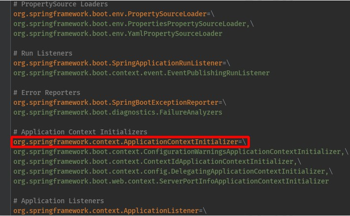
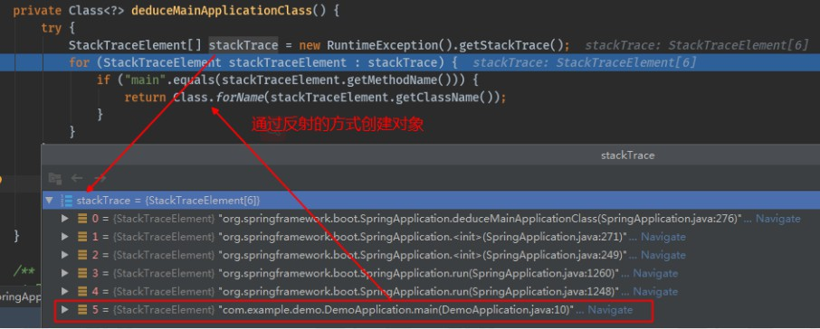

# SpringBoot启动流程分析原理

今天就来一起跟随源码探究下 SpringBoot 到底是如何做到"约定优于配置"的。

首先介绍下演示的项目环境，我们先试用SpringInitializr 来创建一个 SpirngBoot 工程。使用的版本是SpringBoot 2.1.5.RELEASE。


接下来就只在 pom.xml 文件中添加一个web工程的依赖，是为了观察后面容器类型的源码。

```xml
		<dependency>
            <groupId>org.springframework.boot</groupId>
            <artifactId>spring-boot-starter-web</artifactId>
        </dependency>
```

这样我环境就准备好了，跟着 springBoot 的源码来探究它的启动流程，首先找到这个应用程序的入口主方法，在上面打一个断点：


启动后，进入run()方法：

```java
public static ConfigurableApplicationContext run(Class<?>[] primarySources,String[] args) {
	return new SpringApplication(primarySources).run(args);
}
```

到这里会执行new SpringApplication(primarySources)创建spring应用对象，继续F5往下跟会执行SpringApplication构造器

```java
// SpringApplication构造器
public SpringApplication(ResourceLoader resourceLoader, Class<?>... primarySources) {
    // 资源加载器
		this.resourceLoader = resourceLoader;
		Assert.notNull(primarySources, "PrimarySources must not be null");
		this.primarySources = new LinkedHashSet<>(Arrays.asList(primarySources));
    // 1. 可能的web应用程序类型的类型。
		this.webApplicationType = WebApplicationType.deduceFromClasspath();
    // 2. 设置初始化应用context
		setInitializers((Collection) getSpringFactoriesInstances(
				ApplicationContextInitializer.class));
	// 3.设置初始化监听	
    setListeners((Collection) getSpringFactoriesInstances(ApplicationListener.class));
	// 4. 推演主程序类	
    this.mainApplicationClass = deduceMainApplicationClass();
	}
```

详解上述过程：

```java
static WebApplicationType deduceFromClasspath() {
		if (ClassUtils.isPresent(WEBFLUX_INDICATOR_CLASS, null)
				&& !ClassUtils.isPresent(WEBMVC_INDICATOR_CLASS, null)
				&& !ClassUtils.isPresent(JERSEY_INDICATOR_CLASS, null)) {
			return WebApplicationType.REACTIVE;
		}
		for (String className : SERVLET_INDICATOR_CLASSES) {
			if (!ClassUtils.isPresent(className, null)) {
				return WebApplicationType.NONE;
			}
		}
    // 这里是我们测试web容器
		return WebApplicationType.SERVLET;
	}
```

## 1、推断web应用类型

这段代码是来推断我们的应用是哪种web应用程序，当然一开始我们加入了web的依赖，所以是 servlet 容器

```
public enum WebApplicationType {

	/**
	 * The application should not run as a web application and should not start an
	 * embedded web server.
	 */
	NONE, // 不是web应用

	/**
	 * The application should run as a servlet-based web application and should start an
	 * embedded servlet web server.
	 */
	SERVLET, // servlet容器

	/**
	 * The application should run as a reactive web application and should start an
	 * embedded reactive web server.
	 */
	REACTIVE;  // 反应型web应用（webflux）
```


## 2、初始化应用上下文

在设置初始化应用context的时候，是先执行了qetSpringFactoriesInstances(ApplicationContextinitializer.class)方法，参数是ApplicationContextinitializer.class字节码对象

```java
private <T> Collection<T> getSpringFactoriesInstances(Class<T> type,
		Class<?>[] parameterTypes, Object... args) {
		ClassLoader classLoader = getClassLoader();
		// Use names and ensure unique to protect against duplicates
		Set<String> names = new LinkedHashSet<>(
      // 加载ApplicationContextInitializer.class类型的类
       // 这里传入就是参数 ApplicationContextInitializer.clas
	 	SpringFactoriesLoader.loadFactoryNames(type, classLoader));
    // 实例化加载到的类
		List<T> instances = createSpringFactoriesInstances(type, parameterTypes,
				classLoader, args, names);
		AnnotationAwareOrderComparator.sort(instances);
	// 返回
    return instances;
}
```

```java
public static List<String> loadFactoryNames(Class<?> factoryClass, @Nullable ClassLoader classLoader) {
		String factoryClassName = factoryClass.getName();
		return loadSpringFactories(classLoader).getOrDefault(factoryClassName, Collections.emptyList());
}
```

看看如何加载到这些类的

```java
private static Map<String, List<String>> loadSpringFactories(@Nullable ClassLoader classLoader) {
    // 先从缓存中拿
		MultiValueMap<String, String> result = cache.get(classLoader);
		if (result != null) {
			return result;
		}
		try {
// 去资源路径下加载
public static final String ACTORIES_RESOURCE_LOCATION = "META-INF/spring.factories"; 
public static final String FACTORIES_RESOURCE_LOCATION = "META-INF/spring.factories"; 
	Enumeration<URL> urls = (classLoader != null ?	
 classLoader.getResources(FACTORIES_RESOURCE_LOCATION) :     ClassLoader.getSystemResources(FACTORIES_RESOURCE_LOCATION);			result = new LinkedMultiValueMap<>();
			while (urls.hasMoreElements()) {
				URL url = urls.nextElement();
				UrlResource resource = new UrlResource(url);
				Properties properties = PropertiesLoaderUtils.loadProperties(resource);
				for (Map.Entry<?, ?> entry : properties.entrySet()) {
					String factoryClassName = ((String) entry.getKey()).trim();
					for (String factoryName : StringUtils.commaDelimitedListToStringArray((String) entry.getValue())) {
			result.add(factoryClassName, factoryName.trim());
					}
				}
			}
			cache.put(classLoader, result);
             // 返回所有的加载的类
			return result;
		}
		catch (IOException ex) {
			throw new IllegalArgumentException("Unable to load factories from location [" +
					FACTORIES_RESOURCE_LOCATION + "]", ex);
		}
	}
```

这里有两个加载配置类的地方其实都指向了META-INF/spring.factories，通过断点我们可以看到应用程序是加载了以下几个jar下的 spring.factores 文件

双击Shift搜索spring.factories可以看到它存在于以下工程中


spring-boot-2.1.5.RELEASE.jar 下的 spring.factores (截图未完整截取)



spring-boot-autoconfigure-2.1.5.RELEASE.jar 下的 spring.factores


spring-beans-5.1.7.RELEASE.jar 下的 spring.factores


从Map中根据org.springframework.context.ApplicationContextInitializer 的类型拿到需要的类初始化类，断点进入getOrDefault(factoryClassName，Collections.emptyList());方法


之后就是把加载到的需要初始化的类进行实例化添加到一个集合中等待备用

```java
public void setInitializers(
			Collection<? extends ApplicationContextInitializer<?>> initializers) {
		this.initializers = new ArrayList<>();
		this.initializers.addAll(initializers);
	}
```

## 3、初始化监听器类

比较重要的部分：


当我们跟进去之后，会发现在初始化监听类的时候和上面初始化应用上下文是一样的代码。唯一不同的是getSoringFactoriesInstances(AoplicationListenerclass))传进去的是·ApplicationListener.class所以这里就不再赘述。

## 4、推演主程序类

最关键的部分：

```java
this.mainApplicationClass = deduceMainApplicationClass();
```




到这里就完成了 springBoot 启动过程中初始化 SpringApplication 的过程。

## 5、小结

这篇文章主要是给大家说了下 springBoot 启动过程中初始化 SpringApplication 的流程，大致可以分为四个步骤

1. 推演web应用的类型(如果没有加web依赖类型NONE)
2. 初始化 ApplicationContextInitializer
3. 初始化 ApplicationListener
4. 推演出主程序类

通过这样四个步骤就完成了第一步 SpringApplication 的初始化过程。