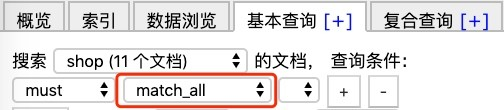
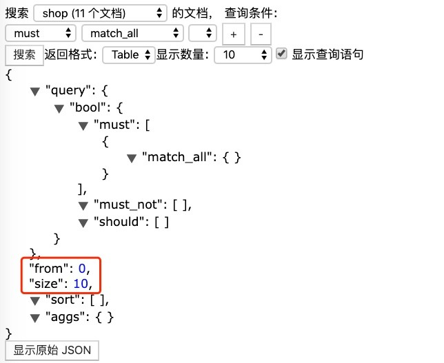

# DSL搜索（查询所有与分页）

## 1、match_all

在索引中查询所有的文档

```
GET     /shop/_doc/_search
```

或

```
POST     /shop/_doc/_search
{
    "query": {
        "match_all": {}
    },
    "_source": ["id", "nickname", "age"]
}
```

Head可视化操作：



## 2、分页展示

默认查询是只有10条记录，可以通过分页来展示

```
POST     /shop/_doc/_search
{
    "query": {
        "match_all": {}
    },
    "from": 0,
    "size": 10
}

{
	"query": {
		"match_all": {}
	},
	"_source": [
		"id",
		"nickname",
		"age"
	],
	"from": 5,
	"size": 5
}
```

Head可视化操作：

