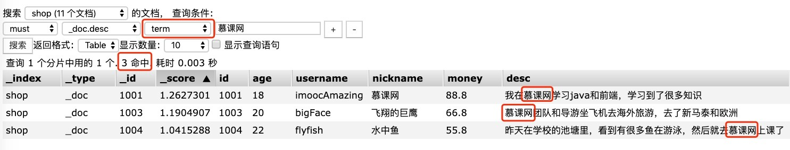
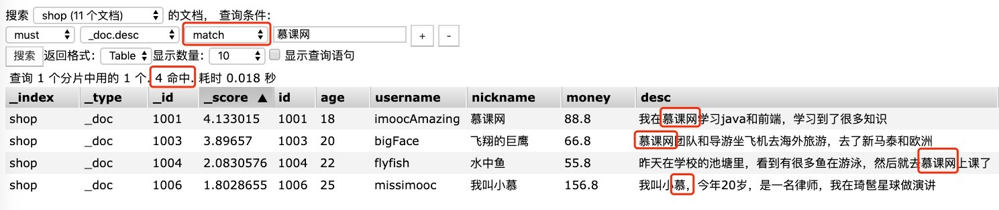

# DSL搜索（term/match）

## 1、term精确搜索与match分词搜索

搜索的时候会把用户搜索内容，比如"慕课网强大"作为一整个关键词去搜索，而不会对其进行分词后再搜索

```
POST     /shop/_doc/_search
{
    "query": {
        "term": {
            "desc": "慕课网"
        }
    }
}
对比
{
    "query": {
        "match": {
            "desc": "慕课网"
        }
    }
}
```

注：**match** 对 慕课网 先进行分词（其实就是全文检索）再查询，而  **term** 则不会，直接把 慕课网 作为一个整的词汇去搜索。

head 可视化操作对比：





## 2、terms 多个词语匹配检索

相当于是 tag 标签查询，比如慕课网的一些课程会打上 “前端”、“后端”、“大数据”、“就业课” 这样的标签，可以完全匹配做类似标签的查询。

```
POST     /shop/_doc/_search
{
    "query": {
        "terms": {
            "desc": ["慕课网", "学习", "骚年"]
        }
    }
}
```

