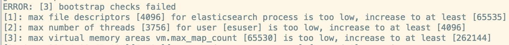
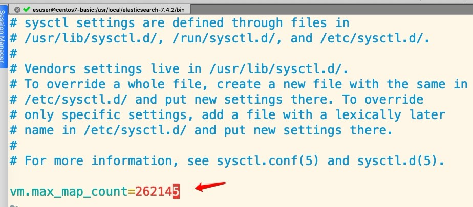

# Elasticsearch整合SpringBoot

## 1、创建工程，引入依赖

```
<dependency>
	<groupId>org.springframework.boot</groupId>
	<artifactId>spring-boot-starter-data-elasticsearch</artifactId>
	<!--<version>2.1.5.RELEASE</version>-->
	<version>2.2.2.RELEASE</version>
</dependency>

<dependency>
	<groupId>org.springframework.boot</groupId>
	<artifactId>spring-boot-starter-test</artifactId>
	<scope>test</scope>
</dependency>
```

## 2、配置yml

```
spring:
  data:
    elasticsearch:
      cluster-name: es6
      cluster-nodes: 192.168.1.187:9300
```

## 3、版本协调

目前sprinaboot-data-elasticsearch中的es版本贴合为es-6.4.3，如此一来版本需要统一，把es进行降级。等sprinaboot升级es版本后可以在对接最新版的7.4

## 4、Netty issue fix

```
@Configuration
public class ESConfig {

    /**
     * 解决netty引起的issue
     */
    @PostConstruct
    void init() {
        System.setProperty("es.set.netty.runtime.available.processors", "false");
    }
}
```

附 elasticsearch6.4.3配置文件

elasticsearch.yml

```
cluster.name: es6
node.name: node0
path.data: /usr/local/elasticsearch-6.4.3/data
path.logs: /usr/local/elasticsearch-6.4.3/logs
network.host: 0.0.0.0
```

如果出现如下错误：



则需要切换到root用户去修改如下配置：

```
vim /etc/security/limits.conf


* soft nofile 65536
* hard nofile 131072
* soft nproc 2048
* hard nproc 4096
```



别忘记 sysctl -p 刷新一下
最后再次启动OK
Don't forget!

中文分词器也需要去配置-下噢别忘记!:)
中文分词器的版本要记得使用6，而不是之前的7，版本一定要贴合噢~

比如目前的所有版本都是统一为es-6.4.3，那么下载地址为:

https://github.com/medcl/elasticsearch-analysis-ik/releases/tag/v6.4.3