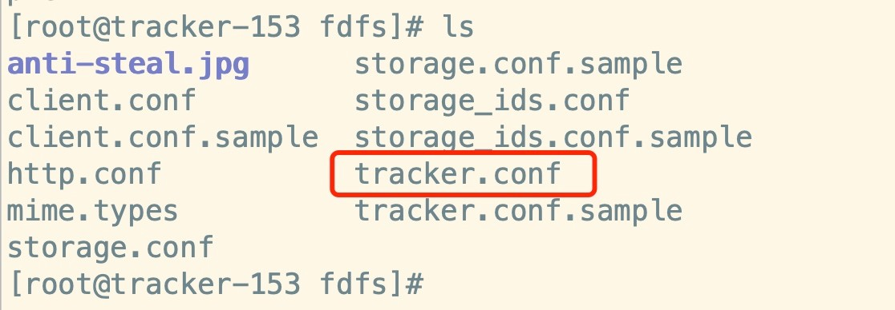
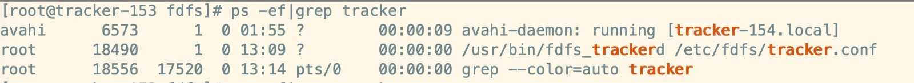

# 配置tracker服务

## 1、说明

tracker和storage都是同一个fastdfs的主程序的两个不同概念，配置不同的配置文件就可以设定为tracker或者storage

## 2、配置tracker

/etc/fdfs 下都是一些配置文件，配置tracker即可

```
vim tracker.conf
```



修改 tracker 配置文件，此为 tracker 的工作目录，保存数据以及日志

```
base_path=/usr/local/fastdfs/tracker

mkdir /usr/local/fastdfs/tracker -p
```

## 3、启动tracker服务

```
/usr/bin/fdfs_trackerd /etc/fdfs/tracker.conf
```

检查进程如下：

```
ps -ef|grep tracker
```



停止 tracker

```
/usr/bin/stop.sh /etc/fdfs/tracker.conf
```

