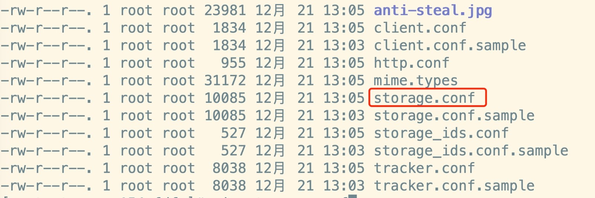
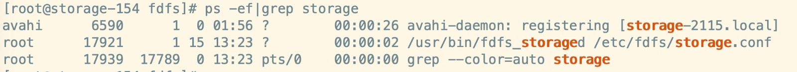
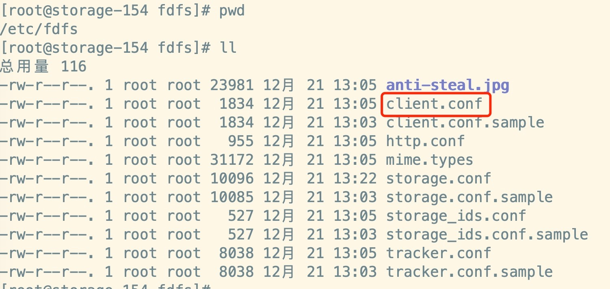
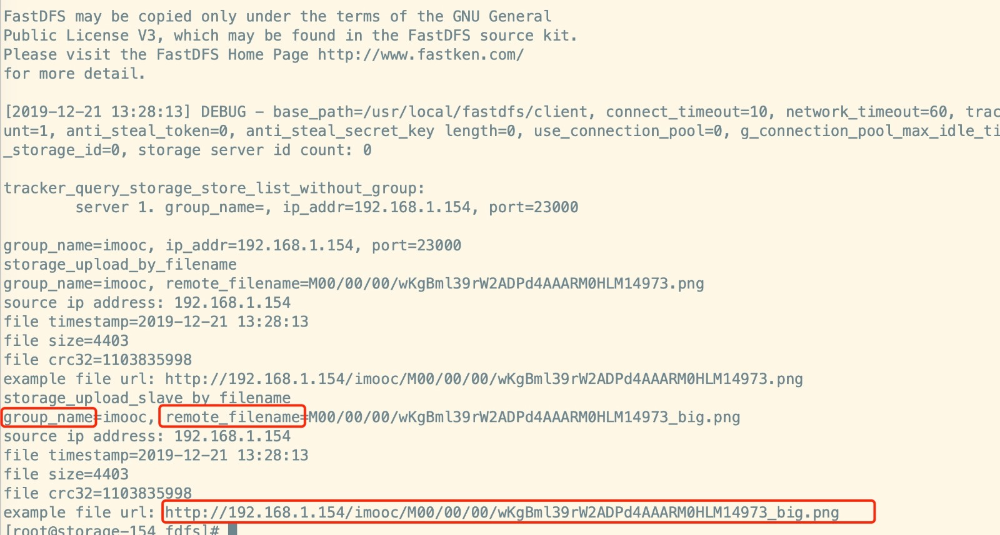

# 配置storage服务

## 1、修改storage配置文件

修改该 storage.conf 配置文件



```
# 修改组名
group_name=imooc
# 修改storage的工作空间
base_path=/usr/local/fastdfs/storage
# 修改storage的存储空间
store_path0=/usr/local/fastdfs/storage
# 修改tracker的地址和端口号，用于心跳
tracker_server=192.168.1.153:22122

# 后续结合nginx的一个对外服务端口号
http.server_port=8888
```

创建目录：

```
mkdir /usr/local/fastdfs/storage -p
```

## 2、启动 storage

前提：必须首先启动 tracker

```
/usr/bin/fdfs_storaged /etc/fdfs/storage.conf
```

检查进程如下：

```
ps -ef|grep storage
```



## 3、测试上传

修改client的配置文件：



```
  base_path=/usr/local/fastdfs/client
  tracker_server=192.168.1.153:22122

  mkdir /usr/local/fastdfs/client
```

测试：

```
wget https://www.imooc.com/static/img/index/logo.png
./fdfs_test /etc/fdfs/client.conf upload /home/logo.png
```

上传成功：

