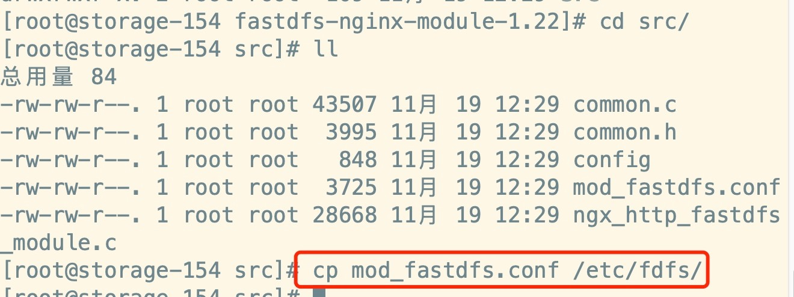
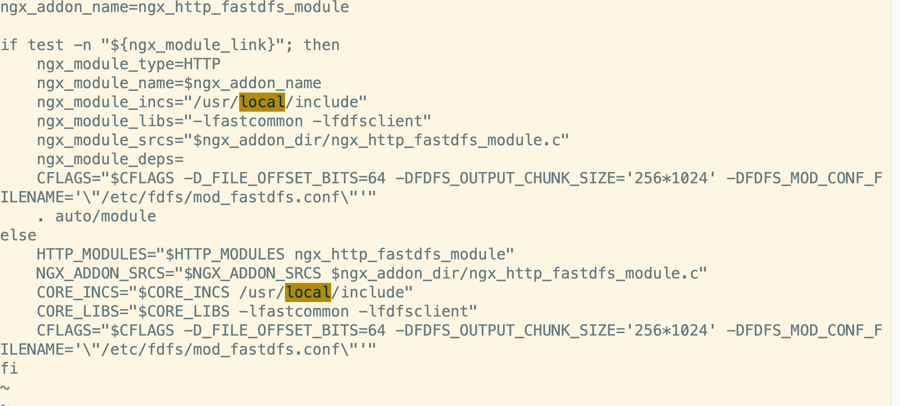

# 配置 nginx fastdfs 实现文件服务器

## 1、引子

fastdfs 安装好以后是无法通过 http 访问的，这个时候就需要借助 nginx 了，所以需要安装 fastdfs 的第三方模块到 nginx 中，就能使用了。

注：nginx 需要和 storage 在同一个节点。

## 2、安装 nginx 插件

解压 nginx 的 fastdfs 压缩包

```
tar -zxvf fastdfs-nginx-module-1.22.tar.gz
```

复制配置文件如下：

```
cp mod_fastdfs.conf /etc/fdfs
```



修改/fastdfs-nginx-module/src/config 文件，主要是修改路径，把 local 删除，因为 fastdfs 安装的时候我们没有修改路径，原路径是 /usr：



## 3、安装 nginx

其中配置如下：

```
./configure \n--prefix=/usr/local/nginx \n--pid-path=/var/run/nginx/nginx.pid \n--lock-path=/var/lock/nginx.lock \n--error-log-path=/var/log/nginx/error.log \n--http-log-path=/var/log/nginx/access.log \n--with-http_gzip_static_module \n--http-client-body-temp-path=/var/temp/nginx/client \n--http-proxy-temp-path=/var/temp/nginx/proxy \n--http-fastcgi-temp-path=/var/temp/nginx/fastcgi \n--http-uwsgi-temp-path=/var/temp/nginx/uwsgi \n--http-scgi-temp-path=/var/temp/nginx/scgi \n--add-module=/home/software/fdfs/fastdfs-nginx-module-1.22/src
```

主要新增一个第三方模块，修改 mod_fastdfs.conf 配置文件：

```
base_path=/usr/local/fastdfs/tmp
tracker_server=192.168.1.153:22122
group_name=imooc
url_have_group_name = true
store_path0=/usr/local/fastdfs/storage
```

新建目录：

```
mkdir /usr/local/fastdfs/tmp
```

修改 nginx.conf ，添加如下虚拟主机：

```
server {
    listen       8888;
    server_name  localhost;

    location /imooc/M00 {
            ngx_fastdfs_module;
    }
}
```

启动 Nginx


```
./configure --prefix=/usr/local/nginx --pid-path=/var/run/nginx/nginx.pid --lock-path=/var/lock/nginx.lock --error-log-path=/var/log/nginx/error.log --http-log-path=/var/log/nginx/access.log --with-http_gzip_static_module --http-client-body-temp-path=/var/temp/nginx/client --http-proxy-temp-path=/var/temp/nginx/proxy --http-fastcgi-temp-path=/var/temp/nginx/fastcgi --http-uwsgi-temp-path=/var/temp/nginx/uwsgi --http-scgi-temp-path=/var/temp/nginx/scgi --add-module=/home/software/fastdfs-nginx-module-1.22/src

```

```
./configure --prefix=/usr/local/nginx  --add-module=/home/software/fastdfs-nginx-module-1.22/src
```
