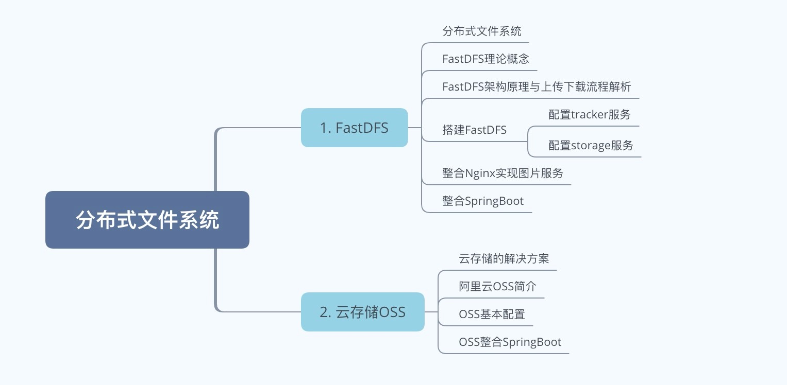

# 总结

思维导图如下：

- 本阶段主要针对fastdfs与oss的讲解，百先我们讲了什么是分布式文件系统与其概念，在传统的文件上传中，我们往往是上传到同服务器，但是这样会面临一个问题，就是当文件越来越多的时候，此时扩容是个问题，而且和业务服务耦合在一个计算机节点，所以在分布式系统中，我们往往需要采用分布式文件存储来解决这一问题。所以我们采用fastdfs来搭建。fastdfs可以很好的解决这一问题，我们讲解了其原理和上传下载流程，并且也搭建了fasdfs，我们采用了两台linux节点，一台搭建tracker服务，另一台搭建storage服务。当然，搭建完毕之后我们可以采用client来测试文件上传是否成功，成功以后就能看到文件上传的位詈了。

- 在搭建完毕fastdfs之后，我们此时并不能通过浏览器访问到。因为我们需要接入fastdfs提供的第三方模块，编译并目安装到nginx中才能使用。

  > 需要注意，配置过程中，nainx的端口需要使用8888，这个和storaae中保持一致，当然也可以自定义，如果是在一台独立的服务器中，完全可以使用http的默认端口号“80”;

- 当fastdfs与nginx搭建完毕以后，我们可以通过浏览器访问到图片，表示文件服务器搭建成功，随后我们能过通过结合springboot整合到项目中，来替换到原来的传统上传模式，当然fastdfs是一种文件存储的方式，但是他毕竟也还是有一定的局限性，比如运维成本较高，对上传后的文件处理也有一定的开发成本和复杂度，所以fastdfs比较适合中小型公司的前期使用，后续业务开展后可以结合云存储，比如阿里云、腾讯云、七牛云等都有第三方文件存储服务，我们可以结合第三方来降低运维成本以及风险，当然必不可少的就是服务会收费。这些云存储功能非常强大，并目也提供CDN加速服务。我们采用OSS进行了讲解与结合。

- 使用OSS需要下载SDK或者直接通过maven导入依赖即可，随后可以通过ossClient来进行上传，整个过程要比fastdfs简化很多，并且也能够通过阿里云的控制台来对文件进行可视化管理，十分方便。