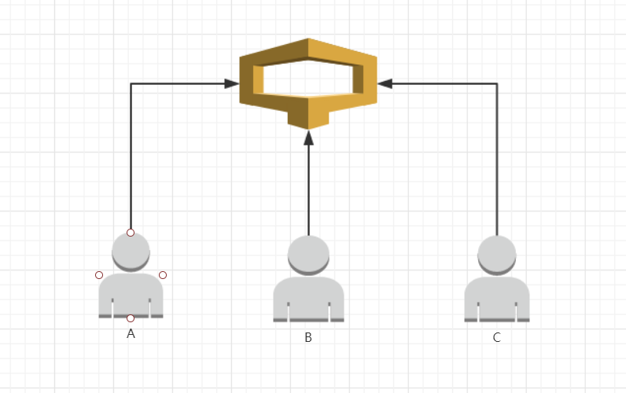
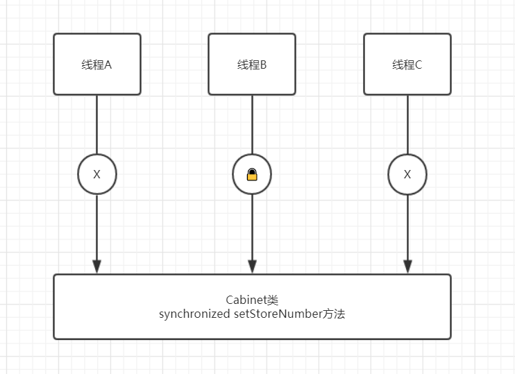

# 什么是锁

##### 1、场景描述

锁在 Java 中是一个非常重要的概念，尤其是在当今的互联网时代，高并发的场景下，更是离不开锁。那么锁到底是什么呢?

在计算机科学中，锁（Lock）或互斥（mutex）是一种同步机制，用于在有许多执行线程的环境中强制对资源的访问限制。锁旨在强制实施互斥排他，并发控制策路。

生活中的例子：大家都去过超市买东西，如果你随身带了包要放到储物柜里，把这个例子再极端一下，假如柜子只有一个，现在同时来了3个人A，B，C，都要往这个柜子里放东西。这个场景就构造了一个多线程，多线程自然离不开锁。如下图所示：



A，B，C 都要往柜子里放东西，可是柜子只能放一件东西，那怎么办呢？

这个时候呢就引出了锁的概念，3个人中谁抢到了柜子的锁，谁就可以使用这个柜子，其他的只能等待。

比如C抢到了锁，C可以使用这个柜子。A和B只能等待，等C用完了，释放锁以后，A和B再争抢锁，谁抢到了，再继续使用柜子。

##### 2、代码示例

我们再将上面的场景反应到程序中，首先创建一个柜子的类：

```java
public class Cabinet {
    //柜子中存储的数字
    private int storeNumber;   
    public void setStoreNumber(int storeNumber){
        this.storeNumber = storeNumber;
    }
    
    public int getStoreNumber(){
        return this.storeNumber;
    }  
}
```

柜子中存储的是数字，然后我们将3个用户抽象成一个类：

```java
public class User {
    //柜子
    private Cabinet cabinet;
    //存储的数字
    private int storeNumber;
    
    public User(Cabinet cabinet,int storeNumber){
        this.cabinet = cabinet;
        this.storeNumber = storeNumber;
    }
    
    //使用柜子
    public void useCabinet(){
        cabinet.setStoreNumber(storeNumber);
    }  
}
```

在用户的构造方法中，需要传入两个参数，一个是要使用的柜子，另一个是要存储的数字。

到这里，柜子和用户都已经抽象成了类，接下来我们再写一个启动类，模拟-下3个用户使用柜子的场景：

```java
public class Starter {
    public static void main(String[] args){
        Cabinet cabinet = new Cabinet();
        ExecutorService es = Executors.newFixedThreadPool(3);
        for (int i = 0; i < 3; i++){
            final int  storeNumber = i;
            es.execute(()->{
                User user = new User(cabinet,storeNumber);
                user.useCabinet();
                System.out.println("我是用户"+storeNumber+",我存储的数字是："+cabinet.getStoreNumber());
            });
        }
        es.shutdown();
    }
}
```

我们仔细的看一下这个main函数的过程：

首先创建一个柜子的实例，由于场景中只有一个柜子，所以我们只创建了一个柜子实例；

然后我们新建一个线程池，线程池中有3个线程，每个线程执行一个用户的操作；

再来看看每个线程具体的执行过程，新建用户实例，传入的是用户使用的柜子，我们这里只有一个柜子，所以传入这个柜子的实例，然后传入这个用户要存储的数字，分别是1，2，3，也分别对应着用户A，用户B，和用户C；

再调用使用柜子的操作，也就是向柜子中放入要存储的数字，然后立刻从柜子中取出数字，并打印出来；

我们运行一下main函数，看看打印的结果：

```
我是用户0,我存储的数字是：2
我是用户2,我存储的数字是：2
我是用户1,我存储的数字是：2
```

从结果中我们可以看出，3个用户在柜子中存储的数字都变成了2。我们再次运行程序，结果如下：

```
我是用户1,我存储的数字是：1
我是用户2,我存储的数字是：1
我是用户0,我存储的数字是：1
```

这次又变成了1。这是为什么呢?

问题就出在 user.useCabinet()这方法上，这是因为柜子这个实例没有加锁的原因，3个用户并行的执行，向柜子中存储他们的数字，虽然是3个用户并行的同时操作，但是在具体赋值时也是有顺序的，因为变量 StoreNumber 只占有一块内存，StoreNumber 只存储一个值，存储最后的线程所设置的值，至于哪个线程排在最后，则完全不确定，赋值语句执行完成后，进入到打印语句，打印语句取 StoreNumber 的值并打印，这时 storeNusr存储的是最后一个线程设置的值，3个线程取到的值是相同的，就像上面打印的结果一样。

那么如何解决这人个问题?

答案是 **锁**  ，在赋值语句上加锁，这样当多个线程(本文当中的多人用户) 同时赋值时，谁抢到了这把锁，谁才能赋值。这样保证同一时刻只能有一个线程进行赋值操作，避免了之前的混乱的情况。

那在程序中如何加锁呢？

这就要使用 Java中的-关键字了-- **snchronized**。 synchronized 分为 synchronzed 方法和 synchronized 同步代码块，下面我们看-一下两者的具体用法：

**synchronized** 方法，顾名思义，是把 synchronized 关键字写在方法上，它表示这个方法是加了锁的，当多个线程同时调用这个方法时，只有获得锁的线程才可以执行。我们看一下下面的例子：

```
    public synchronized String getTicket(){
        return "xxx";
    }
```

我们可以看到 getTicket) 方法加了锁，当多个线程并发执行的时候，只有获得到锁的线程才可以执行，其他的线程只能等待。

我们再来看看 synchronized 块，synchronized 块的语法是：

```
synchronized (对象锁){
    ……
}
```

我们将需要加锁的语向都写在 **synchronized** 块内，而在对象锁的位置，需要填写加锁的对象，它的含义是，当多个线程并发执行时，只有获得你写的这个对象的锁，才能执行后面的语句，其他的线程只能等待。

 **synchronized** 块通常的写法是 **synhronized(this)**，这 this 是当前类的实例，也就是说获得当前这个类的对象的锁，才能执行这个方法，这样写的效果和 synchronized 方法是一样的。

再回到我们的示例当中，如何解决 StoreNumber  混乱的问题呢?

可以在设置 StoreNumber 的方法上加上锁，这样保证同时只有一个线程能调用这个方法。如下所示：

```java
public class Cabinet {
    //柜子中存储的数字
    private int storeNumber;

    public synchronized void  setStoreNumber(int storeNumber){
        this.storeNumber = storeNumber;
    }

    public int getStoreNumber(){
        return this.storeNumber;
    }
}
```

我们在set 方法上加了 **synchronized** 关键字，这样在存储数字时就不会并行的去执行了，而是哪个用户抢到锁，哪个用户执行存储数字的方法。我们再运行一下main函数，看看运行的结果：

```
我是用户1,我存储的数字是：1
我是用户2,我存储的数字是：1
我是用户0,我存储的数字是：1
```

结果还是混乱的，再检查一下代码：

```java
es.execute(()->{
    User user = new User(cabinet,storeNumber);
    user.useCabinet();
    System.out.println("我是用户"+storeNumber+",我存储的数字是："+cabinet.getStoreNumber());
});
```

我们可以看到在 useCabinet 和打印的方法是两个语句，并没有保持原子性，虽然在 set 方法上加了锁，但是在打印时又存在了一个并发，打印语句是有锁的，但是不能确定哪个线程去执行。所以这里，我们要保证 useCabinet和打印方法的原子性，我们使用 synchronized块，但是 synchronized块里的对象我们使用谁的? 这又是一个问题，user 还是 cabinet?

当然是 cabinet ，因为每个线程都初始化了 user，总共有3个 user 对象了,而cabinet 对象只有一个，所以 synchronized 要用cabinet 对象。如下：

```


public class Starter {
    public static void main(String[] args){
        Cabinet cabinet = new Cabinet();
        ExecutorService es = Executors.newFixedThreadPool(3);
        for (int i = 0; i < 3; i++){
            final int storeNumber = i;
            es.execute(()->{
                User user = new User(cabinet,storeNumber);
				synchronized (cabinet){
    				user.useCabinet();
    				System.out.println("我是用户"+storeNumber+",我存储的数字是："+cabinet.getStoreNumber());
    				}
            });
        }
        es.shutdown();
    }
}
```

再去运行一下：

```
我是用户1,我存储的数字是：1
我是用户2,我存储的数字是：2
我是用户0,我存储的数字是：0
```

由于我们加了 synchronized 块，保证了存储和取出的原子性，这样用户存储的数字，和取出的数字就对应上了，不会造成混乱。

最后我们通过一张图上面示例的整体情况：



如上图所示，线程A，线程B，线程C同时调用 Cabinet类的 setStoreNumber() 方法，线程B获得了锁，所以线程B可以执行 setstorelumber 的方法，线程A和线程C只等待。

##### 3、总结

通过上面的场景与示例，我们可以了解多线程情况下，造成的变量值前后不一致的问题，以及锁的作用。在使用了锁以后，可以避免这种混乱的现象。