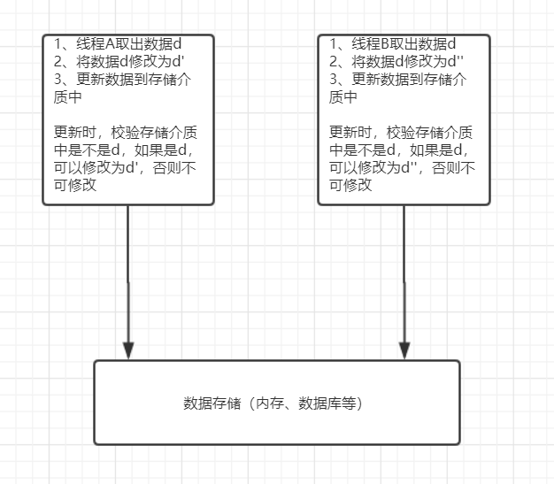
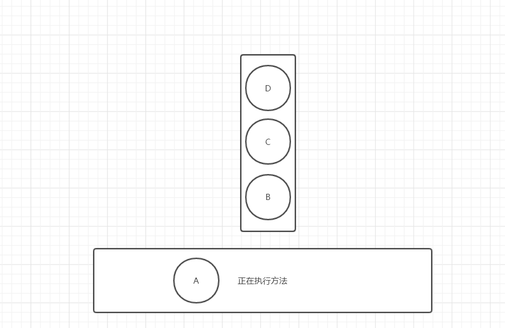
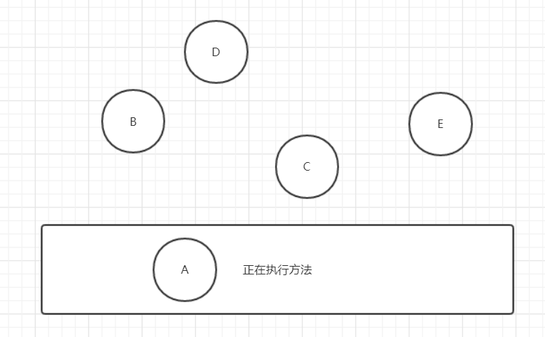

# Java中锁的解决方案

Java 为我们提供了种类丰富的锁，每种的都有不同的特性，锁的使用场景也各不相同，在这里给介绍 Java 中主流的几种锁。

##### 1、乐观锁 与 悲观锁

乐观锁与悲观锁应该是每个开发人员最先接的两种锁，应用场景主要是在更新数据的时候，更新数据也是使用锁的主要的场景之一。

更新数据的主要流程如下：

1. 检索出要更新的数据，供操作人员查看；
2. 操作人员更改需要修改的数值；
3. 点击保存，更新数据；

这个流程看似简单，但是我们用多线程的思维去考虑，就会发现其中隐藏着问题，我们具体看一下：

1. A检索出数据；
2. B检索出数据；
3. B修改了数据；
4. A修改数据，系统会修改成功吗？

当然啦，A修改成功与否，要看程序怎么写。咱们抛开程序，从常理考虑，A保存数据的时候，系统要给提示，说“您修改的数据已被其他人修改过，请重新查询确认”。那么我们程序中怎么实现呢?

1. 在检索数据，将数据的版本号 (version) 或者最后更新时间一并检索出来；
2. 操作员更改数据以后，点击保存，在数据库执行update操作；
3. 执行update操作时，用步骤1检索出的版本号或者最后更新时间与数据库中的记录作比较；
4. 如果版本号或最后更新时间一致，则可以更新；
5. 如果不一致，就要给出上面的提示；

上述的流程就是**乐观锁**的实现方式，在 Java 中乐观锁并没有确定的方法或者关键字，只是一个处理的流程、策路。

**乐观锁**：它是假设一个线程在读取数据的时候不会被其他线程更改数活数据，就像上面的例子那样，但是在更新数的时候会校验数据有没有被修改过。它是一种比较交换的机制，简称CAS(Compale And SwaD) 机制。一旦检测到有冲突产生，也就是上面说到的版本号或者最后更新时间不一致，它就会进行重试，直到没有中突为上冲突为止。

乐观锁的机制如图所示：



咱们看一下 Java 中最常用的 i，咱们思考一个问题，i+ 它的执行顺序是什么样子的? 它是线程安全的吗? 当多个线程并发执行 + 的时候，会不会有问题?

```java
public class Test {
	
    private int i=0;
    public static void main(String[] args) {
        Test test = new Test();
        //线程池：50个线程
        ExecutorService es = Executors.newFixedThreadPool(50);
        //闭锁
        CountDownLatch cdl = new CountDownLatch(5000);
        for (int i = 0;i < 5000; i++){
            es.execute(()->{
                test.i++;
                cdl.countDown();
            });
        }
        es.shutdown();
        try {
            //等待5000个任务执行完成后，打印出执行结果
            cdl.await();
            System.out.println("执行完成后，i="+test.i);
        } catch (InterruptedException e) {
            e.printStackTrace();
        }
    }
}
```

上面的程序中，我们模拟了50个线程同时执行 i++ ，总共执行5000次，按照常规的理解，得到的结果应该是5000，我们运行一下程序，看看执行的结果如何?

```
执行完成后，i=4975
执行完成后，i=4986
执行完成后，i=4971
```


这是我们运行3次以后得到的结果，可以看到每次执行的结果都不一样，而且不是5000，这是为什么呢?

这就说明 i++ 并不是一个原子性的操作，在多线程的情况下并不安全。我们把 i++ 的详细执行步骤拆解一下：

1. 从内存中取出的当前值；
2. 将 i 的值加1；
3. 将计算好的值放入到内存当中；

这个流程和我们上面讲解的数据库的操作流程是一样的。在多线程的场景下，我们可以想象一下，线程A和线程B同时从内存取出的值，假如 i 的值是1000，然后线程A和线程B再同时执行+1的操作，然后把值再放入内存当中，这时，内存中的值是1001，而我们期里的是1002，正是这个原因导致了上面的错误。

那么我们如何解决? 在 Java1.5以后，JDK官方提供了大量的原子类，这些类的内部都是基于CAS机制的，也就是使用了乐观锁，我们将上面的程序稍微改造一下，如下：

```java
public class Test {
    private AtomicInteger i = new AtomicInteger(0);
    public static void main(String[] args) {
        Test test = new Test();
        ExecutorService es = Executors.newFixedThreadPool(50);
        CountDownLatch cdl = new CountDownLatch(5000);
        for (int i = 0;i < 5000; i++){
            es.execute(()->{
                test.i.incrementAndGet();
                cdl.countDown();
            });
        }
        es.shutdown();
        try {
            cdl.await();
            System.out.println("执行完成后，i="+test.i);
        } catch (InterruptedException e) {
            e.printStackTrace();
        }
    }
}
```

我们将 变量i 的类型改为 **AtomicInteger** ， **AtomicInteger** 是一个原子类，我们在之前调用 i++ 的地方改成了 i.incrementAndGet()，incrementAndGet() 方法采用了CAS机制，也就是说使用了乐观锁。我们再运行一下程序，结果如下：

```
执行完成后，i=5000
执行完成后，i=5000
执行完成后，i=5000
```

我们同样执行了3次，3次的结果都是5000，符合了我们预期。这就是乐观锁，我们对乐观锁稍加总结、乐观锁在读取数据的时候不做任何限制，而是在更新数据的时候，进行数据的比较，保证数据的版本一致时再更新数据。

根据它的这个特点，可以看出**乐观锁适用于读操作多，而写操作少的场景**。

悲观锁与乐观锁恰恰相反，悲现锁以读取数据的时候就显示的加锁，直到数据更新完成，释放锁为止，在这期间只能有一个线程去操作，其他的线程只能等待。在 Java中，悲观锁可以使用 **synchronizd** 关健字或者 **ReentrantLock** 类来实现；还是上面的例子，我们分别使用这两种方式来实现一下，首先是使用 **synchronized** 关键字来实现：

```java
public class Test {

    private int i=0;
    public static void main(String[] args) {
        Test test = new Test();
        ExecutorService es = Executors.newFixedThreadPool(50);
        CountDownLatch cdl = new CountDownLatch(5000);
        for (int i = 0;i < 5000; i++){
            es.execute(()->{
                //修改部分  开始
                synchronized (test){
                    test.i++;
                }
                //修改部分  结束
                cdl.countDown();
            });
        }
        es.shutdown();
        try {
            cdl.await();
            System.out.println("执行完成后，i="+test.i);
        } catch (InterruptedException e) {
            e.printStackTrace();
        }
    }
}
```

我们唯一的政动就是增加了 synchronized块,它锁住的对象是 test，在所有线程中谁获得了 test 对象的锁，谁才能执行 i++  操作，我们使用了 synchronized 悲锁的方式，使得 i++ 线程安全。

我们再运行一下，看看结果如何：

```
执行完成后，i=5000
执行完成后，i=5000
执行完成后，i=5000
```

我们运行3次，结果都是5000，符合预期。接下来，我们再使用 ReentrantLock 类来实现悲观锁。代码如下：

```java
public class Test {
    //添加了ReentrantLock锁
    Lock lock = new ReentrantLock();
    private int i=0;
    public static void main(String[] args) {
        Test test = new Test();
        ExecutorService es = Executors.newFixedThreadPool(50);
        CountDownLatch cdl = new CountDownLatch(5000);
        for (int i = 0;i < 5000; i++){
            es.execute(()->{
                //修改部分  开始
                test.lock.lock();
                test.i++;
                test.lock.unlock();
                //修改部分  结束
                cdl.countDown();
            });
        }
        es.shutdown();
        try {
            cdl.await();
            System.out.println("执行完成后，i="+test.i);
        } catch (InterruptedException e) {
            e.printStackTrace();
        }
    }
}
```

我们在类中显示的增加了 Lock lock = new ReentrantLock ();，而且在 i++ 之前增加了 lock.lock()，加锁操作，在  i++ 之后增加了 lock.unlock() 释放锁的操作。

我们同样运行3次，看看结果：

```
执行完成后，i=5000
执行完成后，i=5000
执行完成后，i=5000
```

3次运行结果都是5000，完全符合预期。

我们再来总结一下悲观锁，悲现锁从读取数据的时候了锁，而且在更新数据的时候，保证只有一个线程在执行更新操作，没有像乐观锁那样进行数据版本的比较。所以悲观锁适用于读相对少，写相对多的操作。

##### 2、公平锁 与 非公平锁

公平锁与非公平锁。从名字不难看出，公平锁在多线程情况下，对待每一个线程都是公平的；而非公平锁恰好与之相反，举例说明，场景还是去超市买东西，在储物柜存储东西的例子。

储物柜只有一个，同时来了3个人使用储物柜，这时A先抢到了柜子，A去使用，B和C自觉进行排队。A使用完以后，后面排队中的第一个人将继续使用柜子，这就是公平锁。在公平锁当中，所有的线程都自觉排队，一个线程执行完以后，排在后面的线程继续使用；

非公平锁则不然，A在使用柜子的时候，B和C并不会排队，A使用完以后，将柜子的钥匙往后一抛，B和C谁抢到了谁用，甚至可能突然跑来一个D，这个D抢到了钥那么D将使用柜子，这个就是非公平锁。

公平锁如图所示：



多个线程同时执行方法，线程A抢到了锁，A可以执行方法，其他线程则在队列里进行排队，A执行完方法后，会从队列里取出下一个线程B，再去执行方法。以此类推；**对于每一个线程来说都是公平的，不会存在后加入的线程先执行的情况**。

非公平锁入下图所示：



多个线程同时执行方法，线程A抢到了锁，A可以执行方法。其他的线程并没有排队，A执行完方法，释做锁后，其他的线程谁抢到了锁，谁去执行方法。会存在后加入的线程，反而先抢到锁的情况。

公平锁与非公平锁都在 ReentrantLock 类里给出了实现，我们看一下 ReentrantLock 的源码：

```
    /**
     * Creates an instance of {@code ReentrantLock}.
     * This is equivalent to using {@code ReentrantLock(false)}.
     */
    public ReentrantLock() {
        sync = new NonfairSync();
    }

    /**
     * Creates an instance of {@code ReentrantLock} with the
     * given fairness policy.
     *
     * @param fair {@code true} if this lock should use a fair ordering policy
     */
    public ReentrantLock(boolean fair) {
        sync = fair ? new FairSync() : new NonfairSync();
    }
```

ReentrantLock 有两个构造方法，默认的构造方法中，sync = new Nonfairsync(); 我们可以从字面意思看出它是一个非公平锁。再看看第二个构造方法，它需要传入一个参数，参数是一个布尔型，true 是公平锁，false 是非公平锁，从上面的源码我们可以看出 sync 有两个实现类，分别是 Fairsymc 和 onfairsync ，我们再看看获取锁的核心方法，首先是公平锁 Fairsync 的：

```java
@ReservedStackAccess
protected final boolean tryAcquire(int acquires) {
    final Thread current = Thread.currentThread();
    int c = getState();
    if (c == 0) {
        if (!hasQueuedPredecessors() &&
            compareAndSetState(0, acquires)) {
            setExclusiveOwnerThread(current);
            return true;
        }
    }
    else if (current == getExclusiveOwnerThread()) {
        int nextc = c + acquires;
        if (nextc < 0)
            throw new Error("Maximum lock count exceeded");
        setState(nextc);
        return true;
    }
    return false;
}
```

然后是非公平锁 NonfairSync ：

```java
@ReservedStackAccess
final boolean nonfairTryAcquire(int acquires) {
    final Thread current = Thread.currentThread();
    int c = getState();
    if (c == 0) {
        if (compareAndSetState(0, acquires)) {
            setExclusiveOwnerThread(current);
            return true;
        }
    }
    else if (current == getExclusiveOwnerThread()) {
        int nextc = c + acquires;
        if (nextc < 0) // overflow
            throw new Error("Maximum lock count exceeded");
        setState(nextc);
        return true;
    }
    return false;
}
```

通过对比两个方法，我们可以看出唯一的不同之处在于 **!hasquewedpredecessors()** 这方法，很明显这方法是一个队列，由此可以推断，公平锁是将所有的线程放在个队列中，一个线程执行完成后，从队列中取出下一个线程，而非公平锁则没有这个队列。这些都是公平锁与非公平锁底层的实现原理，我们在使用的时候不用追到这么深层次的代码，只需要了解公平锁与非公平锁的含义，并且在调用构造方法时，传入 true 和 false 即可。

##### 3、总结

Java 中锁的种类非常多，在这一节中，我们找了非常典型的几个锁的类型给大家做了介绍。

乐观锁与悲观锁是最基础的，也是大家必须掌握的。大家在工作中不可避免的都要使用到乐观锁和悲观锁。从公平锁与非公平锁这个维度上看，大家平时使用的都是非公平锁，这也是默认的锁的类型，如果要使用公平锁，大家可以在秒杀的场景下使用，在秒杀的场景下，是遵循先到先得的原则，是需要排队的，所以这种场景下是最适合使用公平锁的。