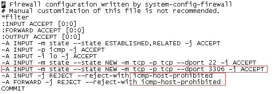

# MySql安装教程

## 1、安装Mysql

### 1.1、 查询释放安装了mysql

```
rpm -qa|grep mysql
```

### 1.2、卸载mysql

（下面是卸载mysql的库，防止产生冲突，mysql也是类似卸载方式）

```
rpm -e --nodeps mysql-libs-5.1.*

 卸载之后，记得： 

find / -name mysql 

删除查询出来的所有东西
```

### 1.3、安装mysql

```
yum install mysql-server
```

 注意：centos7这样安装不行

### 1.4、启动 mysql

```
启动方式1：service mysql start 

启动方式2：/etc/init.d/mysql start 

启动方式3：service mysqld start 

启动方式4：/etc/init.d/mysqld start
```

### 1.5、修改root密码

root账号默认是没有密码的，修改root密码：

```
/usr/bin/mysqladmin -u root password 密码 

例如：

/usr/bin/mysqladmin -u root password pwd   

这样就将root密码设置成pwd了
```

### 1.6、重置root密码

（忘记root密码找回）

#### 1.6.1、停止mysql服务

命令：

```
/etc/init.d/mysqld stop /etc/init.d/mysql stop
```

#### 1.6.2、输入绕过密码认证

命令：

```
mysqld_safe --user=mysql --skip-grant-tables --skip-networking &
```

#### 1.6.3、输入登录用户

命令：

```
mysql -u root mysql
```

#### 1.6.4、输入修改root密码

SQL语句：

```
update user set Password=password ('123456') where user='root';
```

#### 1.6.5、输入数据刷新

命令：

```
FLUSH  PRIVILEGES;
```

#### 1.6.6、退出Mysql

命令：

```
quit;
```

### 1.7、设置允许远程连接

命令：

```
grant all privileges on *.* to root@'%' identified by '123456789' with grant option;
```

### 1.8、开放端口3306

开放端口3306，否则依然无法远程连接

#### 1.8.1、打开防火墙配置文件

命令：

```
vi /etc/sysconfig/iptables
```

#### 1.8.2、 添加命令

命令：

```
-A INPUT -m state --state NEW -m tcp -p tcp --dport 3306 -j ACCEPT
```

注意：开通3306端口的行必须在icmp-host-prohibited前，否则无效：以下为配置结果：



#### 1.8.3、重启防火墙，使配置生效

命令：

```
/etc/init.d/iptables restart
```

### 1.9、设置开机启动mysql

#### 1.9.1、查看mysql服务是否自动开启

命令：

```
chkconfig --list | grep mysqld chkconfig --list | grep mysql
```

#### 1.9.2、开启mysql服务自动开启

命令：

```
chkconfig mysqld on chkconfig mysql on
```

### 1.10、将mysql默认引擎设置为InnoDB

#### 1.10.1、修改mysql配置文件my.cnf

命令：

```
cd /etc vi my.cnf
```

#### 1.10.2、在[mysqld]一段加入

内容：

```
default-storage-engine=InnoDB
```

#### 1.10.3、删除ib_logfile0、ib_logfile1两个文件

命令：

```
cd /var/lib/mysql rm -rf ib_logfile*
```

#### 1.10.4、重启mysql

### 1.11、开启mysql的日志

监控执行的sql语句，命令：

```
show global variables like ‘%general%’；该语句可以查看是否开启，以及生成位置 
```

命令：

```
set global general_log = on; // 打开   

set global general_log = off; // 关闭
```

参考文档：

[mysql]: 	"https://blog.csdn.net/fdipzone/article/details/16995303"

## 2、centos7安装mysql

```
wget http://dev.mysql.com/get/mysql-community-release-el7-5.noarch.rpm  
#rpm -ivh mysql-community-release-el7-5.noarch.rpm 
#yum install mysql-community-server 成功安装之后重启mysql服务 
#service mysqld restart 
初次安装mysql是root账户是没有密码的 设置密码的方法
#mysql -uroot 
mysql> set password for ‘root’@‘localhost’ = password('mypasswd'); 
mysql> exit
```

