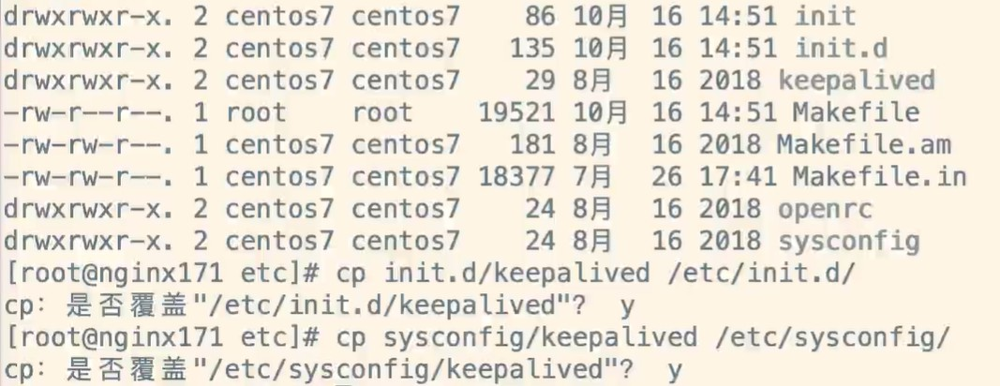
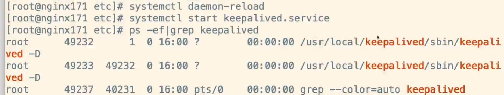

# 将Keepalived注册为系统服务

##### 1、拷贝相关配置

进入目录：

```
cd keepalived/keepalived-2.0.18/keepalived/etc
```

执行拷贝命令：

```
cp init.d/keepalived /etc/init.d/
cp sysconfig/keepalived /etc/sysconfig/
```



##### 2、重新加载配置

```
systemctl daemon-reload
systemctl start keepalived.service
```



