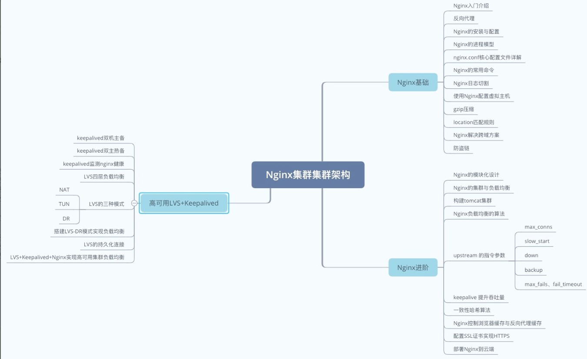

# 总结

## 1、内容思维导图

本阶段主要分为了三个部分:
1. Nginx入门基础
2. Nginx进阶
3. 高可用集群LVS+Keepalived

## 2、Nginx入门基础

本阶段开篇讲了Nginx介绍，啥是Nginx，有啥作用，啥叫反向代理，和正向代理有啥区别，并且也举例说明了。

随后就进行了Nginx的安装和配置，讲解了Nginx的进程模型以及核心配罟文件的内容。当nainx运行后，可以通过一些常用的命令去操作nainx。此外日志是一种生产服务器上调试的手段，可以通过日志来排音问题，但是日志需
要人工切割，否则就是一份大文件，所以我们讲解了如何定时的自动进行日志切割，可以按照时间日期进行切分。

随后我们讲解了如何通过nainx的虚拟主机功能映射不同的域名，这种场景就是当有多个域名但是只有一个服务器的时候，可以用nqinx来构建虚拟主机。

当网站里有css、js、html、图片等文件，可以通过gzip来压缩内容，这样可以节省网络带宽，提高用户的访问效率，减少交互时间。

location匹配规则也是用的比较多，其实也就是路由功能，根据不同的请求url来分配不同的访问。

除了JSONP和SpringBoot解决跨域问题外，也能通过Nginx来解决，所以我们也讲解了如何进行配置，虽然是在nginx.conf中配置，但是原理和springboot配置都是一样的。

对干静态资源，尤其是图片，往往我们可以设罟防盗链，避免被其他网站的引用，这也是平日里用的比较多的。

## 3、Nginx进阶

这一部分主要涉及到Nginx构建集群与负载均衡，首先讲了模块化设计，因为反向代理是属于其中的一个模块的。
随后就简介了集群与负载均衡的原理，并且构建了tomcat集群。集群涉及到相应的负载均衡算法，默认为轮询，当然我们也讲了其他的算法，包括加权轮询、ip hash、ur Ihash等。

此外upstream还提供了一些额外的指令，比如有:max_conns、slow_start、down、backun、max fails、fail_timeout，当然还能通过keepalived来提升系统的吞叶量。

在讲到iphash、url_hash的时候，我们讲了一致性哈希算法的原理，这个在面试过程中可能会被问到，所以需要理解。

在使用nginx的时候，我们往往会设置缓存，一个是浏览器缓存，通过nginx可以控制，另外一个则是反向代理缓存，可以把其他节点的内容缓存到Nginx这一点，以此来提高用户请求效率。

最后我们通过云服务器来演示了ssl的配置，因为https在现如今是非常重要的。并且我们也把Nginx部署到了云端，规避了tomcat的端口暴露。

## 4、高可用集群LVS+Keepalived

这一部分主要是针对高可用，为了解决Nginx的高可用，我们结合了keepalived来配置双机主备或者双主热备，要理解这两者区别，核心是VIP【虚拟IP】，用户通过VIP来访问的，另外为了保证nginx自动重启，提供7x24的不间断服务，需要自行添加脚本使得keepalived对nginx进行检测。

当然，单个Nginx往往是不够的，因为他的并发量还是有限，所以很多企业会采用LVS，LVS是四层负载，LVS涉及到NAT|TUN|DR这三种模式，我们也讲了他们之间的区别和原理，并且实现了DR模式，当然为了保证LVS的高可用，咱们也配合使用了Keepalived，因为Keepalived可以说就是为LVS量身打造的。需要注意，当keepalived和L vs结合以后，Nginx作为LVS的集群，就无需和keepalived结合了。

这一部分是精华部分。

