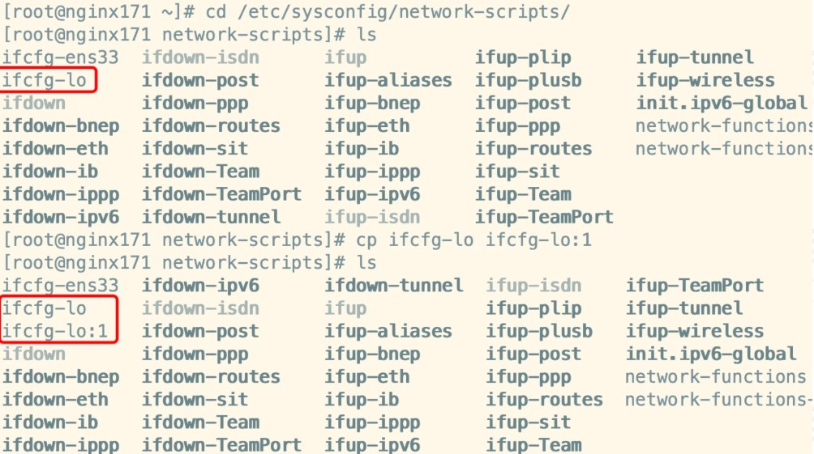
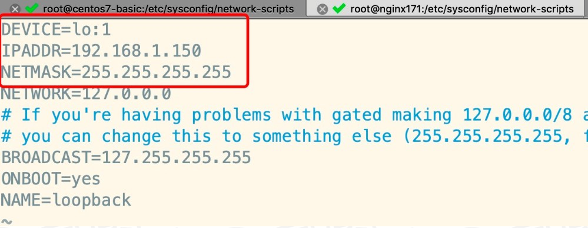
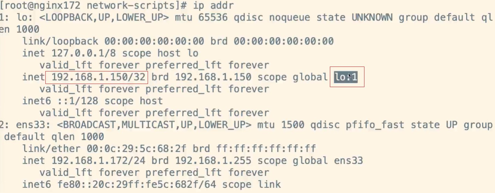

# 搭建LVS-DR模式- 为两台RS配置虚拟IP

## 配置虚拟网络子接口(回环接口)

### 1.1）找到本地环回接口

进入到网卡配罟目录，找到 lo(本地环回接口，用户构建虚拟网络子接口)，拷贝一份新的随后进行修改:



### 1.2）修改内容

修改内容如下：



### 1.3）重启后查看

重启命令：

```
service network restart
```



补充：

> 1)网络接口的命名
> 　　这里并不存在一定的命名规范，但网络接口名字的定义一般都是要有意义的。例如：
> 　　eth0: ethernet的简写，一般用于以太网接口。
> 　　wifi0:wifi是无线局域网，因此wifi0一般指无线网络接口。
> 　　ath0: Atheros的简写，一般指Atheros芯片所包含的无线网络接口。
> 　　lo: local的简写，一般指本地环回接口。       
>
> 2)网络接口如何工作
> 　　网络接口是用来发送和接受数据包的基本设备。
> 　　系统中的所有网络接口组成一个链状结构，应用层程序使用时按名称调用。
> 　　每个网络接口在linux系统中对应于一个struct net_device结构体，包含name,mac,mask,mtu…信息。
> 　　每个硬件网卡(一个MAC)对应一个网络接口，其工作完全由相应的驱动程序控制。  
>
> 3)虚拟网络接口
> 　　虚拟网络接口的应用范围非常广泛。最着名的当属“lo”了，基本上每个linux系统都有这个接口。
> 　　虚拟网络接口并不真实地从外界接收和发送数据包，而是在系统内部接收和发送数据包，因此虚拟网络接口不需要驱动程序。
> 　　虚拟网络接口和真实存在的网络接口在使用上是一致的。
>
> 4)网络接口的创建
> 　　硬件网卡的网络接口由驱动程序创建。而虚拟的网络接口由系统创建或通过应用层程序创建。
> 　　驱动中创建网络接口的函数是：register_netdev(struct net_device *)或者register_netdevice(struct net_device *)。
> 　　这两个函数的区别是：register_netdev(…)会自动生成以”eth”作为打头名称的接口，而register_netdevice(…)需要提前指定接口名称.事实上，register_netdev(…)也是通过调用register_netdevice(…)实现的。      