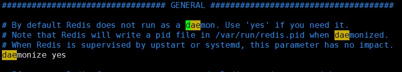
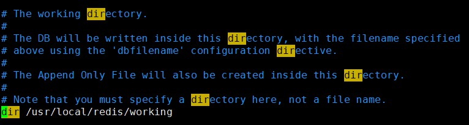
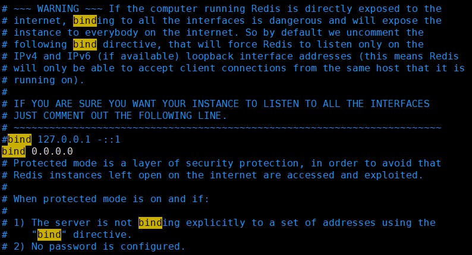
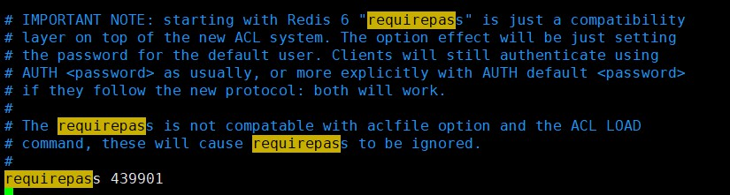
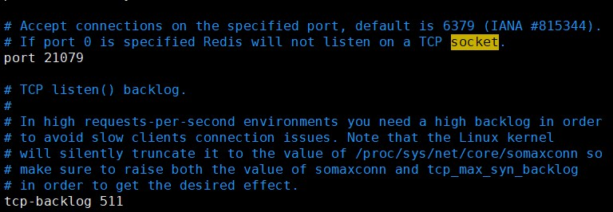
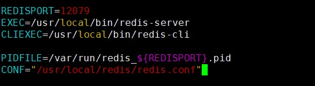
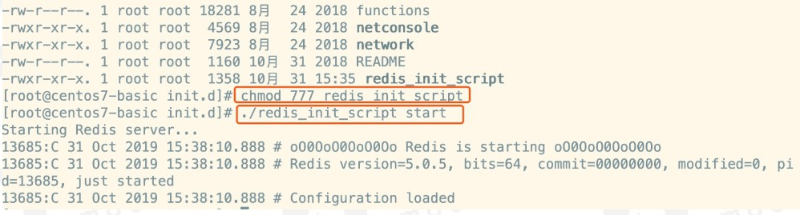
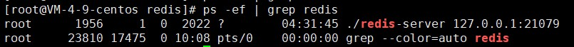
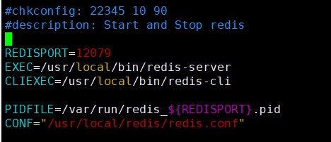

# 安装与配置 Redis

##### 1、下载

官网：https://redis.io/download

##### 2、上传至linux

##### 3、安装 Redis

###### 3.1、解压redis

```
tar -zxvf redis-6.2.6.tar.gz
```

###### 3.2、安装gcc编译环境

安装gcc编译环境，如果已经安装过了，那么就是 nothing to do

```
yum install gcc-c++
```

###### 3.3、安装gcc编译环境

进入到redis-6.2.6目录，进行安装：

    make && make install

执行完毕后安装成功

##### 4、配置redis

###### 4.1、设置开机自启动

在utils下，拷贝redis_init_script到/etc/init.d目录，目的要把redis作为开机自启动

```
cp redis_init_script /etc/init.d/
```

###### 4.2、设置配置文件目录

创建 /usr/local/redis，用于存放配置文件

```
mkdir /usr/local/redis
```

###### 4.3、拷贝redis配置文件

拷贝到 /usr/local/redis 下

```
cp redis.conf /usr/local/redis
```

###### 4.4、修改核心配置文件

修改redis.conf这个核心配置文件，修改 daemonize no -> daemonize yes，目的是为了让redis启动在linux后台运行



修改redis的工作目录，建议修改为： /usr/local/redis/working，名称随意（创建working目录）



修改如下内容，绑定IP改为 0.0.0.0 ，代表可以让远程连接，不收ip限制



最关键的是密码，默认是没有的，一定要设置



修改默认端口为 21079



修改 redis_init_script 文件中的redis核心配置文件为如下，并且修改redis核心配置文件名称为：6379.conf



为redis启动脚本添加执行权限，随后运行启动redis

```
chmod 777 redis_init_script
./redis_init_script start
```



检查redis进程

```
ps -ef | grep redis
```



 到此redis安装并且启动成功！

##### 5、设置redis开机自启动

设置redis开机自启动，修改 redis_init_script，添加如下内容

```
#chkconfig: 22345 10 90
#description: Start and Stop redis
```

如图所示：



随后执行如下操作：

```
chkconfig redis_init_script on
```

重启服务器(虚拟机)后，再看进程：

