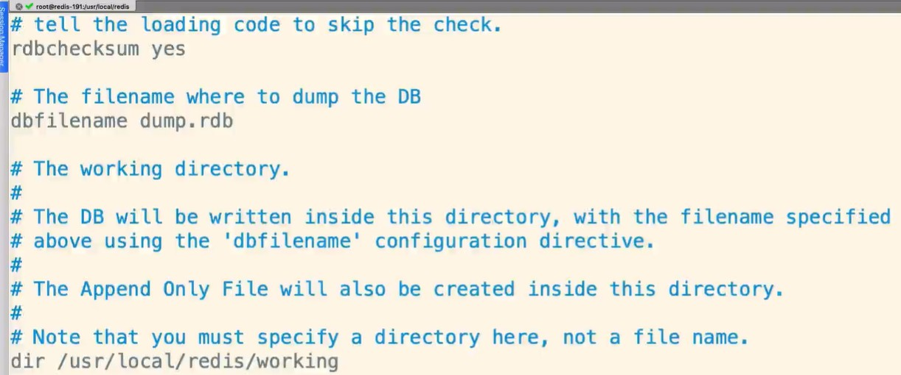
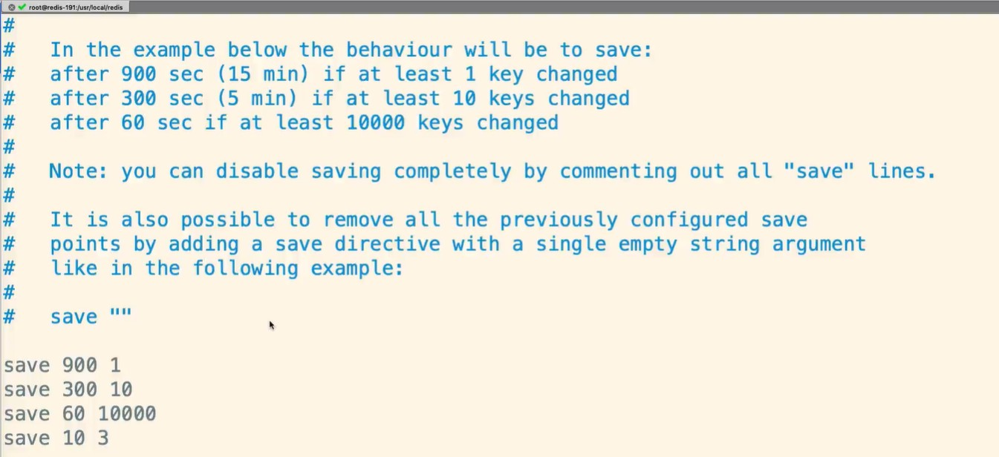
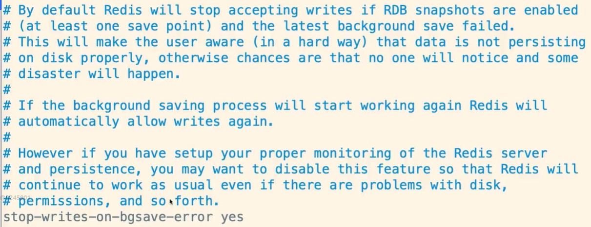
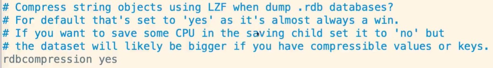

# Redis的持久化机制(RDB)

持久化作用

> 线上服务器一般都是一直运行的, 所以Redis理论上处于一直工作的状态; 从理论上说，redis缓存无需持久化也可以一直存在于内存中，但是如果我们的redis服务泵机了，程序员眼中没有绝对，这样就会造成数据丢失等问题，这个时候就需要Redis持久化，将内存的数据写到硬盘上去;

持久化机制两种方式：

RDB：Redis DataBase

AOF：Append Only File

## 1.什么是RDB

RDB：每隔一段时间，把内存中的数据写入磁盘的临时文件，作为快照，恢复的时候把快照文件读进内存中。如果宕机重启，那么内存里的数据肯定会没有的，那么再次启动redis后，则会恢复。

## 2.备份与恢复

内存备份-->磁盘临时文件

临时文件-->恢复到内存

## 3.RDB优劣势

优势：**(恢复简单方便)**

1.每隔一段时间备份，全量备份

2.灾备简单，可以远程传输

3.子进程备份的时候，主进程不会有任何io操作（不会有写入或者删除），保证备份数据的完整性。

4.相对AOF来说，当有更大文件的时候可以快速重启恢复

劣势：**(数据不一致性)**

1.发生故障时，可能会丢失最后一次的备份数据

2.子进程所占用的内存会和主进程一模一样，会造成cpu负担

3.由于定时全量备份是重量级操作，所以对于实时备份，就无法处理了

## 4.RDB的配置

1.保存位置，可以在redis.conf自定义：

/usr/local/redis/working/dump.rdb



2.保存机制

```
save 900 1
save 300 10
save 60 10000
save 10 3
```

```
* 如果1个缓存更新，则15分钟后备份
* 如果10个缓存更新，则5分钟后备份
* 如果10000个缓存更新，则1分钟后备份
* 演示：更新3个缓存，10秒后备份
* 演示：备份dump.rdb，删除重启
```



1.stop-writes-on-bgsave-error

yes：如果save过程中出错，则停止写操作

no：可能造成数据不一致



2.rdbcompression

yes：开启rdb压缩模式

no：关闭，会节约CPU损耗，但是文件会很大，道理同nginx


3.rdbchecksum

yes：使用CRC64算法校验rdb进行数据校验，大约有10%性能损耗

no：不校验



## 总结

RDB适合大量数据的恢复，但是数据的完整性和一致性可能会不足（宕机后最后一次数据保存的完整性）