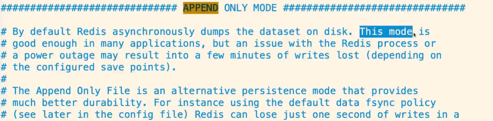
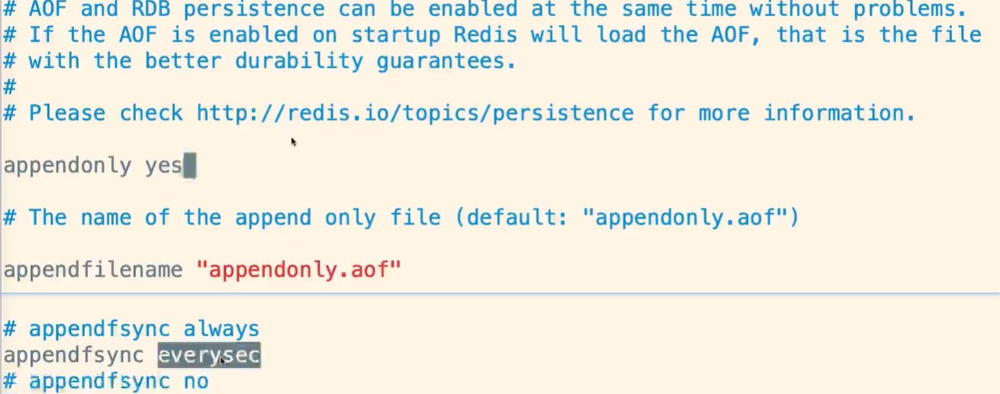
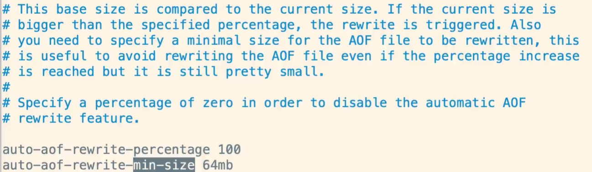
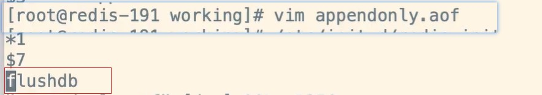
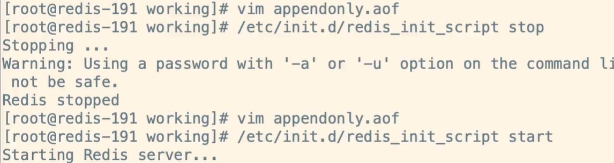

# Redis的持久化机制(AOF)

## 1、引子

RDB会丢失最后一次备份的rdb文件，但是其实也无所谓，其实也可也以忽略不计，毕竟是缓存丢了就丢了，但是如果追求数据的完整性，那么就得考虑使用AOF了。

## 2、AOF特点

1.以日志的形式来记录用户请求的写操作。读操作不记录，因为写操作会存储。

2.文件已追加的形式而不是修改的形式。

3.redis的aof恢复其实就是把追加的文件从开始到结尾读取执行写操作。

## 3、优势

1.AOF更加耐用，可以以秒级别为单位备份，如果发生问题，也只会丢失最后一秒的数据，大大增加了可靠性和数据完整性。所以AOF可以每秒备份一次，使用fsync操作。

2.以log日志形式追加，如果磁盘满了，会执行redis-check-aof工具。

3.当数据太大的时候，redis可以在后台自动重新AOF。当redis继续把日志追加到老的文件中去时，重写也是非常安全的，不会影响客户端的读写操作。

4.AOF日志包含的所有写操作，会更加便于redis的解析恢复。

## 4、劣势

1.相同的数据，同一份数据。AOF比RDB大

2.针对不同的同步机制，AOF会比RDB慢，因为AOF每秒都会备份做写操作，这样相对于RDB来说就略低。每秒备份fsync就没问题，但是如果客户端的每次写入就做一次备份fsync，那么redis的性能就会下降。

3.AOF发生过bug，就是数据恢复的时候数据不完整，这样显得AOF会比较脆弱，容易出现bug，因为AOF没有RDB那么简单，但是为了反之bug的产生，AOF就不会根据旧的指令去重构，而是根据当时缓存中的数据指令去重构，这样就更加健壮和可靠了。

## 5、AOF的配置

```
# AOF 默认关闭，yes可以开启
appendonly no

# AOF 的文件名
appendfilename "appendonly.aof"

# no：不同步
# everysec：每秒备份，推荐使用
# always：每次操作都会备份，安全并且数据完整，但是慢性能差
appendfsync everysec

# 重写的时候是否要同步，no可以保证数据安全，yes会产生数据不一致
no-appendfsync-on-rewrite no

# 重写机制：避免文件越来越大，自动优化压缩指令，会fork一个新的进程去完成重写动作，新进程里的内存数据会被重写，此时旧的aof文件不会被读取使用，类似rdb
# 当前AOF文件的大小是上次AOF大小的100% 并且文件体积达到64m，满足两者则触发重写
auto-aof-rewrite-percentage 100
auto-aof-rewrite-min-size 64mb
```







flushdb后数据恢复，删除相关flush命令即可



重启数据即可恢复



## 6、到底采用RDB还是AOF呢？

1.如果你能接受一段时间的缓存丢失，那么就可以使用RDB

2.如果你对实时性的数据比较在意，那么就用AOF

3.使用RDB和AOF结合一起做持久化，RDB做冷备，可以在不同时期对不同版本做恢复，AOF做热备，保证数据仅仅只有1秒的损失。当AOF破损不可用了，那么再用RDB恢复，这样就做到了两者的相结合，也就是说redis恢复会先加载AOF，如果AOF有问题会加载RDB，这样就达到了冷热备份的目的。