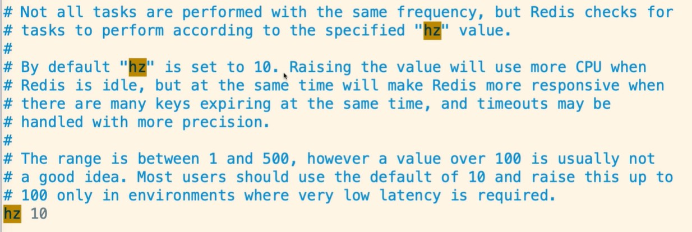
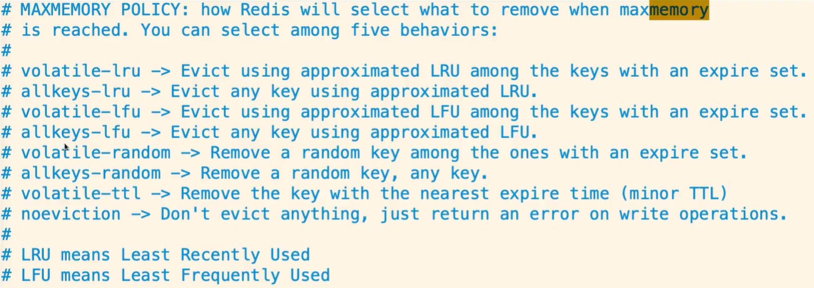
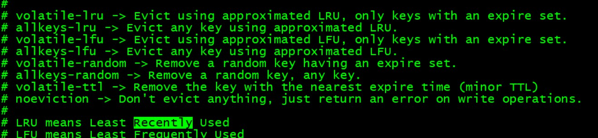

# Redis缓存过期处理与内存淘汰机制

## 1、引子

计算机内存有限，越大越贵，Redis的高并发高性能都是基于内存的，用硬盘的话GG。

## 2、已过期的key如何处理?

设置了expire的key缓存过期了，但是服务器的内存还是会被占用，这是因为redis所基于的两种删除策略 redis有两种策略:

1、(主动)定时删除

定时随机的检查过期的key，如果过期则清理删除。(每秒检查次数在redis.conf中的hz配置)



2、(被动)惰性删除

当客户端请求一个已经过期的key的时候，那么redis会检查这个key是否过期，如果过期了，则删除，然后返回一个nil。这种策略对cpu比较友好，不会有太多的损耗，但是内存占用会比较高。

所以，虽然key过期了，但是只要没有被redis清理，那么其实内存还是会被占用着的。

## 3、如果内存被Redis缓存占用慢了咋办?

内存占满了，可以使用硬盘，来保存，但是没意义，因为硬盘没有内存快，会影响redis性能。

所以，当内存占用满了以后，redis提供了一套缓存淘汰机制:MEMORY MANAGEMENT

maxmemory:当内存已使用率到达，则开始清理缓存

```
* noeviction：旧缓存永不过期，新缓存设置不了，返回错误
* allkeys-lru：清除最少用的旧缓存，然后保存新的缓存（推荐使用）
* allkeys-random：在所有的缓存中随机删除（不推荐）
* volatile-lru：在那些设置了expire过期时间的缓存中，清除最少用的旧缓存，然后保存新的缓存
* volatile-random：在那些设置了expire过期时间的缓存中，随机删除缓存
* volatile-ttl：在那些设置了expire过期时间的缓存中，删除即将过期的
```



## 4、内存淘汰管理机制

核心配置文件中 -- MEMORY MANAGEMENT 模块

配置内存溢出阀值  maxmemory

Redis设置最大内存溢出，自动清理策略

```
1、noeviction(默认)

内存满了后，如果有新缓存要保存，会旧缓存会保留在redis中，但是新缓存添加的时候会抛异常

2、allkeys-lru/allkeys-lfu(推荐使用)

清除最少用的旧缓存,保存新的缓存

lru是最近使用很少的，lfu的长期观察的结果使用频率最少的;

3、allkeys-random(不推荐)

在所有缓存中随机删除(包括热键也是随机的),来使新的缓存可以被保存

4、volatile-lru/lfu

在设置了expire过期时间的缓存中，清除使用最少的缓存，保存新缓存

lru是最近使用很少的，lfu的长期观察的结果使用频率最少的;

5、volatile-random

在设置了expire过期时间的key中，随机删除

6、volatile-ttl

在那些设置了expire过期时间的缓存中，删除距离过期时间最近的key

```

