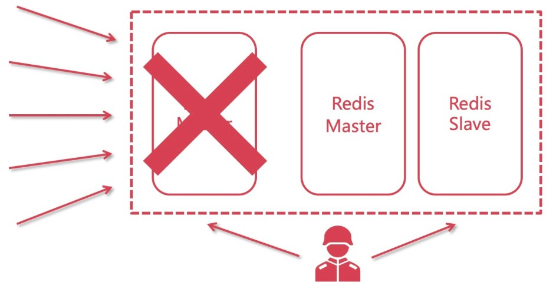

# Redis哨兵机制与实现

## 1、引子

Master挂了，如何保证可用性，实现继续读写

## 2、什么是哨兵

Sentinel（哨兵）是用于监控Redis集群中Master状态的工具；是Redis高可用解决方案；哨兵可以监视一个或者多个redis master服务，以及这些master的所有从服务；当某个master服务宕机后，会把这个master下的某个服务升级为master来替代已宕机的master继续工作。

示例图如下：



## 3、配置哨兵监控master

创建并且配置sentinel.conf

普通配置：

```
port 26379
pidfile "/usr/local/redis/sentinel/redis-sentinel.pid"
dir "/usr/local/redis/sentinel"
daemonize yes
protected-mode no
logfile "/usr/local/redis/sentinel/redis-sentinel.log"
```

核心配置：

```
# 配置哨兵
sentinel monitor mymaster 127.0.0.1 6379 2
# 密码
sentinel auth-pass <master-name> <password>
# master被sentinel认定为失效的间隔时间
sentinel down-after-milliseconds mymaster 30000
# 剩余的slaves重新和新的master做同步的并行个数
sentinel parallel-syncs mymaster 1
# 主备切换的超时时间，哨兵要去做故障转移，这个时候哨兵也是一个进程，如果他没有去执行，超过这个时间后，会由其他的哨兵来处理
sentinel failover-timeout mymaster 180000
```

## 4、启动哨兵*3

 redis-sentinel sentinel.conf

## 5、测试

master挂了，看slave是否成为master

master恢复，观察slave状态

## 6、结论

master挂了以后，由于哨兵监控，剩余slave会进行选举，选举后其中一个成为master，当原来的master恢复后，它会成为slave