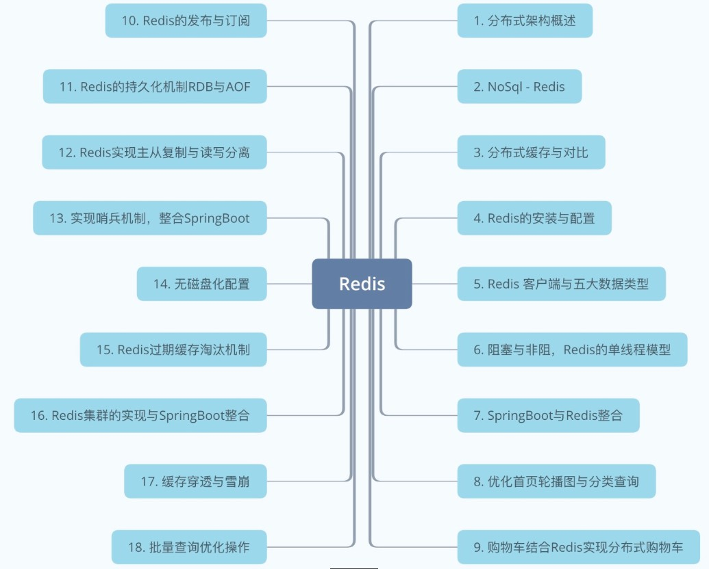

# Redis总结

内容如下图：

1. 本阶段开篇讲述了分布式相关，其实分布式和集群的概念在前期就介绍过了，不同的节点做着不同的事，就是分布式，不同的节点做着相同的事就是集群。那么Redis是NoSql，不仅仅是sql，功能更强劲，可以作为缓存写入内存，提供高速访问，为数据库做了一道屏障，保护数据库，把热点数据放入缓存，从而提升项目的并发量与吞吐量。

2. 介绍完Redis后我们又一起搭建了单机单实例版的Redis，需要注意，Redis虽然可以在win或mac上搭建，但是企业里都是linux，所以我们一定要使用linux来搭建和配置。

3. Redis提供命令行客户端工具，也就是redis-cli，进入命令行后可以进行相应的操作，我们讲述了五大数据类型，分别为:string，list，hash，set与zset。每个数据类型包含了一些操作指令，这些没有必要去死记硬背，遇到了，就去杳一下api，百度一下即可。
4. Redis是单线程的，但是他的性能却很高，在这里我们讲述了Redis的单线程模型，这一点往往在面试过程中会被问到。
5. 当单机的Redis安装配置完毕以后，我们整合到了项目中，结合了SpringBoot，优化了首页的轮播图与分类，因为这些完全可以放入缓存，没有必要去查询数据库。当然，对于前期单体阶段的购物车，我们结合了redis实现了分布式购物车，如此，不论用户在任何电脑访问，都能看到曾经的购物车数据，并且我们也实现了登录后的同步购物车功能。
6. Redis可以实现类似于MQ的发布与订阅，是属于生产者与消费者模式，但是正所谓专人做专事，发布订阅机制没有必要用Redis来实现，企业里都是使用的MQ。
7. Redis的持久化机制，RDB与AOF，这两种模式大家一定要知道他们之间的区别，一个是全量备份，一个是增量定时，各有各的好，也有缺点，面试过程中会被问到。

8. 单机Redis存在单点故障与读并发量的限制，所以可以通过主从与哨兵来实现，主从解决读写分离，并且一主多从能够提升读的并发。哨兵提供监控机制，一旦主挂了，备则上位成为主，如此实现高可用。
9. 在Redis中可以设置无磁盘化，如果磁盘比较慢，可以打开，但是一般来说，服务器都会采用ssd，尤其针对数据存储类的。
10. 当key过期了，你会发现内存占用率还是很高，这是因为redis的机制，有被动主动之分。这一点在面试中可能会被问到。此外，对于内存写满后的key淘汰机制，我们也在这里提到过，不同的策略都可以配置。
11. Redis除了单机与哨兵模式外，还能搭建集群，最经典的还属三主三从，搭建完毕后我们还整合了SpringBoot，其实由于springboot的yml配置特性，大大的减少了配置项，如果你使用springmvc，xml中的配置会有很多，而yml中的配置也就2-3行的事。
12. 对于缓存来说，我们还需要预防缓存穿透与雪崩，穿透的话一般来说只需要针对空值缓存就行，过期时间设置5-10分钟，这样就流量就不会打在数据库上导致死机宕机。雪崩其实也可以做到提前预防，那就是用到过期时间的key，时间全部错开，此外，有些数据可以做永久保存的话那就直接保存好了，这样就不会造成大面积的key失效了。
13. 最后有一点还需要说的，就是当一次请求过来，如果查询的key比较多，能做到批量就批量，如果是循环查询缓存的话，一来吞吐量低，而来比较low。