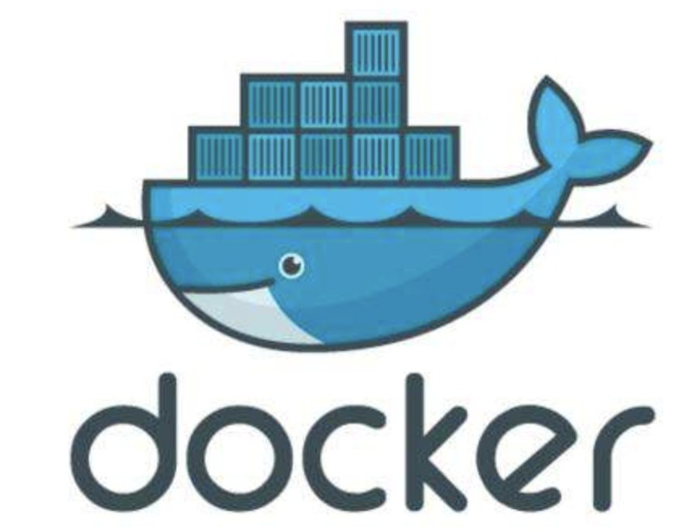
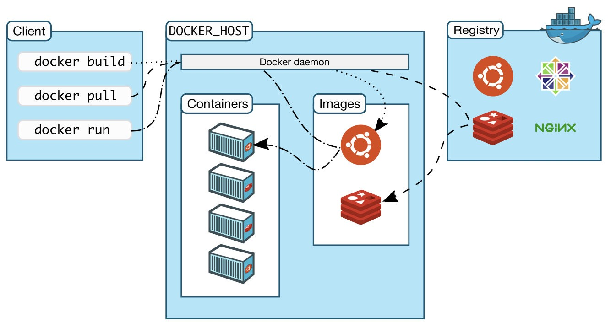
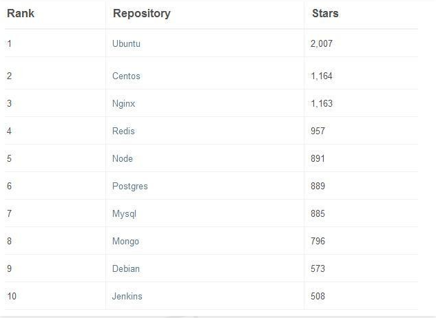
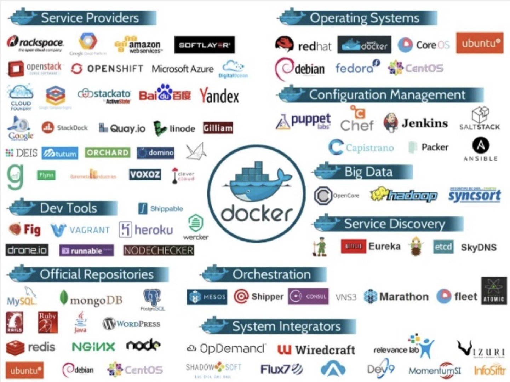
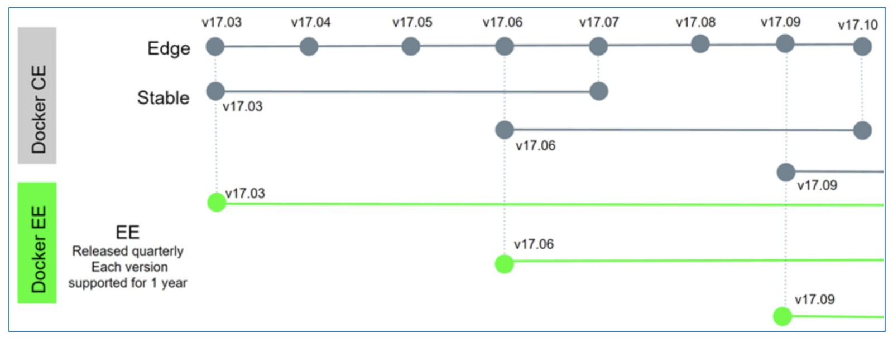

# Docker的功能和理念

## 1、Docker能做什么?

说到容器，大家第一反应就是Docker，由此可见Docker的第一要务就是容器的运行和管理。

容器的英文名叫做“Container“，最直白的翻译其实应该是“集装箱”。Docker Logo里的这只背着集装箱的蓝鲸是不是特别生动?

那么Docker容器有哪些特点呢?

1. Docker集装箱尺寸千变万化：小到袜子、手帕(helloworld)，大到汽车、房间(LAMP应用集群)，都可打包放入集装箱。Docker集装箱可谓包罗万象、无所不能。
2. Docker集装箱外观保持一致：它是个标准的长方体，不带门窗、不含阳台。它没有个性，却可以有很好的适配性和兼容性，它是个标准化产品，只要还有空间(CPU、内存)，Docker集装箱可以轻松塞入轮船、汽车、
   火车、飞机(服务器、虚拟机、集群、laaS云)里。
3. 每个Docker集装箱的尺寸上限是固定的：它可以通过继承自老祖宗LXC的cgroup功能，来限制每个容器的CPU、内存和IO资源，防止个别集装箱浪费飞机、轮船的宝贵存储空间。
4. Docker集装箱间还互相隔离：源自于Linux的namespace功能，很方便地实现了集装箱的进程、信号、用户、网络、文件系统等的隔离。单个集装箱内部的故障和问题，不会影响其他集装箱和承载集装箱的飞机、轮船。

## 2、Docker技术特点?

我们还是切换回“容器”的叫法吧，Docker在LXC的基础上真正将容器技术发扬光大，它完成了前辈容器技术没有实现的几个关键技术难点：

**1.方便的客户端管理：**通过Docker客户端(命令行、AP等)，它可以方便地进行容器的准备和部署，几条命令就可以迅速完成复杂应用的准备和部署。

**2.强大的服务器端引擎：**Docker支持OCI (open Container lnitative) 组织的规范，提供了一套runc的容器运行环境，满足了上面提到的集装箱主流特点，并且通过Docker engine这个后台daemon完成了容器界的人机交互和自动化服务管理。

**3.便利的境像技术：**对于开发团队而言，动态Java应用服务来自于静态的jar/war包和软件代码，对于运维团队而言，动态的VMware虚拟机环境来自于静态的OVA/OVF模版。当实践来到Devops环境，动态的应用容器又如何实现敏捷地配置调整和弹性地反复发布呢? Docker给出了它的答案：容器镜像（Docker Image) 。用户可以基于Docker Commit和Dockerfile两种技术手段，方便地进行镜像的修改、版本控制和快速发布。镜像的管理和发布方式，正是Docker相对于前辈LXC的最大优势之一。

**4.无敌的镜像仓库(Registry)：**Docker通过其庞大的生态圈，提供了除Docker Hub官方仓库之外的大量境像仓库。同时用户还可以很方便地在本地搭建自己的私有仓库，仓库化的镜像管理，极大地方便了容器的准备和分享，以Docker Hub官方库为例，当今最热门的几大镜像repo都聚粉无数:

**5.庞大的生态系统：**当前各大主流操作系统 (Linux、Windows、MacOS)、硬件平台和云平台都对Docker进行了支持。并且Docker具有最庞大的容器编排、资源调度开源伙伴群体，拥有最完善的监控、继承、管理工具集。

## 3、Docker发展

从2017年开始，Docker逐步从开源版本发展成免费的社区版和收费的企业版两大分支：

**1.Docker CE(Docker Community Edition)：** 包合了Docker原生的大部分功能，可以满足多数企业的功能性需求。

**2.Docker EE(Docker Enterprise Edition)：**除了社区版的功能外，追加了具有集中管理功能的Docker Datacenter和大量的安全增强组件，适合对于管控和安全有较高要求的公司。

