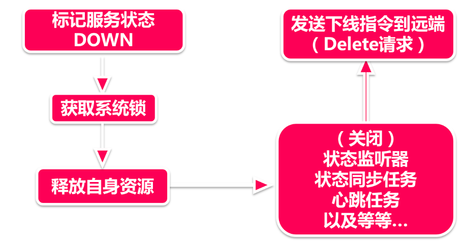

# 服务下线

前面讲了一堆续约，剔除和自保，都是由注册中心在控制，在Eureka的价值观中，难道服务节点的生死就只能被动接受注册中心安排吗?

 不！服务节点还可以选择一条自己的路，做一回命运的主人，只不过这条路是一条“不归路”——服务下线。

## 1、服务下线

服务下线，通常由服务器关闭，或主动调用shutdown方法来触发，是由服务节点主动向注册中心发起的资源释放命令。
下线代表着服务的生命周期走到了尾声，服务节点在工作岗位站到了最后一刻。我们遵从服务节点的要求，一切从简，今天追悼会我们只有一个环节—追忆服务节点下线前的点点滴滴：



1. **标记状态：**下线的第一步，就是先要给自己立一个flag,告诉别人“我不行了，这一步在 `EurekaServiceRegistry.deregister` 里完成，这个方法也只做这么一件事情；
2. **获取系统锁：** 服务下线是一件严肃的事情，总不能反反复复被执行吧，所以这一步需要借助一个特殊的锁，来完成线程安全的下线操作；
3. **释放资源：** 在服务注册伊始，服务节点创建了很多监听器和后台任务，比如状态监听器会在服务状态发生变化的时候同步给注册中心，心跳任务会主动发送心跳包，还有很多生前的亲密战友们，都会被一同关闭，或者释放。
4. **发送下线指令：** 最后，发送一个Delete指令到注册中心，完成整个服务下线请求

服务节点就这样走完了它平凡又忙碌的一生。

## 2、锁

前面提到了一个很特殊的同步锁，这里我们展开讲一下。

Java中的线程安全方法有很多，比如大家就知的`synchronize`，或者借助 `concurrent`包下的各种类。可是当面减官问你，抛开这些，你还有什么线程安全的方式?

有的同学可能会说Thread中的wait和notify。很好，那还有其他的方式吗?

刚才我们说的都是Java层面提供的封装好的机制，然而还有一个利用底层操作系统实现的乐观同步锁，他叫做CAS，Compare ad Swap。从字面意思上理解，就是先比较，再替换的过程，比如我们拿服务下线里的操作看，它调用了`AtomicBoolean`的 CAS 操作。

```java
public final boolean compareAndSet(boolean expect, boolean update) {
    int e = expect ? 1 : 0;
    int u = update ? 1 : 0;
    return unsafe.compareAndSwapInt(this, valueOffset, e, u);
}
```

这里的`expect`和`update`入参是不同的两个值，expect=false，update=true，而最后一行`unsafe.compareAndSwapInt`操作是看不到源码的，因为CAS操作是借助了底层作系统的接口，因以这实际是一个被native关键字修饰的由操作系统实现的方法。操作系统的cas操作作会将内存值与export值进行比较，如果相等就会将`update`参教更新到内存，并返回成功，如果不等则返回失败，在操作系统层面，这个比对-普换的操作是原子性的，所以也就可以保证线程安全，这和我们平时业务代码中的乐观锁实现比较类似。

当然，CAS也有一个著名的ABA问题，也就是当内存值A变到B，然后再变回A的情况下，假如我的期望值是A，尽管中途发生了A->B的变化，可是因为最终又变回了A，因此CAS操作依然认为内存值是没有发生变化的。这个问题的解决方法很简单，用简单的版本号的方式规避掉就可以了(在比对的时候同时验证版本号，每次修改后版本号+1)。