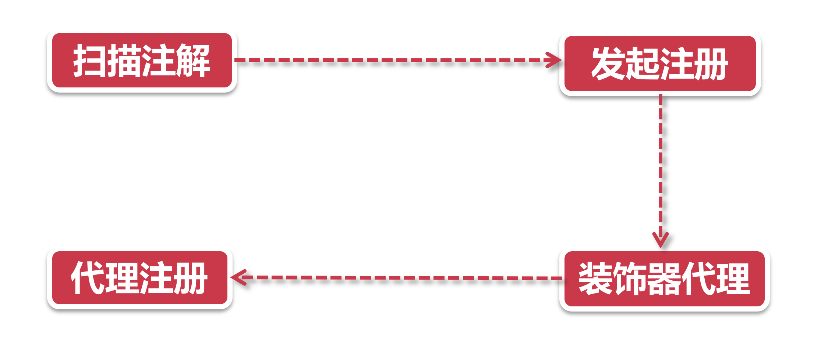
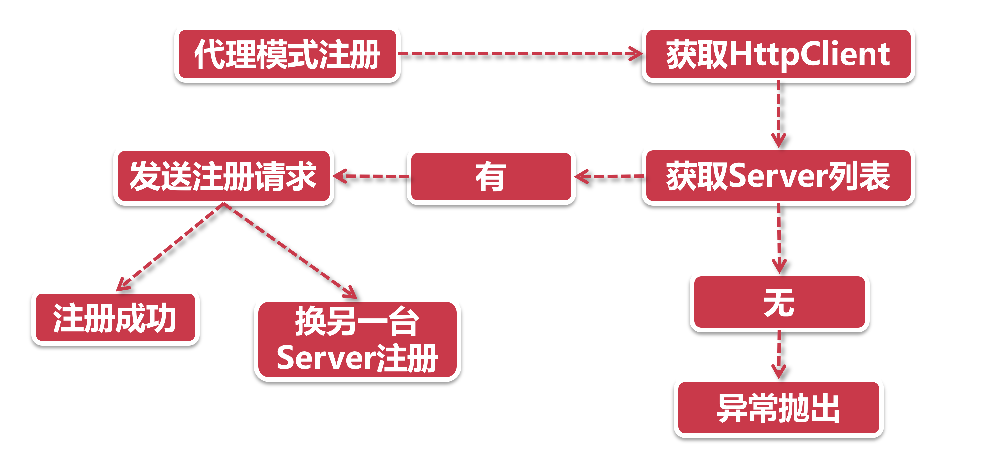

# 服务注册知多少

## 1、起手式

1. **扫描注解：** 高手过招之前，招式未出，先得把招式名称报上来，还要喊得响亮，整个服务注册流程，这个`@EnableDiscoveryClient` 注解就是这一声自报家门，挂在我们的SpringBoot启动类上。随着这一声叫喊，已经暗地里运起了 `@EnableDiscoveryClient`注解里内置的`autoRegister`心法；
2. **发起注册：** 此刻真气行至一个关键穴位，`DiscoveryClient`类的 `register` 方法，大家可以把这个类当做一个类似 Facade模式 的门面类，他是服务节点很多操作的入口。就像所有招式总要先气沉丹田一般，服务注册也要经过这个门户来向外发功，在这一步中`DiscoveryClient` 运起了设计模式中的无上功法，**代理+装饰器模式**，现在执行到了`SessionedEurekaHttpClient`装饰器；
3. **装饰器+代理：**话说 `SessionedEurekaHttpClient`还有个师父（父类），江湖人称`EurekaHttpClientDecorator` ，Eureka的一众连接器全部师从（继承）自这个类。从名字中的 `Decorator`就可以看出它用了装饰器设计模式，简单的说，装饰器就像一层套一层的俄罗斯套娃，每一层都会给本体加上一层Buff，所以你也尽可称呼它为装B模式。JDK 里使用装饰器模式的还有大名鼎鼎的输入输出流框架 （lnputStream和OutputStream）；
4. **代理注册：** Eureka的注册流程其实是用代理+回调的方式，实现了类似装饰器的效果，也就是说虽然这个祖师爷`EurekaHttpClientDecorator` 名字里带了个 `Decorator`，但并不是完全体的装B模式，他没有上一步提到的JDK Stream框架装B的彻底，接下来，就要看Eureka大显神通，运用层层代理，给注册器加上各种装饰器的Buff。

你以为这就开始注册了?那就错了，到目前为止，整个注册过程只是完成了起手式的准备动作。真正的注册，还在后头呢。

## 2、支线剧情

很多同学看到这里已经被绕晕了，为什么单单一个注册功能还要准备这么多起手招式，而且还需要这么多类的配合，其实这都是为了达到组件化设计，职责划分，开闭原则等设计理念，这就要说倒业务系统和开源项目孵化的不同。

所谓业务系统，在保证可扩展性的基本要求下，尽可能支持公司业务的快速增长，往往不会特别在意系统架构层面的清晰度和组件化。这点在互联网公司表现的更加直接，大型互联网公司业务增长迅速，制约业务发展的往往是IT系统跟不上业务的奔跑速度。比如老师曾经在阿里工作的时候，由于业务增长速度超乎想象，各方需求纷终而至但现有系统无法支撑，后来2个月的时间我们把整个商品中心重做了2次，这感觉就像给飞行中的飞机换引擎，才撑过了业务量爆发阶段，在这个过程中，首要任务是满足业务发展，留给系统设计架构思考的时间，少之又少。这就是为什么大公司也会有质量很低的代码的原因，缺少code review和架构设计的时间。

在互联网公司做业务团队，老板只会关注你是不是能及时满足业务发展的要求，何曾见到业务团队把架构设计当做一项KPI?  正所谓大家只关心你飞的高不高，而不关心你飞的累不累。

而对于开源项目孵化来说，站在Spring组织的角度，对接口规范的履约程度和组件化的划分是有明确要求的。打一个比方，不管你是使用Spring Portlet 规范做一套项目还是使用SpringMVC做项目，你会发现这些组件都严格执行了一套500封装的Spring接口规范，在做技术栈变更的时候只用替换具体模块组件就好，对自身业务代码的影响会很小。也就是说，Spring 治理下所有开源项目都是一种可插拔的组件模式，当你从一个组件切换到另一个组件的时候，由于遵循同一套接口规范，这种迁移变得十分容易，这也就是为什么一个进入Apache或Spring的开源项目，要经过官方指导的漫长的孵化器，一方面是为了稳定功能和版本，另一方面也是为了做好组性化的划分。

## 3、发起注册

1. **代理模式注册：** 前面说到了装饰器模式就像层层嵌套的洋娃娃，我们抽丝剥茧之后发现，总共有4层洋娃娃，每一层装饰器都有特殊的功能。这里我们选一层最重要的娃娃来展开，那就是`RetryableEurekaHttpClient`(注意，这不是最里层的那个)。从名字`Retryable`我们不难看出，它自带了 “失败重试” 的功能，这就是它的特殊的Buff——原地复活；
2. **获取HtpClient：** 这里的 `HttpClient` 是 `RetryableEurekaHttpClient`里面的代理对象，也是下一层的洋娃娃，它里面封装了上次同步成功的注册中心地址等信息。假如代理对象为空，那我们就不知道该连向哪个注册中心了，这时候我们就要从Server列表中找一台服务器；
3. **获取Server列表：** 在之前的章节我们提到过，客户端的Server列表是开发人员通过上帝视角直接配置的，那么第一步就是获取这些已经配置好的Server列表信息。当然真正的代码在这一步骤的处理上可谓煞费苦心，后面在源码阅读环节会带大家一探究竟。

> 没有找到可用服务器?一个异常直接扔出，等待后台定时服务在一定时间后重新启动服务注册流程；
>
> 发现可用服务器列表?那太好了，直接取列表中的第x台机器作为目标注册机器(大家记着这个x，后面有用)

4. **发送注册请求：** 最里层的装饰器发起了真正的杀招，调用了 `JerseyApplicationClient`的 `register`方法向注册中心发起最后一击，同学们一定好奇都注册了哪些信息，这里你只要记住注册信息中的三大金刚: 服务名称，服务节点IP，节点状态，就完成任务了。接下来看看注册中心返回什么 response：

> - **注册成功：**那便深藏功与名，出门左转慢走不送；
> - **注册失败：**胜败乃兵家常事，大侠请重新来过，咱不是有个原地复活的Buff吗?那我们可以换一个注册节点再来Retry。还记得上一步获取Server列表时，当有可用服务器时取第x台机器吗?这里就用到了，这里咱就把x自增一，然后重新走一遍注册流程取下一台机器就好了。
> - **复活次数达到上限：**所有机器全都注册失败? 那只能等下次后台定时Task来注册。

## 4、小结

在本节课程中，我们学习了服务注册的精髓，包括：

1. 发起注册前的起手式：代理+装饰器模式构建的组件化架构；
2. 服务注册的核心流程和状态流转。