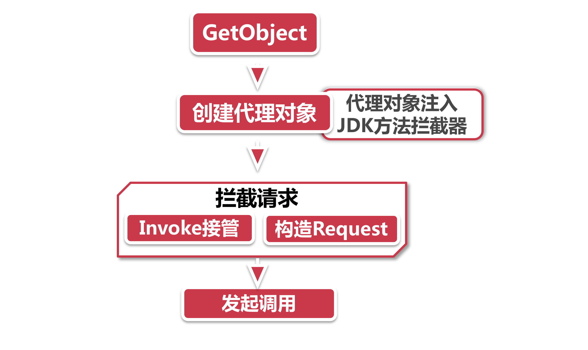

# 动态代理

为什么要加个“动态”二字呢，难道还有静态代理一说?

简单的说，所谓“动态”是相对于"静态编译“来说的，在Java中，假如我们在编译期不知道这对象是何方神圣，只能等待程序执行的时候，也就在是运行期才能知道，那么我们就称之为"动态” 获取对象（比如通过类名+反射创建一个实例）。而所谓“动态代理“，就是指在运行期指定一个代理对象，以接管的方式执行后续的任务。就是这么简单。

而Feign的 ”动态代理”是个偷天换日的过程，我们把目标服务看做一个新娘子，当服务调用请求发出后，一伙迎亲车队浩浩荡荡地出发去迎亲。这时候，一伙打着Feign名号的抢亲小队出现了，他们利用“动态代理"的方式，截胡了迎亲车队，自个儿当起了新郎官去接新娘。我们这就来看看这伙抢亲小队是怎么工作的。

## 1、抢亲小队 - 截胡方法调用

问: 截胡迎亲小队总共分几步? 

答：总共分四步：

**1.GetObject：**原配的迎亲小队出发了，一路喊着“接对象咯”(getObject) ，成功吸引到了抢亲小队的注意力。

- 这一步是FeignClientFactoryBean的getObject方法发起的，为了获取一个可以发起远程调用的实体方法，只是这时它还不知道，getObject方法获取到的其实是一个代理对象；
- 我们知道Feign实际上是调用了@FeignClient注解所修饰的接口，FeignClientFactoryBean封装了这个接口中所包含的配置信息，比如Eureka服务名称，服务调用的路径，降级逻辑的处理类，等等。

**2.创建代理对象：**一伙抢亲小队听到风声，立马开始着手准备埋伏。在上一步的getObject方法的最后做好了埋伏，开始了偷天换日的过程。

上一步中getObiect最后一行，经由Targeter类的转发，抢亲小队登场了；

下面就是创建代理对象的时候了，Feign的所有代理实例均通过ReflectiveFeign.newInstance创建，他的底层是采用Builder模式，将@FeignClient接口的特征，方法名，参数等等一系列信息提取出来，拼装成Java反射机制中通用的Method类;

偷天换日：这一步是整个动态代理机制中的核心操作。在newInstance的创建过程中，Feign通过实现JDK的invocationHandler接口(所有动态代理方案几乎都和它有关联)，将自己的Handler和上一步组装的Method进行了关联，这样一来，所有对这个接口方法的调用，都将被Feign自定义的invocationHandler给接管。这种动态代理的方式，我们叫做JDK动态代理；

所有一切就绪，就等截胡方法调用了。

**3.拦载请求：**这时迎亲车队经过了，因为我们在前一步已经做了埋伏，这方法调用立马被我们自己人，也就是上一步中自定义的invocationHandler截胡了。

SynchronousMethodHandler这时接管了invoke方法，构造Request请求，装模作样当起了新郎官，(在构造Request请求的同时还会涉及一系列的参数拼装和加密等步骤)

**4.发起调用：**最后一步，借助LoadBalancerFeignClient发起了真正的HTTP请求，从这个类的名字大家可以看到，似乎和负载均衡有点关系? 没错，这个就是Feign和Ribbon组合而成的一个Client类，它会利用Ribbon实现超时重试等操作。

前面讲到过，Feign是武装到牙齿的组件，每一步的背后都有非常复杂的处理流程，我们学习Feign不求泛而求情，把其中每一步都研究透并不现实，但是一定要把最核心的部分吃透，比如“动态代理”。

## 2、Spring的动态代理

Spring的AOP有两种动态代理方式，其中一种就是前面讲到的Feign采用的方式：JDK动态代理，在Spring中通过JdkDynamicAopProxv实现。它有两个特点：

- 实现InvocationHandler接口，接管invoke方法实现自己的业务逻辑，所有调用都会被传递到InvocationHandler的invoke方法，通过Proxy.newProxylnstance获取动态代理对象；
- 被代理的对象必须实现了某个接口，不能代理无接口的类。

Spring还有一种动态代理的方式，那就是CGLIB，它并不强制代理类实现某个接口。在实际使用中，CGLIB在代理对象的性能方面比JDKDynamic要快很多，但是在创建代理对象上的时间花费也相当长。所以，如果你的类并没有实现接口，或者是单例模式的类不需要重复创建，建议使用CGLIB的方式。