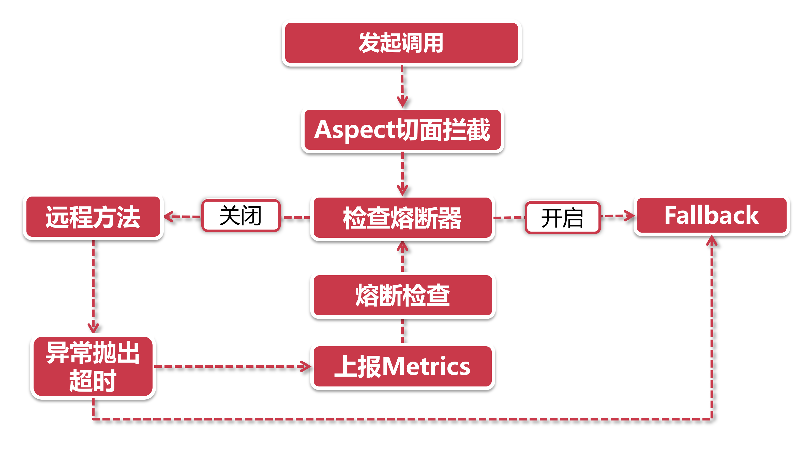

# 熔断器以及工作原理

服务熔断是建立在降级之上的强力手段，是进击的降级。对于我们Hystrix的锦衣卫来说，降级抓人不在话下，可如果这些坏分子在fallback里不好好改造，放出来后立马又进了fallback，来来回回七进七出，那就拿他们一点办法没有了吗?

## 1、押入天牢—熔断开启

非也!

我们锦衣卫不是来给你们当门卫的，如果一个服务反反复复调用失败，大半辈子都在fallback里果着，那还放他出去什么?索性一直在fallback里果着就好了，且看我们锦衣卫是如何把这些屡教不改的家伙押入天牢。

以上流程中省略了服务降级部分的业务，我们只关注熔断部分。

**发起调用-切面拦截：**由于熔断是建立在服务降级的基础上，因此在前面的触发机制上和服务降级流程一模一样，在向 @HystrixCommand注解修饰的方法发起调用时，将会触发由Aspect切面逻辑；

**检查熔断器：**当熔断状态开启的时候，直接执行进入fallback，不执行远程调用；

**发起远程调用-异常情况：**还识得前面服务降级小节里讲到的，服务降级是由一系列的回调函数构成的，当远程方法调用抛出异常或超时的时候，这个异常情况将被对应的回调函数捕捉到；

**计算Metrics：**这里的Metrics指的是衡量指标，在异常情况发生后，将会根据断路器的配置计算当前服务健康程度，如果达到熔断标准，则开启断路开关，后续的请求将直接进入fallback流程里。

## 2、取保候审—熔断半开启

最近六扇门里的单间比较紧张，这天牢里关着这么多人也不是个法子，可放他们出去没准又进了fallback，隔的李公公想到了劳动改造的法子。

李公公把劳动改造分为了三个阶段：

**熔断器open状态：**劳改中，服务在一定时间内不得发起外部调用，前来探视者一律去fallback里接待；

**熔断器half-open状态：**取保候审，在fallback里待的也够久了，给一个改过自新的机会，可以尝试发起真实的服务调用，但这一切都在监视下进行；

**熔断器closed：**无罪释放，上一步的调用成功了，那便关闭熔断，开始一段正常生活

但也不是所有人都能好好改造，尤其在第二步取保候审的时候，有的人就爱在违法的边缘疯狂试探！因此，假如在断路器half-open的时候，服务依然调用失败，这时候不需要达到熔断器阀值，直接押回天牢，等待下一次取保候审的机会。

## 3、熔断器的判断阀值

我们六扇门主要从两个维度判断熔断器是否开启：

- 在一定时间窗口内，发生异常的请求数量达到临界值；
- 在一定时间窗口内，发生异常的请求数量占请求总数量达到一定比例。

其中时间商口的大小也是可以配置的，而且我们还可以指定half-open判定的时间间隔，比如说熔断开启10秒以后进half-open状态，此时就会让一个请求发起调用(并发调用时如何保证只放行一个调用请求?)，如果成功就关闭熔断器。