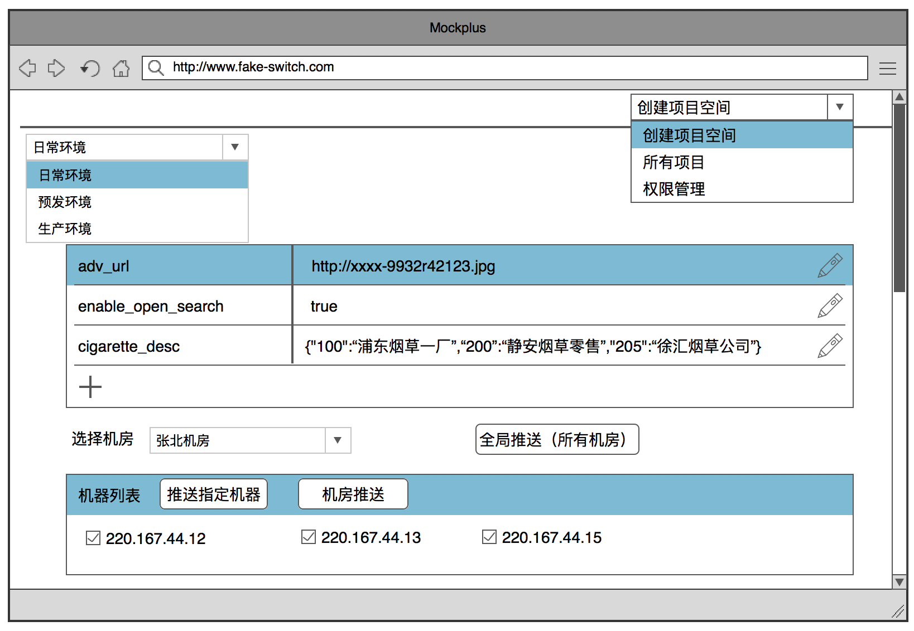
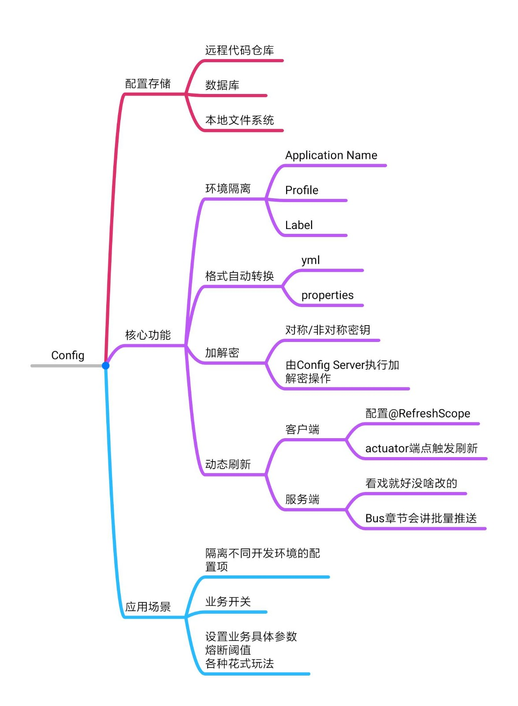

# 阿里系的分布式配置中心Switch

前面我们学习了SpringCloud的分布式配置中心，接下来让我们去见识见识阿里系的配置中心Switch。Swich相比SpringCloud来说，是个更轻量级目简单易用的组件，非常适合用来做实时准送和灰度测试。那我们就来看看Switch有什么神奇之处。

## 1、轻量级vs重量级

我们知道Config是一个重量级的配置中心，它提供了很多丰富的功能，比如根据部署环境不同来切分配置服务，加密属性，动态刷新参教等等那么大家想想看，如果这个组件让你来设计，它还有什么改进的空间?

从技术的视角跳出来，从更高层面的业务视角来看待问题，你就会有新的发现，那我们从业务的视角出发，来分析一下电商行业的业务场景的需求：

**1.二八理论：**在任何一组东西中，最重要的只占其中一小部分，约20%，其余80%尽管是多数，却是次要的。我们试着想一想电商业务下那最重要的20%的需求：

- **Feature Toggle：**电商公司大多采用”糙快猛”的研发模式，需求变更频繁，研发周期采用倒排期，加之开发自测的模式，导致研发周期被大幅压缩。相比传统IT公司来说，互联网行业线上问题的触发概率会高一些，因此我们会在上线的功能中添加各式各样的“开关”，来保证一旦线上出问题可以及时做切换；
- **轻量级灰度：**精准推送属性变更到指定的某台或某个机房的服务器，做轻量级的灰度部署。

**2.用户友好：**电商行业的产品角色会深度参与到上下游业务中，我们需要推送的配置项有可能是一句促销活动的描述，也有可能是商品详情页的某个特殊品类的补充说明，这部分内容会由产品或运营根据业务需要动态设置，我们需要为这类非技术背景的用户提供非常简洁高效的配置管理页面，让他们可以通过页面轻松管理配置属性。因此，像Config那样基于GitHub或数据库的配置管理方式，并不能称得上是用户友好。

把这两点综合起来看，我们就可以得出一个更符合电商行业的需求范用，那就是一个更”轻量级”的只聚焦在最重要的20%功能上的配置管理组件，同时又有一个方便的Portal页面可以实现配署更改、精准推送和访问权限控制。

Config是否能胜任以上需求？可以，但是应大过于庞大笨重，要依赖服务发现件实现高可用，而且对非技术人品不够“友好”，我们可以用一款更轻量级的组件来更好的服务电商场景的业务。

## 2、Switch

从Switch的名字就可以看出，它设计之初的目的非常简单，就是一个轻量级的”开关”组件。Switch的操作页面如下：

我们先从右上角看起，右上角的下拉框提供了2个主要功能：

1. **创建workspace：**这是一种配置隔离措施，给当前项目创建不同的配置管理空间；
2. **分配访问权限：**指定当前的workspace可以被哪些用户修改/查看。

相比较Config操作GitHub实现资源隔离的方式，Switch的管理方式更加简单快捷。

我们再来看下左上角的下拉菜单，这里指定了部署环境，目前阿里系应用有三个大环境：

- **日常环境：**用于日常开发测试的环境，数据源和生产环境是隔离的；
- **预发环境：**上线前的集成测试环境，连接生产环境数据源；
- **生产环境：**真正的线上环境。

在Switch中，可以选择相应的环境，对该环境下的配置项进行变更，如果Config+GitHub的配置方式，还需要通过创建不同名称的配置文件并上传GitHub，则是显得比较笨重。

我们再来看下中间的Table，这里是设置配置属性的她方，在上面这个例子中设置了三个属性，第一个是广告图片的地址，第二个是控制搜索功能开启/关闭的开关，第三个则是一段JSON字符串，用在后台实际业务中。新增、更改属性都非常简单。Switch上统一配置的是字符串类型的参数，Switch会根据后台代码中对应属性的类型（比如Integer，String）做自动类型转换。

最下面的Table则是推送服务，我们有这么几种推送策略：

- **全局推送：**一次性推送到所有的机房；
- **指定机房推送：**把变更推送到指定机房下的所有服务器；
- **指定机器推送：**选择某几个机器，变更只发送到这几台服务器上。如果服务器集群庞大，可以使用地址匹配功能，匹配一段IP地址范围的机器做推送。这个功能经常用来做轻量级的灰度部署验证。

## 3、章节总结

