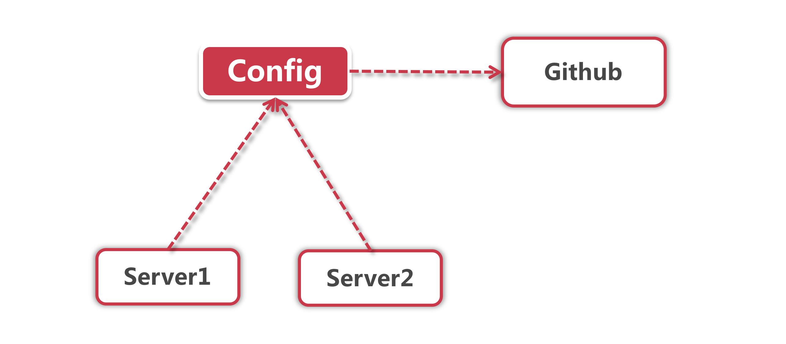

# 直连式配置中心

前面我们了解了Config的主要功能，这一小节我们看一下Config最简单的部署结构—直连式配置中心。

为了精简帮派结构，优化人员配置,更好更快的满足群众需要，我们帮派也决定采取扁平化的管理模式，
采用帮主-传功长老-小弟的三层架构。

## 1、帮派组织架构



**帮主：**仍然是我们的Github服务器 (后面会讲到其他存放属性文件的方式)，存放所有的配置项信息；

**传功长老：**Config组件，从Github那里获取资源文件，并保存一份放到本地；

**小弟：** 众多服务节点，从传功长老那里获取帮主的指令。

## 2、Config Server的工作模式

Config Server主要有两种工作模式：

**1、效忠帮主：** 在这个模式下，Config Server只会从Github或者数据库获取配置信息

- **Github方案：**如果Github是公共仓库，那就不需要配置用户名和密码，如果是私有仓库，要把登录用的用户名和密码写到配置文件里面，当然密码可以通过加密方式存储，然后系统启动的时候使用密钥进行解密；
- **Database方案：**需要额外指定spring.profiles.active=jdbc切换到db方案，并指定数据源。

**2、自立门户：** 帮主? 我就是帮主，Github被我一脚踢开，Config 组件自己说了算，直接从本地路径读取资源文件

采用这种方式，需要指定 springprofiles.active=native 开启功能，然后指定本地文件存储路径

为了简化配置，我们采用第一种模式管理配置文件，也就是Github公共仓库，在项目配置中非常简单，只用指定Gihub地址就可以，例如：

```
spring.cloud.config.server.git.uri=https://github.com/xxxxx/config-repo.git
```

在企业应用中，有时也会有多个项目共同使用一个Github repo的情况，这时候就需要将不同项目的资源文件放到不同目录下，使用如下配置，给你的服务指定一个独立的目录存放配置文件：

```
spring.cloud.config.server.git.search-paths=/{appName}
```

## 3、直连式方案的利弊

优点：从部署结构上来讲相当简单，组件间依赖也少；

缺点：可用性不能得到保障，假如Config节点宕机会产生较大影响。由于需要将在客户端启动的时候指定Config地址，即便这里使用DNS地址（比如域名等非IP形式），如果域名发生变化仍然需要在客户端重新配置Config地址。