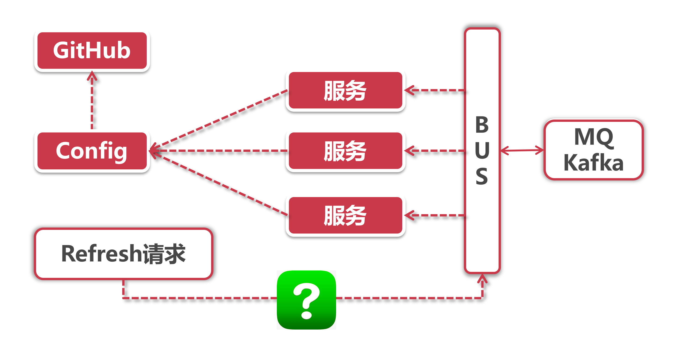

# 消息总线在微服务中的应用

上一章我们学习了Spring Cloud中的分布式配置组件Config，每个服务节点可以从Config Server拉取外部配置信息。但是似乎还有一个悬而未决的问题，那就是当服务节点数量非常庞大的时候，我们不可能一台一台服务器挨个去手工触发刷新，这时候就需要一个可以号令武林的角色出场，由它代替我们做批量刷新的事儿。

接下来，让我们继续“总线式架构”的展望，看看Spring Cloud中哪个组件可以担当号令武林的角色。

## 1、BUS-消息总线

从这个“总”字就可以看出身份地位不一般，它代理了这个号令武林的角色，将消息变更发送给所有的服务节点。

在微服务架构的系统中，通常我们会使用消息代理来构建一个Topic，让所有服务节点监听这个主题，当生产者向Topic中发送变更的时候，这个主题产生的消息会被所有实例所消费，这就是消息总线的工作模式，也就是我们熟悉的“发布-订阅”模型。

其实广义的消息总线不单指代这种"发布-订阅”的模式，也可以代指分布式服务间进行通信、消息分发的“单播"模式，甚至有的公司既不使用HTTP也不用RPC来构建微服务，完全靠消息总线来做服务调用。比如银行的一些老系统就是采用总线型架构，在不同服务节点之间做消息分发。

Spring Cloud中BUS的职责范围就相对小了很多，因为还有一个Stream组件代理了大部分的消息中间件通信服务，因此BUS实际应用中大多是为了应对”消息广播“的场景，比如和Config一同搭配使用推送配置信息。

不同于其他Spring CIoud组件洋洋洒洒的大篇功能猫述，Spring 官网对BUS的应用场景寥寥数笔，总结一下它的应用范围就是：广播状态更改，例如配置变更或者其他管理指令。

## 2、总线式架构的完整流程

下面我们揭开总线式架构的完整面纱：

在Config章节里的“Weapon X“终于揭开了面纱，那就是BUS组件，我们主要来关注一下白底红框那三个和BUS有关系的步骤：

- **MQ/Kafka：** BUS是一个调用封装，它背后还是需要依赖消息中间件来完成底层的消息分发，实际项目中最常用的两个中间件分别是RabbitMQ和Kafka；
- **BUS：** 作为对接上游应用和下游中间件系统的中间层，当接到刷新请求的时候，通知底层中间件向所有服务节点推送消息；
- **Refresh：** 在Config章节中我们通过Refresh请求来刷新配置，那么对于总线式架构的Refresh请求来说，有两个需要解决的问题：

1. 谁来发起变更-是由服务节点，还是由Config Server发起变更请求?
2. 何时发起变更-是手工发起变更?还是每次GitHub改动完成后自动推送?