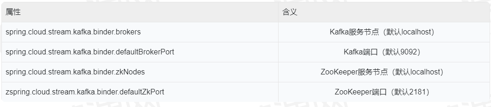

# Bus的接入方式

前面我们了解了Bus的工作方式，在动手改造配置中心之前，我们先来了解一下Bus有哪些接入方式。

Spring的组件一向是以一种插件式的方式提供功能，将组件自身和我们项目中的业务代码隔离，使得我们更换组件的成本可以降到最低。SpringCloud Bus也不例外，它的底层消息组件非常容易替换，替换过程不需要对业务代码引入任何变更，Bus就像一道隔离了底层消息组件和业务应用的中间层，比如我们从RabbitMQ切换为Kafka的时候，只需要做两件事就好了：

1、在项目pom中替换依赖组件；

2、更改配置文件里的连接信息。

接下来我们就看一下RabbitMQ和Kafka两种消息组件如何接入Bus。

## 1、接入RabbitMQ

接入RabbitMO的方式很简单我们只要在项目中引入以下依赖：

```
<dependency>
	<groupId>org.springframework.cloud</groupId>
	<artifactId>spring-cloud-starter-bus-amqp</artifactId>
</dependency>
```

点进去查看这个依赖的pom，你会发现它依赖了 spring-cloud-starter-stream-rabbit，
也就是说Stream组件才是真正被用来发送广播消息到RabbitMQ的，Bus这里只是帮我们封装了整个消息的发布和监听动作。

接下来我们看下项目中所需的具体配置：

```
spring:
  rabbitmq:
    host: localhost
    port: 5672
    username: guest
    password: guest
```

上面配置分别指定了RabbitMQ的地址、端口、用户名和密码，以上均采用RabbitMQ中的默认配置。

## 2、接入Kafka

要使用Kafka来实现消息代理，只需要把上一步中引入的spring-cloud-starter-bus-amqp依赖替换成spring-cloud-starter-bus-kafka依赖：

```
<dependency>
    <groupId>org.springframework.cloud</groupId>
    <artifactId>spring-cloud-starter-bus-kafka</artifactId>
</dependency>
```

如果大家的Kafka和ZooKeeper都运行在本地，并且采用了默认配置，那么不需要做任何额外的配置，就可以直接使用，但是在生产环境中往往Kafka和ZooKeeper会部署在不同的环境，所以就需要做一些额外配置：

