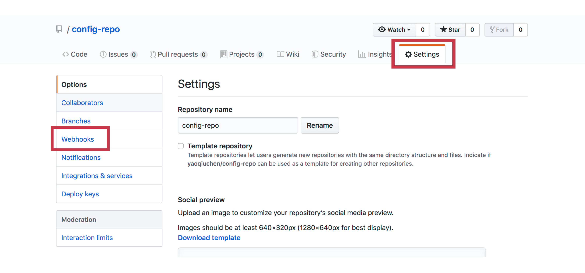
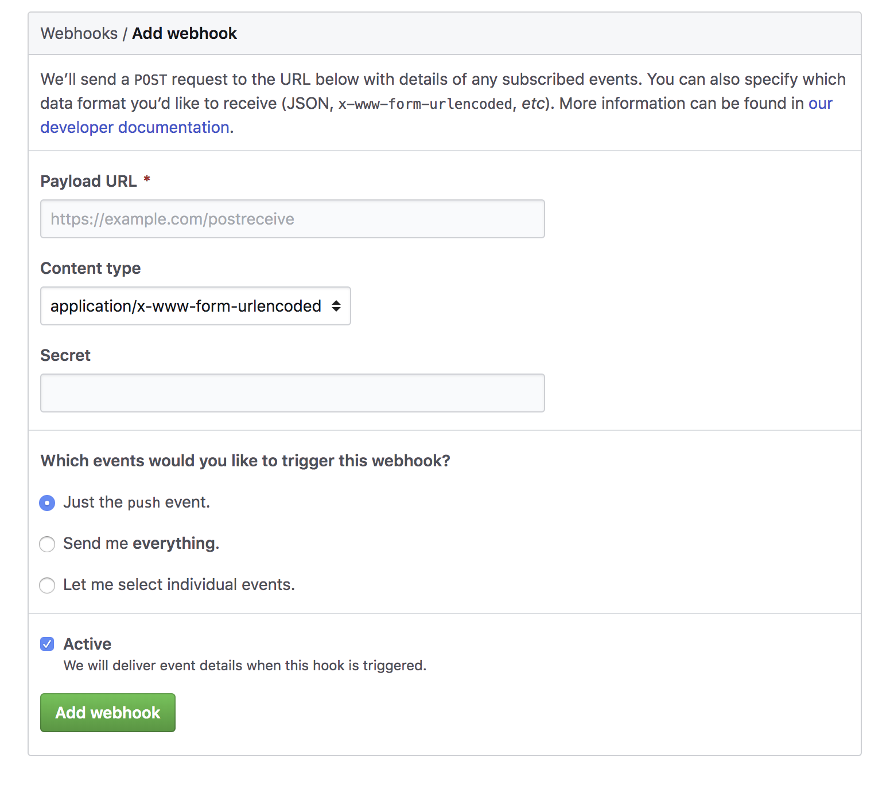

#  如何实现自动推送

## 1、如何实现自动推送

前面我们深入了解了BUS的底层原理，是时候解决本章节开场时候提的一个悬而未决的问题了，那就是由谁发起状态变更请求。

这问题不是解决了吗，使用`/actuator/bus-refresh` 随便用一台机器就好了。话是没错，可这调用不是还得人工来发吗？要是哪天做了变更却忘了推送，岂不是会闹出问题了。相信自己不如相信机器，接下来让我们看看如何通过GitHub的Webhook机制实现自动推送。

## 2、Webhook?

有的同学在想了，老夫用了这么多年的GitHub，咋没听说过Webhook这号人物?这是个什么东东?

从字面意思上看，是个什么钩子?

说对了一半，这确实是个钩子，不过不是海盗手上那个。Webhook这个词是由 Jeff Lindsay在2007年在计算机科学hook项目第一次提出的，指的是一种callback机制，去增加或者改变web page或者web app行为的方法。

对于Git来说，Webhook是Git的一种机制，可以用于自动化的构建，举个例子来说，当每次提交代码到Git以后，会触发Webhook执行一段程序，来完成预定义的操作，比如让钩子通知CI/CD系统从GitHub拉取最新代码开始执行构建过程，或者执行其他操作。

在这个小节，我们将试着借助Git的Webhook功能，实现提交变更后触发Bus的自动刷新。

## 3、Webhook三步走

配置Webhook只需要三步：

1. 设置encrypt.key
2. 将上一步中的key添加到GitHub仓库设置中
3. 配置Webhook url

首先我们来看第一步，设置encrypt.key。这一步和之前我们做属性加密解密的方式一样，只要在application.yml中设置一个key就好了：

```
encrypt:
  key: yourKey
```

接下来，我们登录自己的GitHub，进入存放配置文件的Repository目录下：



点击右上角的“Setings“，然后在左侧列表栏中选择” Webhooks”，进入下一页面后，点击右上方的"Add Webhook “。由于添加钩子是一个很敏感的操作，所以GitHub会要求你输入一遍账号密码进行确认。验证完成后，接下来就是设置Webhook的过程了。



在Payload URL里我们要填上bus-efresh的刷新地址(比 http://190.1.1.1:9000/actuator/bus-refresh ) ，这里的IP地大家不能再填localhost了，否则Webhook调用不到你的机器，这里必须是一个网上可以访问到的IP，比如托管到云上并可被外部访问到的服务器。Payload URL 填好以后，接下来把第一步中的Secrert添加到Secret一栏，点击Add Webhook就好了。

如果在本地自己尝试的话，可能会碰到Webhook不起作用的问题，这还真是bus的一个bug，开源软件也是挺不靠谱的。这里提供两个解决方案：

**1.声东击西：**不直接调用bus/refresh，我们自己向外部提供一个简单的POST接口，让Webhook将请求POST到接口，然后再从这个接口内部调用bus/refresh；

**2.求助官方：**有的国外小伙伴也发现了同样的问题，还给官方提了issue，同学们可以参考这里的解决方：https://github.com/spring-cloud/spring-cloud-bus/issues/124#issuecomment-423960553

## 3、自动推送要注意的问题

自动推送不是万能药丸，因此也要留意一下可能会发生的问题，比如万一发生异常状况：

**1.无法测试：**改动只要一提交就被推送到所有机器，假如不小心修改错了属性，那所有服务器就要团灭了；

**2.定点推送：**尽管Bus支持在URL中添加目标范围，定向推送到指定机器，但毕竟URL在Webhook里面是写死的，不方便我们根据实际情况做定点推送。

所以在项目中我们还是需要根据实际情况，谨慎使用Webhook功能.