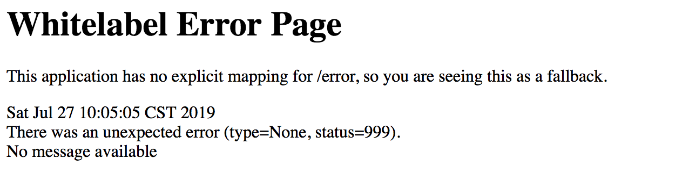

# 网关统一处理异常

前面我们在网关层搭建了一套基于JWT的用户鉴权服务，这一小节我们来探讨一下如何在网关层做统一异常处理。

## 1、异常的种类

网关层的异常分为以下两种：

- **调用请求异常：**通常由调用请求直接抛出的异常，比如在订单服务中直接报错 `throw new RuntimeException(”error")`。
- **网关层异常：**由网关层触发的异常，比Gateway通过服务发现找不到可用节点，或者任何网关层内部的问题，这部分异常通常是在实际调用请求发起之前发生的。

在以上两种问题中，我认为网关层只应该关注第二个点，也就是自身异常。在实际应用中我们应该尽量保持网关层的“纯洁性“并且做好职责划分，Gateway只要做好路由的事情，不要牵批到具体业务层的事儿，最好也不要替调用请求的导常操心。

对于业务调用中的导常情况，如果需要采用统一格式封装调用导常，那就交给每个具体服务去定义结构，让各自业务方和前端页面协调好异常消息的结构。

但是在实际项目中，不能保证每个接口都实现了异常封装，如果想给前台页面一个统一风格的JSON格式异常结构，就需要让Gateway做一些分外的事儿，比如如拦截Reponse并修改返回值。(还是强烈建议让服务端自己定义异常结构，因为Gateway本身不应该对这些异常做额外封装只是原封不动的返回)

Gateway已经将网关层直接抛出的异常（没有调用远程服务之前的异常）做了结构化封装，对于POST的调用来说其本身也会返回结构化的导常信息，但是对于GET接口的异常来说，则是直接返回一个HTML页面，前端根本无法抓取具体的异常信息，所以本章主要聚焦在**如何外理调用请求异常**。

### 1.1）调用异常

我们定义一个主动抛出异常的GET接口，然后通过网关层发起调用，会发现默认返回了HTML的异常页面。



当我们使用常规的全局异常处理方式会发现根本不起作用，这是为什么呢?因为我们目前使用的GreenWich版本底层是基于WebFlux来实现的，并不是Pure Servlet应用，因此常规的手段在这里不起作用。那么接下来，我就带大家通过添加一个过滤器，来处理异常调用，并目将返回值改为JSON格式。

## 2、改造客户端异常

我们先来看看Gateway网关层异常情况下的返回数据：

```
{
    "timestamp": "2019-10-26T15:13:29.870+0000",
    "path": "/gateway/error",
    "status": 500,
    "error": "Internal Server Error",
    "message": "Unable to find instance for FEIGN-SERVICE-PROVIDER"
}
```

看起来干净整洁，那我们是否可以在网关层对服务端返回的异常做一番改造，也呈现类似的效果呢? 接下来，我们就运用最开始Eureka章节中学到的装饰器编程模式+代理模式，给Gateway加一层特效，改变ResponseBody中的数据结构，顺带也体验一下如何将编程模式运用到实际需求中。

### 2.1）代理模式 - BodyHackerFunction接口

在最开始我们先定个代理模式的接口：

```java
package com.imooc.training;

import org.reactivestreams.Publisher;
import org.springframework.core.io.buffer.DataBuffer;
import org.springframework.http.server.reactive.ServerHttpResponse;
import reactor.core.publisher.Mono;

import java.util.function.BiFunction;

public interface BodyHackerFunction extends
        BiFunction<ServerHttpResponse, Publisher<? extends DataBuffer>, Mono<Void>> {
}
```

这里引入代理模式是为了将装饰器和具体业务代理逻辑拆分开来，在装饰器中只需要依赖一个代理接口，而不需要和具体的代理逻辑绑定起来。

### 2.2）装饰器模式- BodyHackerDecrator

接下来我们定义一个装饰器类，这个装器继承自`ServerHttpResponseDecorator`类，我们这里就用装饰器模式给Response Body的构造过程加上一层特效：

```java
package com.imooc.training;

import org.reactivestreams.Publisher;
import org.springframework.core.io.buffer.DataBuffer;
import org.springframework.http.server.reactive.ServerHttpResponse;
import org.springframework.http.server.reactive.ServerHttpResponseDecorator;
import reactor.core.publisher.Mono;

public class BodyHackerHttpResponseDecorator extends ServerHttpResponseDecorator {

    /**
     * 负责具体写入Body内容的代理类
     */
    private BodyHackerFunction delegate = null;

    public BodyHackerHttpResponseDecorator(BodyHackerFunction bodyHandler, ServerHttpResponse delegate) {
        super(delegate);
        this.delegate = bodyHandler;
    }

    @Override
    public Mono<Void> writeWith(Publisher<? extends DataBuffer> body) {
        return delegate.apply(getDelegate(), body);
    }
}
```

这个装饰器的构造方法接收一个BodyHancker代理类，其中的关键方法WiteWith就是用来向Response Body中写入内容的。这里我们覆盖了该方法，使用代理类来托营方法的执行，而在整个装饰器类中看不到一点业务逻辑，这就是我们常说的单一职责。

#### 2.2.1）创建Filter

```java
@Component
@Slf4j
public class ErrorFilter implements GatewayFilter, Ordered {

    @Override
    public Mono<Void> filter(ServerWebExchange exchange, GatewayFilterChain chain) {
        final ServerHttpRequest request = exchange.getRequest();
        BodyHackerFunction delegate = // TODO 这里定义写入Body的逻辑

        // 将装饰器当做Response返回
        BodyHackerHttpResponseDecorator responseDecorator = 
            new BodyHackerHttpResponseDecorator(delegate, exchange.getResponse());
            
        return chain.filter(exchange.mutate().response(responseDecorator).build());
    }

    @Override
    public int getOrder() {
        // WRITE_RESPONSE_FILTER的执行顺序是-1，我们的Hacker在它之前执行
        return -2;
    }
}
```

在这个Filter，我们定义了一个装饰器类BodyHackerHttpResposeDecorator，同时声明了一个匿名内部类(代码TODO部份)，实现了BodyHackerFunction代理类的Body替换逻辑，并且将这个代理类传入了装饰器。这个装饰器将直接参与构造Response Body。

我们还覆盖了getOrder方法，是为了确保我们的Filter在默认的Response构造器之前执行。

#### 2.2.2）改造Response Body

这里就是上一步中标注TODO的部分：

```java
BodyHackerFunction delegate = (resp, body) -> Flux.from(body)
       .flatMap(orgBody -> {
            // 原始的response body
            byte[] orgContent = new byte[orgBody.readableByteCount()];
            orgBody.read(orgContent);
            
            String content = new String(orgContent);
            log.info("original content {}", content);

            // 如果500错误，则替换
            if (resp.getStatusCode().value() == 500) {
                content = String.format("{\"status\": %d,\"path\":\"%s\"}",
                        resp.getStatusCode().value(),
                        request.getPath().value());
            }

            // 告知客户端Body的长度，如果不设置的话客户端会一直处于等待状态不结束
            HttpHeaders headers = resp.getHeaders();
            headers.setContentLength(content.length());
            return resp.writeWith(Flux.just(content)
                    .map(bx -> resp.bufferFactory().wrap(bx.getBytes())));
        }).then();
```

我们对500的HTP Status做了特殊定制，使用我们自己的JSON内容替换了原始内容，同学们可以根据需要向JSON中加入其它参数。对于其他非500 Status的Response来说，我们还是返回初始的Body。

这里有个需要注意的地方就是记得在header中设置content-length，让客户端知道Response中内容的长度，否则的话客户端会认为传输未结束，一直等在那里。

#### 2.2.3）使用Filter

上面步骤都完成以后，接着我们就可以将这个Filter应用在指定的路由规则中，或者定义成global Filter，对所有路由规则生效。经过这次的改造，远程服务抛出的异常也在网关层做了统一处理，从HTML页面转为了JSON格式的数据。