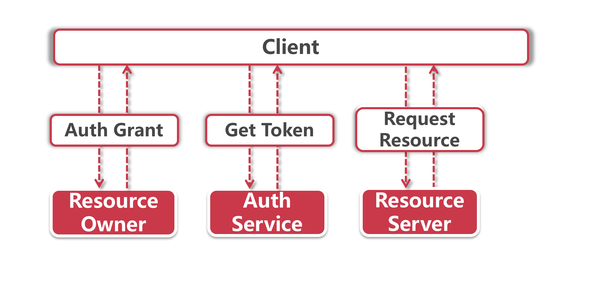

# 权限认证-分布式session替代方案

前面我们了解了Gateway组件的过滤器，这一节我们就探讨一下Gateway在分布式环境中的一个具体用例-用户鉴权。

## 1、传统单应用的用户鉴权

从我们开始学JavaEE的时候，就被洗脑式灌输了一种权限验证的标准做法，那就是将用户的登录状态保存到HttpSession中，比如在登录成功后保存一对key-value值到session，key是userld而value是用户后台的真实ID。

接着创建一个ServletFilter 过滤器，用来拦截需要登录才能访问的资源，假如这个请求对应的服务端session里找不到userld这个key，那么就代表用户尚未登录，这时候可以直接拒绝服务然后重定向到用户登录页面。

大家应该都对session机制比较熟悉，它和cookie是相互依赖的，cookie是存放在用户浏览器中的信息，而session则是存成在股务器端的。当浏览器发起服务请求的时候就会带上cookie，服务器端接到Request后根据cookie中的jsessionid拿到对应的session。

由于我们只启动一台服务器，所以在登录后保存的session始终都在这台服务器中，可以很方便的获取到 session中的所有信息，用这方法我们一路搞定了各种课程作业和毕业设计，结果一到工作岗位发现行不通了，因为所有应用都是集群部署，在一台机器保存了的session无法同步到其他机器上，那我们有什么成熟的解决方案吗?

## 2、分布式环境下的解决方案

### 2.1）同步session

session复制是最容易先想到的解决方案，我们可以把一台机器中的session复制到集群中的其他机器。

比如Tomcat中也有内置的session同步方案，但这并不是一个很优雅的解决方案，它会带来以下两个问题：

**Timing问题：** 同步需要花费一定的时间，我们无法保证session同步的及时性，也就是说，当用户发起的两个请求分别落在不同机器上的时候，前一个请求写入session的信息可能还没同步到所有机器，后一个请求就已经开始执行业务逻辑了，这不免引起脏造幻读。

**数据冗余：** 所有服务器都需要保存一份session全集，这就产生了大量的冗余数据

### 2.2）反向代理: 绑定IP或一致性Hash

这个方案可以放在Nginx网关层做，我们可以指定某些IP段的请求落在某指定机器上，这样一来session始终只存在一台机器上，不过相比前一种session复制的方法来说，绑定IP的方式有更明显的缺陷：

**负载均衡：** 在绑定IP的情况下无法在网关层应用负载均衡策略，而且某个服务器出现故障的话会对指定IP段的来访用户产生较大影响，对网关层来说该方案的路由规则配置也极其麻烦；

**IP变更：** 很多网络运营商会时不时切换用户IP，这就会导致更换IP后的请求被路由到不同的服务节点处理，这样一来就读不到前面设置的session信息了。

为了解决第二个问题，可以通过一致性Hash的路由方案来做路由，比如根据户ID做Hash，不的Hash值落在不同的机器上，保证足够均匀的分配，这样也就避免了IP切换的问题，但依然无法解决第一点里提到的负载均衡问题。

### 2.3）Redis解决方案

这个方案解决了前面提到的大部分问题，session不再保存在服务器上，取而代之的是保存在redis中，所有的服务器都向redis写入/读取缓存信息。

在Tomcat层面，我们可以直接到入tomcat-redis-session-manager组件，将容器层面的session组件替换为基于redis的组性，但是这种方案和容器绑定的比较紧密。

另一个更优雅的方家是借助spring-session管理redis中的session。尽管这个方案脱离了具体容器，但依然是基于session的用户鉴权方案，这类session方案已务在微服务应用被淘汰了。

### 2.4）分布式Session的替代方案

让我们把session抛到脑后，看看现在流行的两种认证方式：

#### 2.4.1）OAuth 2.0

大家一定用过现在比较流行的第三方登录，比如我们通过微信扫码登录就可以登录某个应用的在线系统，但是这个应用并不知道我的微信用户名和密码，这便是我们要介绍的第一个鉴权方案-OAuth 2.0。

OAuth 2.0是一个开放授权标准协议，它允许用户让第三方应用访问该用户在某服务的特定私有资源，但是不提供账号密码信息给第三方应用。

在上面的例子中，微信就相当于一个第三方应用，我们通过OAuth 2.0拿微信登录第三方应用的例子来说：



- **Auth Grant ：**在这一步CIient发起 Authorization Request 到微信系统(比如通过微信内扫码授权)，当身份验证成功后获取Auth Grant；
- **Get Token：** 客户端拿着从微信获取到的Auth Grant，发给第三方引用的鉴权服务，换取一个Token，这个Token就是访问第三方应用资源所需要的令牌；
- **访问资源：** 最后一步，客户端在请求资源的时候带上Token令牌，服务端验证令牌真实有效后即返回指定资源。

我们可以借助Spring Cloud中内置的 `spring-cloud-starter-oauth2` 组件搭建OAuth 2.0的鉴权服务，OAuth 2.0的协议还涉及到很多复杂的规范，比如角色、客户端类型、授权模式等。这一小节我们暂且不深入探讨OAuth 2.0的实现方式，先来看另外一个更轻量级的授权方案：JWT鉴权。

#### 2.4.2）JWT鉴权

JWT也是一种基于Token的鉴权机制，它的基本思想就是通过用户名+密码换取一个Access Token。

##### 2.4.2.1）鉴权流程

相比OAuth 2.0来说，它的鉴权过程更加简单，其基本流程是这样的：

1、用户名+密码访问鉴权服务

- 验证通过：服务器返回一个Access Token给客户端，并将token保存在服务端某个地方用于后面的访问控制(可以保存在数据库或者Redis中)；
- 验证失败：不生成Token。

2、客户端使用令牌访问资源，服务器验证令牌有效性

- 令牌错误或过期：拦截请求，让客户端重新申请令牌；
- 令牌正确: 允许放行

##### 2.4.2.2）Access Token中的内容

JWT的Access Token由三个部分构成，分别是Header、 Payload和Signature，我们分别看下这三个部分都包含了哪些信息：

**Header：** 头部声明了Token的类型 (JWT类型) 和采用的加密算法 (HS256)；

```
{
  'typ': 'JWT',
  'alg': 'HS256'
}
```

**Payload：**这一段包含的信息相当丰富，你可以定义Token签发者、签发和过期时间、生效时间等一系列属性，还可以添加自定义属性，服务端收到Token的时候也同样可以对Payload中包合的信息做验证，比如说某个Token的签发者是"Feign-API"，假如某个接口只能允许"Gateway-API"签发的Token，那么在做鉴权服务时就可以加入lssuer的判断逻辑。

**Signature：** 它会使用Header和Payload以及一个密钥用来生成签证信息，这一步会使用Header里我们指定的加密算法进行加密

目前实现JWT的开源组件非常多，如果决定使用这个方案，只要添加任意一个开源JMT实现的依赖项到项目中的POM文件，然后在加解密时调用该组件来完成。