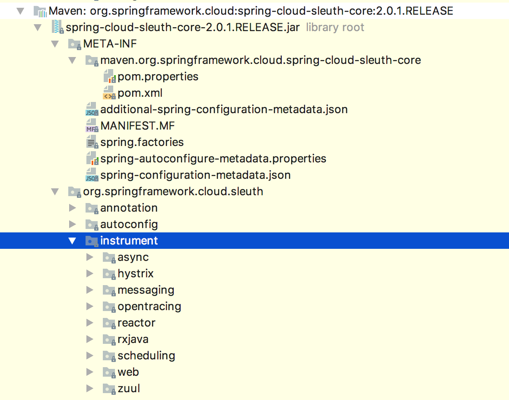

# 追踪链路原理进阶

接下来我们深入了解一下Sleuth的链路追踪原理。

## 1、Sleuth自启动

大家有没有发现，SIeuth是整个SpringCloud中最干净的组件。干净到什么程度？你不用做任何配置，也不用什么注解标签，只要引入SIeuth的依赖到pom里，项目就自动具备了链路追踪功能。

对Sleuth这类静默启动的组件来说，找入门机关有一个诀窍，那么就是查找”AutoConfiguration”关键字，一准跑不了 (对Spring Cloud中其他组件用这个法子也管用) 。顺着这个思路，我们就找到了TraceAutoConfiguration自启动类，它是Sleuth最项层的自动装配类，Sleuth的静默启动就是靠着这个类上面的一行配置：

```
@ConditionalOnProperty(value="spring.sleuth.enabled", matchIfMissing=true)
```

@ConditionalOnProperty注解的意思是，由指定配置项的值来决定是否开启自动配置，而“ matchllfMissing=true 的意思是，假如我们没有主动声明关闭Sleuth功能的话（spring.sleuth.enabled=false) ，那么默认开启链路追踪功能，在TraceAutoConfiguration主类载完成后，还会陆续启动后置的几个自动配置类。

## 2、链路追踪适配方案



我们知道Spring Cloud在上下游调用中会涉及到多种不同的组件，每个组性的玩法都不一样，有的组件使用HTTP协议，有的采用WebSocket办议，有的使用RxJava，有的用WebFluxZ，而每种协议调用方式用来传递信息的姿势也各不相同。

在这个情况下，Sleuth发扬了兵来将挡水来土掩的做法，定义了一系列五花八门的适配方案，具体可以参见 `org.springframework.cloud.sleuth.instrument`下的package，也就是上图中选中的"instrument"包下的内容，每个子package里封装了一套特殊适配器，用来抽取特定调用方式的链路信息。

比如“hystrix”包中的适配器就是专门应付Hystrix组件的，而“messaging"包是专门适配消息组件的。

Sleuh为了对接各式各样的协议和组件，真是花了大功夫来做适配，为的就是捕捉到调用链路在不同组件间传递的细节信息。比如说我们通过Spring WebFlux 调用了服务A，然后服务A又调用了消息组件，由于Sleuth分别对WebFlux 和 Messaging 的流程都做了适配，因此就可以为这两个环节的创建Span并记录链路数据，假如某个环节没被适配到，那这个环节的调用过程就无法被抽取成一个Span，也就无法体现在最终的调用链路中。

Sleuth中的每个适配方案实现方式都大相径庭，但是主线步骤遵循了同样的三步走原则：

**1.AutoConfiguration：**每个适配方案都通过一个自动装配类来加载独有的配置项或初始化核心类，比如RxJava (Hystrix中绕来绕去的回调函教) 的适配器有对应的RxJavaAutoConfiguration，WebFlux(Gateway底层的实现方式) 的适配器有对应的TraceWebFluxAutoConfiguration；

**2.span管理：** 创建新的Span，与上游Span做关联，将链路信息加入到当前Span中；

**3.链路信息的传递：** 比HTTP的适配方案是通过在HTTP Header里写入特殊标签的方式来做的，而消息组件是通过向Message Header写入数据来传递信息。对于其他不同的适配方案来说，传递参数的方式各有不同。

考虑到Sleuh适配器众多，没必要对每个适配器都深入学习。